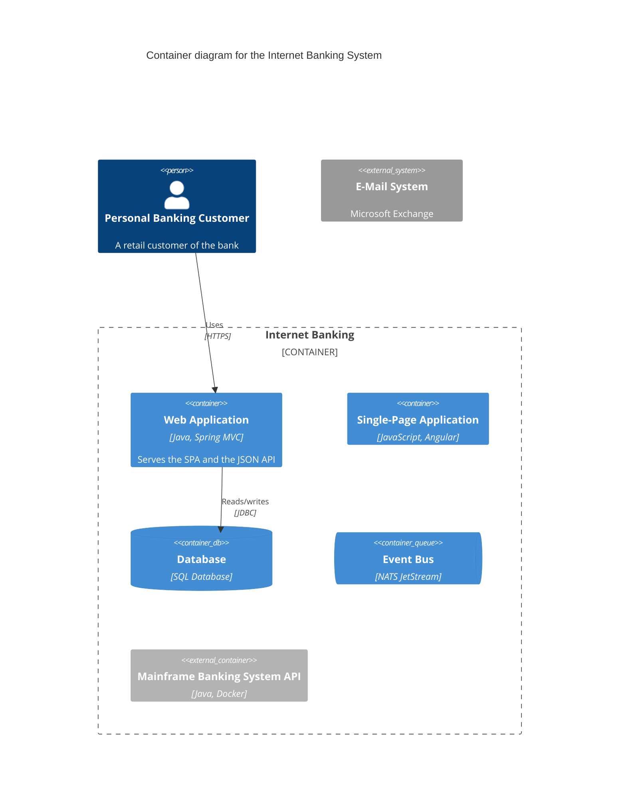

# Architecture

How the plugins in this repository fit together. This document is the
source of truth for naming, responsibilities, and the contract between
generic and language-specific code. Touch this file when those
conventions change; otherwise individual PR descriptions are enough.

## Plugin family

```text
development              ← generic, language-agnostic (orchestrator)
development-swift        ← language: Swift
development-python       ← language: Python
development-java         ← language: Java (Gradle); composes with development-spring
development-javascript   ← language: JavaScript + TypeScript (combined); composes with development-react
development-go           ← language: Go (modules; golangci-lint v2, ko, buf)
development-…            ← future: rust, …
development-container    ← topic: containers / OCI images (planned, #172)
development-claude-plugin ← topic: projects that ARE Claude Code plugins
development-spring       ← topic: Spring framework (composes with development-java)
development-docs         ← topic: documentation (C4 architecture docs; marker docs/architecture/)
development-react        ← topic: React framework (composes with development-javascript)
development-kubernetes   ← topic: infrastructure-as-code (manifests, Helm, Kustomize, Argo CD; may be primary)
development-opentofu     ← topic: infrastructure-as-code (cloud provisioning; OpenTofu + Terraform-compatible HCL; may be primary)
development-…            ← future topics: …
```

All plugins live in this monorepo. End users install whichever subset
they need; nothing forces installation of the full family.

There are **three categories** of plugin:

| Category | Purpose | Dispatched when | Examples |
| --- | --- | --- | --- |
| **Generic** | Orchestrator + shared scripts + policy | Always (entry point) | `development` |
| **Language** | Language-specific idioms + tooling | Project uses that language (`pyproject.toml`, `package.json`, `go.mod`, `Package.swift`, `build.gradle`, …) | `development-python`, `development-java`, `development-javascript`, `development-swift`, `development-go` |
| **Topic** | Cross-language concern in a specialized domain | Project has the topic marker (Dockerfile, k8s manifests, .tf files, `.claude-plugin/plugin.json`, an `org.springframework.boot` plugin, a `docs/architecture/` directory, `react` in a `package.json`'s runtime dependencies, …) | `development-claude-plugin`, `development-spring`, `development-docs`, `development-react`, `development-kubernetes`, `development-opentofu`, future: `development-container` |

Language plugins and topic plugins share the **same dispatch contract**
(same JSON schema, same response shape, same agent + worktree
patterns). The only thing that differs is what triggers them. From
`development`'s point of view, "this project uses Python and has a
Dockerfile" leads to dispatching to both `development-python` and
`development-container`, potentially in parallel.

### Naming

`development` for the generic plugin. `development-<lang>` for language
plugins. `development-<topic>` for topic plugins. No abbreviations
(`development-typescript` not `development-ts`, `development-kubernetes`
not `development-k8s`). Lowercase, hyphens, the most common
user-facing public name (Python → `python` not `py`; containers →
`container` not `oci` or `docker` — the former is too jargony, the
latter is vendor-coupled).

**Special case: JavaScript + TypeScript** ship as one plugin,
`development-javascript`. Most modern JS projects use TS somewhere; the
tooling (ESLint, Prettier, npm, package.json) overlaps so heavily that
two plugins would duplicate ~90% of their content. The plugin handles
both `.js` and `.ts` files; pure-JS projects get the same skill set
minus TypeScript-specific bits.

### Language-first principle (for topic plugins)

When a language has a canonical path for a topic, the **language plugin
gets first crack at it**, and the topic plugin handles only what's
genuinely language-agnostic or what the language plugin couldn't reach.

Concrete example — container images:

| Language | Canonical container path (owned by the language plugin) |
| --- | --- |
| Java / Kotlin | Spring Boot's `bootBuildImage`, Cloud Native Buildpacks |
| Python | Multi-stage with `distroless/python3` final |
| Go | Single-stage `distroless/static` (Go binaries are static) |
| Node | `distroless/nodejs` final |
| Rust | `distroless/cc` for libc-linked binaries |

`development-container` therefore does NOT own Dockerfile generation
for these idioms — it owns:

- Container-scan findings (Trivy / Snyk CVE response across base
  images regardless of language)
- Multi-arch build patterns + caching (already in `bootstrap`; the
  maintenance side keeps them current)
- SBOM + provenance + cosign signing patterns
- Distroless migration recommendations when a language plugin's
  default still uses a full base
- Multi-language Dockerfiles (Python + Node bundled in one image,
  etc.) — the case no single language plugin claims

The principle generalizes: the `development-kubernetes` plugin defers to
language plugins for the application's entrypoints and images, and owns
only the manifest-side concerns — see
[`development-kubernetes` owns](#development-kubernetes-owns) for the
concern boundary, which deliberately leaves generic manifest hygiene to
`kube-linter` rather than restating it here.

### Primary / auxiliary model

Every repo has exactly one **primary type** — its reason to exist — and zero or
more **auxiliary** languages/topics (supporting material). Maintenance treats
them differently:

- **Primary** gets the full, opinionated pipeline with its app-grade gates
  (coverage floor, dependency upgrades, …).
- **Auxiliary** gets a *fit-for-purpose* treatment: mechanical / lint-level
  checks only — **not** primary-grade gates. Running a Python app's 90%-coverage
  pipeline over a plugin repo's three helper scripts is a category error; this
  prevents it.

This **generalizes the language-first principle above**: there a *language* gets
first crack at a *topic*; here the **primary** (which may itself be a topic, e.g.
`claude-plugin`) gets the full treatment and the rest is auxiliary. Language-first
is the special case where the primary is a language and the auxiliary is a topic.

**Declared, not inferred.** The primary is set by `/development:bootstrap` in a
repo-root `.maintenance.yml`:

```yaml
primary: claude-plugin   # a language (python) or a topic (claude-plugin)
```

No file ⇒ no distinction: every detected stack is treated as primary (the
pre-model behavior). The model is opt-in and backward-compatible.

**Mechanism.** The orchestrator reads `.maintenance.yml` and tags each dispatch
via the payload's `dispatch_mode` (`"primary"` | `"auxiliary"`). The language /
topic plugin honors it — *auxiliary* means **delegate with a policy override**
(run the plugin's mechanical fixers, skip its app-grade gates), **not
re-implement** the auxiliary's linting inside the primary. E.g. `development-python`
in auxiliary mode runs `python-ruff-fixer` only — no coverage pre-flight, no
dependency upgrades.

### Why we split

- **Modularity** — A Python-only project doesn't need Swift skills
  loaded into context.
- **Independent versioning** — Bumping Python-tooling pins shouldn't
  trigger a release of the generic plugin.
- **Idiom isolation** — Python idioms drift from Go drift from Swift.
  Keeping them apart prevents "is this rule Python-only?" confusion.
- **Future ecosystem** — Third parties can publish their own
  `development-rust` without forking this repo.

### When NOT to split

A change belongs in `development` (not in any language plugin) when it:

- Operates on repo structure regardless of language (`.gitignore`,
  `dependabot.yml`, `.github/SECURITY.md`).
- Defines policy (Quality Gate thresholds, security severity bars).
- Is cross-cutting tooling (Trivy config, container scanning,
  pre-commit framework setup).
- Is a generic helper (commit message generation, git branch naming).

If you find yourself adding language-specific logic to `development`,
or generic logic to `development-<lang>`, the split is doing its job
by surfacing a category error.

## Polyrepo, contracts, and the cross-repo big picture

The plugin family is *about* a single repo at a time — bootstrap runs in
one repo, maintenance runs in one repo. But the **projects those plugins
serve are not single-repo systems.** The default project shape we design
for is:

- Many small repos, each producing a deployable artifact (microservice,
  micro-UI, library, design-system package, CLI tool).
- Each repo deployable **independently** — no coordinated-release
  requirements between repos.
- Each producer-consumer pair held together by a **stable contract**, so
  the producer can roll forward without breaking the consumer and vice
  versa.
- Different teams owning different repos (often a frontend team vs. a
  backend team; sometimes per-service teams).
- Shared libraries and a shared UI/UX design system, each in their own
  published-package repos consumed across many projects.

This is a deliberate architectural choice, not a default. A repo design
that *forces* coordinated releases across producer + consumer is, by our
standard, **not stable**. Backward-compatible evolution is the criterion;
polyrepo is the shape that makes the criterion enforceable per-repo.

Monorepo projects still work — `development:maintenance` already dispatches
to multiple language and topic plugins in parallel, so a polyglot
monorepo bootstraps and maintains identically to a polyrepo from the
plugin family's point of view. The architecture is monorepo-tolerant; the
*default design we optimize for* is polyrepo.

### API contracts are first-class published artifacts

Every repo that exposes an outward-facing surface treats its contract as
a **published artifact**, not an implementation detail to be inferred from
the code. "Outward-facing surface" is broad and the bootstrap detection
must recognise every form of it:

- **REST APIs** (OpenAPI / Swagger).
- **gRPC and Protobuf services**.
- **GraphQL schemas**.
- **AsyncAPI / event-driven message schemas** (Avro, JSON Schema, Protobuf
  in a registry).
- **CLI tools** — flags, subcommands, exit codes, output formats. The
  `--help` snapshot is the contract.
- **Library public exports** — any function, class, type, or constant
  exported from a published package. Per language: TypeScript declaration
  files, Python `__all__` + type stubs, Java public classes, Go exported
  identifiers, Rust `pub` items, Swift `public` declarations.
- **Environment-variable contracts** — required env vars, their formats,
  their defaults.
- **Config-file schemas** — anything a user writes to configure the
  program.
- **Webhook payload shapes** — outgoing event bodies the consumer parses.
- **Queue / topic message formats** — every shape this repo publishes to
  a shared bus.
- **MCP tool signatures** — for repos exposing MCP servers, the tool
  argument schemas.
- **Database views / stored procedures** when the repo shares state with
  other services through a database (anti-pattern but real).

Any of those that the bootstrap detection finds in a repo becomes a
tracked contract artifact.

### Contracts are prominent, not buried

The contract must be **readable by a downstream consumer (human or
Claude) without reading the whole producer repo.** Concretely, every
producer repo gets:

- A top-level **`contracts/`** (or `api/`) directory holding the
  authoritative artifacts. Generated artifacts are committed, not built
  on demand — consumers and grep can read them directly.
- A top-level **`CONTRACTS.md`** that names every exposed surface, links
  to its artifact, records the surface type (REST, gRPC, library export,
  CLI, …), describes the compatibility policy (semver for libraries,
  URL-path versioning for REST, etc.), and best-effort lists known
  consumers.

These exist because the central question for any consumer working in a
sibling repo is: *what can I rely on from this producer?* The answer
should be `cat CONTRACTS.md` + reading the linked artifact, never "clone
the whole repo and read its code." This is the seam that makes polyrepo
work — without it, every cross-repo task degrades into a full-repo read.

### Backward compatibility is enforced mechanically, not by policy text

Policy text in `CONTRACTS.md` describes the intent; the **enforcement is
in CI** and runs on every PR that touches a contract artifact. The
detector is matched to the surface type:

| Surface | Detector |
| --- | --- |
| REST / OpenAPI | `oasdiff` / `openapi-diff` |
| gRPC / Protobuf | `buf breaking` |
| GraphQL | `graphql-inspector` |
| AsyncAPI / event schemas | `asyncapi-diff` or schema-registry diff |
| CLI parameters | `--help` snapshot diff |
| Library exports (TS) | `api-extractor` |
| Library exports (Python) | `griffe` + `python-semver-check` |
| Library exports (Java) | `revapi` or `japicmp` |
| Library exports (Go) | `gorelease` |
| Library exports (Rust) | `cargo-semver-checks` |
| Library exports (Swift) | `swift-api-digester` |
| Env-var schemas, config schemas, webhook payloads | JSON Schema diff |
| MCP tool signatures | JSON Schema diff against the tool definitions |

A breaking change in any contract artifact fails the build **unless** the
PR carries a deliberate signal that the break is intentional and the
version bump matches (`feat!:` / `BREAKING CHANGE:` for libraries, major
version increment for the package, URL-path or header version bump for
REST).

The Approver's per-language policy template ships an *API stability*
criterion that reads the same detector output, so a breaking change
without the right signal is automatic `REQUEST_CHANGES` — not a separate
judgement call, just the mechanical gate raised to a review verdict.

The full bootstrap-and-Approver scope for this is tracked in
[#174](https://github.com/timo-jakob/timos-claude-code-plugins/issues/174),
now **superseded by epic
[#684](https://github.com/timo-jakob/timos-claude-code-plugins/issues/684)**
(see the contract-lifecycle section below) — no residual #174 scope remains.

### API contract lifecycle — the versioned spec artifact (epic #684)

For REST/OpenAPI surfaces the contract is not merely *diffed* for breakage — it
is **published as a versioned artifact** and its whole lifecycle is mechanical.
Design:
[`docs/superpowers/specs/2026-07-10-webui-plugin-family-design.md`](docs/superpowers/specs/2026-07-10-webui-plugin-family-design.md)
§3 (contract flow) and §4 (versioning, multi-major serving, deprecation). The
model, and the children of #684 that deliver each piece:

- **Per-major `contracts/` layout, dual publication (#692, #706).** The producer
  owns `contracts/vN/openapi.yaml` — one directory per live major, the single
  source of truth. Each major is published as an **npm spec package** (the
  machine channel: consumers pin it in `package.json` and Renovate bumps it, so
  drift is structurally impossible, not policed) and, optionally, to an
  **APIM developer portal** with rendered docs (the governance channel, #706).
  A repo without an `apim/` directory gets the full drift guarantee from the npm
  channel alone. Bootstrap installs the layout, the publish workflow, and the
  **exact-pin `.spectral.yaml` shim** when it detects an OpenAPI surface (#692
  seeded a replaceable local starter; #689 retired it — the shim carries no rules
  of its own, so enforcement lives in one published artifact rather than N
  drifting copies).
- **The org styleguide ruleset is a PUBLISHED ARTIFACT, versioned on its own
  line (#689).** `styleguide/spectral/ruleset.yaml` lives at the repo root, not
  under `development/skills/bootstrap/templates/`, because it is *fetched by* a
  bootstrapped repo at lint time rather than *rendered into* one. It is
  published by cutting a **`styleguide-vX.Y.Z`** git tag (slash-free: jsDelivr
  reads the segment after `@` as the version) and served over the jsDelivr `gh`
  path; a consumer's `.spectral.yaml` is a thin shim that `extends` one **exact**
  pinned URL. Three rules that are easy to get wrong:
  **(1)** the `styleguide-v*` namespace is deliberately independent of
  `development/plugin.json` / `.claude-plugin/marketplace.json` — the two version
  lines never track each other, so a ruleset change is not a plugin bump and vice
  versa; **(2)** a published tag is **never** re-pointed or deleted, only
  superseded, because jsDelivr caches by tag and re-pointing would hand different
  repos different rules under one version string with no PR anywhere to notice;
  **(3)** an unfetchable pin fails `contracts-lint` **loudly** — there is no
  offline fallback, vendored copy or opt-out flag, since a lint that degraded to
  "no rules loaded, 0 problems" would report success while enforcing nothing.
  `contracts-lint` applies the ruleset to `contracts/ops/vN/openapi.yaml` as well
  as `contracts/vN/`, so an org rule must be true of the shared ops fragment.
- **Strict semver, the version triangle (#693).** `info.version`, the npm
  package version, and the URL major in `servers:` (`/v2/`) must agree; `oasdiff`
  classifies every spec diff (breaking / additive / editorial) and the build
  fails unless the bump matches. A breaking change is never an in-place edit — a
  new major is published alongside and the old major gets a sunset date.
- **Multiple live majors via an in-service anti-corruption adapter (#694).** The
  service natively implements only the newest major; each older supported major
  is served by an adapter that translates old-shape requests onto the new domain
  and back. The impl-matches-spec drift gate runs **per live major**.
- **Deprecation lifecycle: active → deprecated (sunset) → retired
  (#695/#707/#708).** `deprecated: true` + `x-sunset: <date>` in the spec (a
  versioned contract change); `Deprecation` (RFC 9745) + `Sunset` (RFC 8594)
  headers — **declared in the spec** on the newest major, where the org
  styleguide's `org-deprecation-sunset-headers` lints them at `error` (#944),
  and runtime-only on a frozen major, where the freeze wins because adding them
  is an additive change `check-contracts-semver.sh` rejects; the consumer client
  generator maps `deprecated: true` to
  TypeScript `@deprecated` so ESLint warns at every call site; a maintenance
  finding fires when a major is served past its sunset, and retirement deletes
  the adapter + spec and the gateway returns 410.

### Standardized operations surface + OpenTelemetry-only instrumentation (#688)

Every backend service that exposes an **HTTP surface** carries one
**org-standard ops surface** — `/info`, `/health`, `/metrics`, defined as a
shared, versioned OpenAPI fragment (`contracts/ops/vN/openapi.yaml`; v2 is current, #1330) so
"standardised" is testable, not aspirational. Bootstrap installs it **alongside
the contracts machinery** (the fragment + checker whenever an API surface is
detected; the `ops-conformance` CI job additionally gated on a Dockerfile). A
purely gRPC-internal service with no HTTP surface has no ops fragment to conform
to, and `spring-config-advisor`'s conforms-to-ops-api check is scoped
accordingly — it never flags a repo that ships no ops fragment. Design:
[`docs/superpowers/specs/2026-07-10-webui-plugin-family-design.md`](docs/superpowers/specs/2026-07-10-webui-plugin-family-design.md)
§5.

- **The fragment is a contract artifact** — `/info` (build + the served API
  majors with lifecycle state and, once deprecated, a sunset date, making the
  #684 deprecation machinery observable), `/health` (human-facing aggregate),
  **`/health/live` (K8s liveness — process only) and `/health/ready` (K8s
  readiness — dependencies) as distinct probes** (a single endpoint can't drive
  both without the liveness-checks-dependencies restart-storm anti-pattern), and
  `/metrics` (Prometheus/OpenMetrics exposition). It rides the same machinery as
  the business contract: `contracts-lint` (Spectral) and `contracts-semver`
  (oasdiff) discover `contracts/ops/v[0-9]*/openapi.yaml`, so a breaking change
  to the ops surface is a new ops major, never an in-place edit.
- **Ops major v2 — RFC 9457 error bodies (#1330).** The two probes' `503`s return
  `application/problem+json` (RFC 9457) instead of the v1 `{"status":"down"}`
  envelope, because RFC 9457's `status` is the HTTP code as an **integer** and
  collides head-on with the health envelope's `"ok"`/`"down"` string. The health
  string is **dropped** from the 503 — 503 already says "down" — and the diagnosis
  rides in a `components` extension member byte-identical to the map `/health`
  serves. Readiness carries it; **liveness carries none**, being dependency-free
  by contract. `v1` stays frozen and unedited beside `v2`, per the rule above.
  Two consequences worth stating, because both are easy to get wrong:
  **(1)** the `Problem` / `ReadinessProblem` schemas declare their four members
  **inline** rather than composing with `allOf` — measured, an `allOf` composition
  still fails `org-problem-json-errors`, because the rule reads the resolved
  schema's own top-level `required` and a composition has none;
  **(2)** `contracts-lint` lints only the **newest major per contract family**
  (both `contracts/vN` and `contracts/ops/vN`). A frozen major is immutable, so
  linting it against a ruleset cut after it froze can only produce red nobody is
  permitted to fix. The corollary is a real trap: a repo that never adopts a newer
  major keeps the old one as its newest and **is** still linted, so migrating is
  mandatory and manual — see
  [Adopt the ops surface](https://timo-jakob.github.io/timos-claude-code-plugins/how-to/adopt-the-ops-surface/).
- **The surface is internal, on a management port.** It is served on a separate
  **management port** (not the public app port), and `/info` is minimal by
  contract (build + API lifecycle only — never framework/server/OS versions), so
  build data is unreachable externally without per-endpoint auth. Enforcing the
  boundary — a `NetworkPolicy` restricting the management port to the kubelet +
  monitoring namespace, a `Service` exposing only the app port, and the probe
  wiring — is the **deployment layer's** job (the composition repo, #687/#719/
  #720): the service provides the seam, the platform draws the boundary. Ops
  endpoints are never published as APIM products.
- **Conformance is mechanical.** `scripts/check-ops-conformance.zsh` curls a
  running service's management base URL and validates the endpoints against the
  fragment's shapes (including the deprecated-major-needs-sunset rule); bootstrap
  wires it as a standalone `ops-conformance` CI job (independent of epic #704's
  rest harness).
- **Instrumentation is OpenTelemetry-only.** The org-wide rule: instrument with
  the **OTel SDK + OTel semantic conventions, exclusively** — one vocabulary
  across every language, covering traces and metrics without a second system.
  **OTLP push to a collector is the primary pipeline**; the `/metrics` pull
  endpoint is a **mandatory compatibility surface** served by the same SDK's
  Prometheus exporter (a config flag, not a second metrics system) — it stays
  curl-able so conformance and smoke checks need no collector, local dev needs
  no collector, and Kubernetes scraping still works. Per the language-first
  principle, Spring gets the surface via Actuator/Micrometer (Micrometer maps to
  OTel semantic conventions) — `spring-config-advisor` gains a conforms-to-ops-api
  check — and every other language plugin owns its canonical implementation of
  the same fragment (Python, Java-non-Spring, **Go (#1192)**, **Node (#936)** and
  **Swift (#937)** are the blessed non-Spring references — with Swift landed,
  every language the family scaffolds a service in now has one). **Go, Node and
  Swift all shipped at the v1.1 shape from the start** — the `components` seam and
  the hard/soft readiness hinge behind an interface (a protocol, in Swift's case),
  with no breaker library on the import path — rather than reworking the handler
  later as #1142 and #1143 each had to. Two Go-specific facts are load-bearing there: the surface is a **single
  mux** (unlike Java, whose Prometheus exporter runs its own server and forces a
  `/metrics` reverse-proxy hop), and the routes are **`http.ServeMux` method
  patterns**, whose grammar the standard library gates on the module's **`go`
  directive** — a service still declaring `go 1.21` compiles the payload cleanly
  and then 404s every ops endpoint, so bootstrap raises the directive rather than
  installing a surface that answers 404. **Node follows Go's single-listener
  shape**, not Java's: its Prometheus exporter is constructed with
  `preventServerStart` and mounted on the management server, so one `node:http`
  server answers all five endpoints and no second port is bound. Its HTTP layer
  is `node:http` with **no web framework**, so the payload drops into an Express,
  a Fastify or a framework-less service alike. **Two payloads fail closed on
  `/info`'s build metadata rather than serving a placeholder**, and they differ in
  how far they take it. Node stamps no VCS revision into a build, so
  `build.git_sha` has **no fallback at all** and an unset `$GIT_SHA` fails the
  service at startup — a confidently-wrong commit in the ops surface is worse
  than a service that refuses to boot (Node's `build.version` still falls back, to
  `$BUILD_VERSION` then the service's own `package.json` version, because that
  one *is* truthful). **Swift (#937) fails closed on both**: neither
  `$BUILD_VERSION` nor `$GIT_SHA` has a fallback, and an unset one throws before
  the listener binds. Python, Java and Go fall back to `"unknown"`.

### Resilience policy + dependency health (#964, #965)

A service depends on things it does not control. Two gaps, and they are two
halves of one story: **observability** (report own health, each direct
upstream's, and the aggregate) and **resilience** (losing a dependency must
never make the service unresponsive). The unifying idea: **the circuit breaker
keeps you serving; the dependency-health surface tells you what's degraded** —
an open breaker *is* a **down** dependency, and a service still serving despite
one *is* a degraded service. (Breaker → dependency status is exact: closed =
`up`, half-open = `degraded`, open = `down`.) Design:
[`docs/superpowers/specs/2026-07-23-resilience-dependency-health-design.md`](docs/superpowers/specs/2026-07-23-resilience-dependency-health-design.md).

- **The six mandates.** Every outbound dependency call MUST have: a
  **timeout**; a **circuit breaker** (one per dependency — the unit `/health`
  reports); **bounded retry + jittered backoff** (never an unbounded or tight
  retry loop, which turns a blip into a stampede); a **registered fallback**;
  **background reconnect** (an open breaker probes, and full function resumes
  with no deploy); and **stay-stable** (a lost dependency fast-fails through the
  open breaker — it never exhausts threads/connections, hangs the event loop, or
  crashes the process). The plugin enforces that a fallback is *wired*, never
  what it returns — structure, not business logic.
- **Health is read passively from breaker state, and only one hop out.** A
  service never probes a dependency on a schedule and **never transitively calls
  a downstream's `/health`** — that is the cascading health-check-storm
  anti-pattern, where one slow leaf hangs every ancestor's health check. Real
  traffic (or the breaker's own probe) already moves the breaker, so reading it
  costs nothing. Each service reports one hop; the observability layer assembles
  the graph.
- **Hard vs soft is the readiness hinge.** Each dependency is declared **hard**
  (nothing works without it — its loss **fails `/health/ready`** so Kubernetes
  sheds traffic) or **soft** (degraded operation is possible — its loss never
  fails readiness; the breaker opens, the pod stays ready, and `/health` reports
  it degraded). This single classification resolves the tension between naive
  readiness (shed traffic on any dependency loss) and resilience (stay up and
  degrade). **Liveness is never a function of a dependency** — that is the
  restart-storm anti-pattern #688 already split away from; mandate 6 is what
  keeps the process alive when a dependency dies.
- **The contract extension is additive — ops-api v1 → v1.1.** `/health` gains an
  optional `components` map (per-dependency `status`, `kind`, `breaker`,
  `since`) and a `degraded` aggregate; `check-ops-conformance.zsh` validates the
  shape when present and rejects an aggregate that **under-reports** its
  components (a hard dependency down while the aggregate still claims to serve).
  The components set a **floor**, not an equality — over-reporting is legal, so
  a service may be `degraded` for an internal reason no dependency models — and
  a `down` aggregate **fails conformance outright**, because the check asserts a
  *serving* service: `down` is a legitimate runtime state, not one the
  conformance job can pass in. `/health` itself always answers **200** while the
  process can respond (the verdict is in the body); 503 is the two probes'
  vocabulary, not the human-facing aggregate's. **All five blessed non-Spring
  ops-api templates implement this**, by two different routes: Java (#1142) and
  Python (#1143) were each *reworked* by the slice that had to teach the same
  handler to report `components` — together closing #1139, where both had aliased
  `/health` to the readiness handler and answered 503 when readiness failed —
  while Go (#1192), Node (#936) and Swift (#937) shipped at the v1.1 shape from the
  start and so never had the defect to fix. The v1.0 checker had always
  rejected that (it has always required HTTP 200 on `/health`), but a healthy
  service conforms either way, so the divergence only surfaced during an outage.
  Populating `components` from breaker state is the per-language slice (#967).
  Two encoding constraints are load-bearing, both empirically pinned by the
  repo's own gate: the healthy aggregate stays **`ok`** (renaming it to `up`
  would break every v1.0 consumer), and the widened states are declared
  **`x-extensible-enum`** rather than `enum`, because oasdiff classifies
  `response-property-enum-value-added` as breaking — a plain `enum` widening
  would have forced an ops **major** for a semantically additive change.
- **Realized per language, enforced two ways.** The policy and contract are
  central and language-agnostic (#965). The **review dimension** (#966) is
  shipped and catches violations on new diffs. The per-language scaffolding is
  #967's six children, of which **Spring (#1141), non-Spring Java (#1142),
  Python (#1143) and Go (#1144) have landed** — see below; javascript and swift
  are #1145/#1146. #1145's prerequisite is now met — **#936 shipped the Node
  ops-api surface with its `components` seam unfilled**, which is the gap #1144
  closed for Go. **#1146's prerequisite is now met too** — #937 shipped the Swift
  ops-api surface with the same seam unfilled: an `async`, `Sendable`
  `DependencyHealthSource` returning a snapshot, with no breaker library on the
  import path. **The Node
  realization will be `opossum`** (#1145), the blessed breaker library for the
  language, named here because #936's shipped templates already promise it to
  adopters. #1146's Swift library is undecided. A
  **maintenance advisor** will catch the same defect classes on the back
  catalogue (#968) and is **not yet built** — until it lands, the pattern is
  enforced on new diffs only.
- **The Spring realization is resilience4j (#1141).** One blessed library per
  language, and for Spring Boot it is
  `io.github.resilience4j:resilience4j-spring-boot4`, pinned directly rather than
  through `resilience4j-bom` (which still manages only the Boot 3 starter).
  **Spring Cloud Circuit Breaker is deliberately rejected**: its
  `CircuitBreakerFactory` exists to make the breaker library swappable — a
  portability layer that contradicts one-blessed-library — and it hides the
  registry the `/health` binding must read. The bootstrap payload
  (`templates/languages/spring/resilience/`) ships the six-mandate client shape,
  a `resilience.dependencies` hard/soft declaration, and an **Actuator
  `@Endpoint`** serving `/health`, `/health/live` and `/health/ready` from breaker
  state. It serves those three paths **instead of Actuator's health endpoint**,
  which cannot express the contract (it spells states `UP`/`DOWN` and nests custom
  fields under `details`, whereas ops-api needs `{status, kind, breaker, since}`
  at the component root). **An `@Endpoint` rather than a `@RestController`, for a
  structural reason**: the management port is served by a *child* application
  context whose MVC stack is deliberately minimal — a `DispatcherServlet` plus a
  `CompositeHandlerMapping` over the `HandlerMapping` beans present, with no
  `RequestMappingHandlerMapping` — so a controller registered there is never
  mapped at all, while one in the main context is mapped on the **public app
  port**, publishing the dependency graph. (`@RestControllerEndpoint`, the old
  bridge, has been deprecated for removal since Boot 3.3.) The endpoint's id is
  `opshealth`, since Actuator's own `HealthEndpoint` bean would otherwise collide
  on the id, and `management.endpoints.web.path-mapping` puts it at `/health`; the
  exposure list therefore carries `info,prometheus,opshealth` and not `health`.
  Actuator still supplies `/info`, `/metrics` (given
  `micrometer-registry-prometheus`, which the starter does **not** bring and the
  payload therefore declares — without it Boot never auto-configures the
  `prometheus` endpoint and `/metrics` 404s), and the `ApplicationAvailability`
  state readiness is built on, so startup and graceful-shutdown behaviour stays
  Spring's own. The payload covers the **health** third of the surface only:
  `/info` still needs build-info plus a custom `InfoContributor` for the
  served-majors table, which `check-ops-conformance.zsh` enforces. Two wiring rules are
  load-bearing because breaking them fails **silently**: `fallbackMethod` goes on
  `@Retry`, not `@CircuitBreaker` (resilience4j makes Retry the outer aspect, so
  a fallback on the breaker converts the failure to a success before Retry ever
  sees it and the call is never retried), and `CallNotPermittedException` must be
  in the retry's `ignore-exceptions` (else an open breaker's fast-fail is itself
  retried through the full backoff schedule).
- **The non-Spring Java realization is also resilience4j (#1142)** — the same
  blessed library, applied differently. Without Spring there is no AOP to weave
  `@CircuitBreaker`/`@Retry`, so the payload
  (`templates/languages/java/resilience/`) decorates **programmatically**:
  `DependencyCatalog` owns the declared dependencies, one breaker and one retry
  each, and a `call(name, call, fallback)` wrapper composing
  `fallback(retry(breaker(call)))` — the same nesting Spring's aspect order
  produces, spelled out rather than configured, with `CallNotPermittedException`
  in the retry's `ignoreExceptions` for the same reason. Versions come **from
  `resilience4j-bom`**, the opposite of the Spring payload's direct pin and for
  the same underlying fact: the BOM manages every core module but not the Boot 4
  starter. `resilience4j-all` is rejected — it adds ratelimiter/bulkhead/cache/
  micrometer for one `Decorators` builder the two static `decorateSupplier`
  calls replace more legibly. The hard/soft declaration is a
  `resilience-dependencies.properties` file (`<name>=hard|soft`, overridable by
  `$OPS_DEPENDENCIES_FILE` for a mounted ConfigMap) rather than Spring's
  `resilience.dependencies` YAML, since a plain-Java service has no
  configuration framework to bind. **Under-reporting is a startup failure from
  both sides**, which is the only way the pair is useful: `requireDeclared` (from
  a client's constructor) refuses a dependency guarded in code but undeclared,
  and `requireAllDeclaredGuarded()` (from startup, after the clients are built)
  refuses one declared but guarded by nobody — whose eagerly-created breaker
  could never leave `CLOSED`, so `/health` would swear it was `up` through a
  total outage. **Not every exception is a dependency failure**: a
  `NotADependencyFailure` type carries caller errors (4xx) and local
  cancellations (an interrupt during a drain) and sits in *both* the retry's and
  the breaker's `ignoreExceptions`, so user-driven 404s cannot open a breaker on
  a healthy dependency and an interrupt is never retried (the backoff's
  `Thread.sleep` would throw at once **and clear** the interrupt flag); an
  `of(deps, CircuitBreakerConfig, RetryConfig)` overload is the seam for a
  third-party client's own such type. The breaker also carries the Spring
  sibling's **slow-call thresholds** (2s/100%), without which a brownout — a
  dependency answering in 2.9s and never erroring — yields a 0% failure rate, so
  the breaker never opens, the fallback never fires and `/health` reports `up`
  for the whole event. **It extends
  the #935 ops-api payload rather than replacing it**: `OpsApi` gained a
  `DependencyHealthSource` interface over plain records — so it still needs no
  breaker library on its classpath — plus the aggregate floor, the
  `withInternalStatus` over-reporting hook, and the hard-dependency half of
  readiness. That rework also **fixes the Java half of #1139**: `/health` now
  answers 200 with the verdict in the body, as the contract requires, instead of
  503. That was the **Java half** of #1139; #1143 fixed the Python half the same
  way, which closed the issue.
- **The Python realization is a PAIR — `circuitbreaker` + `tenacity` (#1143)** —
  and the pair *is* the decision: no maintained Python library is resilience4j,
  so the breaker (mandate 2) and the bounded jittered retry (mandate 3) come from
  two libraries that `dependency_catalog` composes into the same
  `fallback(retry(breaker(call)))` nesting the Java payload spells out. The
  payload (`templates/languages/python/resilience/`) ships that catalog, a
  `DependencyHealth` that reads the `components` map from breaker state, the same
  `resilience-dependencies.properties` hard/soft declaration as the Java sibling
  (deliberately the same file name and syntax — the file an on-call human has to
  find is in the same place in every service), and both guards
  (`require_declared` from a client's `__init__`, `require_all_declared_guarded()`
  from startup). **`pybreaker` is rejected despite being the popular choice**: its
  `call()` holds a `threading.RLock` for the whole guarded call, so four
  concurrent 1s calls through one breaker take 4s (measured on 1.4.1) — a breaker
  that makes contention *worse* than none, which is the parked-caller behaviour
  mandate 6 forbids — and its async path is Tornado's `gen.coroutine`, which
  would hold that threading lock across an `await`. **`purgatory` is rejected**
  as a near-miss: asyncio-native and properly concurrent, but its sync and async
  APIs are separate factories and reading a circuit's state in async mode is
  itself a coroutine, awkward from the synchronous thread that serves `/health`.
  **Three `circuitbreaker` gaps are load-bearing and documented in the payload**,
  because each fails silently: it has **no slow-call detection**, so *the client's
  transport timeout IS the slow-call threshold* (a brownout raises nothing, and a
  breaker that sees no exception never opens); it counts **consecutive** failures
  rather than a rate, so the threshold is set low; and it publishes **no
  state-change callback**, so `since` is stamped when a change was first
  *observed* (only a `/health` scrape is an observation, so the stamp lands
  within one scrape interval of the transition). One gap runs
  the other way and is worth having: `state` computes the open → half-open
  transition from elapsed time inside the property, so a recovering dependency
  reads `degraded` on the next scrape with **no traffic and no deploy** — mandate
  5's visibility for free, where resilience4j needs
  `automaticTransitionFromOpenToHalfOpenEnabled`. **The one trap the payload must
  never "simplify" away**: `circuitbreaker`'s `call()` and context manager do *not*
  check whether the circuit is open — only its decorator form does — so
  `DependencyCatalog._reject_if_open` is what makes mandate 6 real; without it the
  breaker still opens and `/health` still says `down` while every request keeps
  hammering the dead dependency for its full timeout. **`NotADependencyFailure`
  carries the same job as its Java namesake with the opposite override
  semantics**, deliberately: the constructor's `not_a_dependency_failure=`
  argument **extends** the built-in ignored set (which always holds
  `NotADependencyFailure` and `CircuitBreakerError`) and one tuple feeds both the
  breaker predicate and the retry policy — so the Java payload's two standing
  hazards, an `ignoreExceptions` that *assigns* and a widening applied to only one
  of the pair, are not expressible here. **Two more details are load-bearing for
  the same reason they are invisible**: the retry predicate keeps an explicit
  `retry_if_exception_type(Exception)` clause, because tenacity's attempt manager
  records `BaseException` too and defers to the predicate — overriding the default
  without it silently retries `asyncio.CancelledError` through the whole backoff
  budget, hanging the graceful shutdown mandate 6 exists to protect; and the
  modules' sibling imports are written relative-first behind an `except
  ImportError` fallback, because Python 3 has no implicit relative imports and the
  bare form raises `ModuleNotFoundError` at startup under the documented
  `src/<pkg>/` placement. **Two Python-only hardenings round it out**, both
  fail-toward-severity: an off-contract component `status`/`kind` arriving through
  the `DependencyHealthSource` protocol is coerced to `down`/`hard` rather than
  read as healthy/soft (the Java sibling has no equivalent, and its `Dependency`
  record holds equally unconstrained `String`s — that silence is a gap, not type
  safety), and an off-contract `internal_status` return is read as `down` too
  (Python-only for the opposite reason: Java's `internalStatus` is a
  `Supplier<Status>` over an enum, where the value is unrepresentable rather than
  merely unhandled). **A third guard is SHARED with the Java sibling**, which
  answers the same way: a dependency source that *raises* is reported as `down` at
  HTTP 200 rather than allowed to unwind out of the handler, where the connection
  would close and the checker would report `/health` unreachable instead of a
  diagnosis. Only its refinement is Python's own — the response is **serialized
  inside the same guard**, because `json.dumps` is where a source-supplied value
  of the wrong *type* fails, one frame after the source call itself returned. The
  worked
  client also **excludes 408 and 429 from its caller-error band**, where the Java
  client classifies the whole 4xx range: resilience4j merely *ignores* an ignored
  exception, while `circuitbreaker` records it as a **success** — so under
  Python's library a rate-limit storm would otherwise zero the failure count on
  every 429 and hold the breaker closed on a dependency that is visibly struggling.
- **The Go realization is `sony/gobreaker` — one library, no retry pair (#1144).**
  Unlike Python, which needed a *pair* because no maintained library is
  resilience4j, Go needs only the breaker: mandate 3's bounded jittered retry is
  ~30 lines of `math/rand/v2` + `time` inside the catalog. That is a deliberate
  rejection of a second dependency, on the reasoning that the retry must be
  **breaker-aware regardless** — never retry an open breaker's rejection (mandate
  6), a caller's own error, or a spent context — so any library would be wrapped in
  that predicate anyway, while adding a version surface to every bootstrapped repo.
  gobreaker was **confirmed, not assumed**: measured against v2.4.0, four
  concurrent 1s calls through one breaker take 1.00s, which is precisely the
  property that disqualified `pybreaker` for Python (4.01s — it holds a lock across
  the guarded call). Two gaps are load-bearing and documented because each fails
  silently: gobreaker has **no slow-call detection**, so the client's transport
  timeout *is* the slow-call threshold, and its default trip rule is *consecutive*
  failures, so the payload ships a failure **rate** with a minimum volume instead.
  One gap runs the other way and is worth having: open → half-open is computed from
  elapsed time inside `State()`, so recovery is visible on `/health` with no
  traffic and no deploy — the same property the Python payload gained from
  `circuitbreaker`. The payload (`templates/languages/go/resilience/`) keeps the
  siblings' `resilience-dependencies.properties` hard/soft declaration, but
  **`//go:embed`s it into the binary** rather than reading it at runtime — the one
  genuinely Go-specific decision here. Java resolves its copy on the classpath and
  Python via `Path(__file__)`, so in both the declaration already travels inside
  the deployable; a Go binary has no equivalent, and the blessed image path is ko
  onto `distroless/static`, which ships no data files at all. `$OPS_DEPENDENCIES_FILE`
  still overrides it for a mounted ConfigMap, and there is deliberately no
  working-directory fallback — that tier would be present in local dev and absent
  in the image, so a mistake would surface only after deploy. The trade is that
  changing a Go service's hard/soft classification is a rebuild, not a
  config edit. The payload is a **separate `resilience` package** that
  imports
  `ops` and never the reverse, which is what keeps the #1192 ops package free of a
  breaker import as its own contract promises.
- **The review dimension is `resilience`** (#966) — a `*-resilience-reviewer`
  agent in each **service** language plugin (Go, Java, Python, Swift), wired
  into that language's review panel alongside bugs/security/performance. It
  flags four defect classes on a diff: an outbound dependency call with no
  breaker, timeout, or registered fallback; an unbounded or un-backed-off
  retry; a path where a lost dependency hangs or crashes the service (the
  language-specific shapes — a blocked event loop in Python, thread-pool
  exhaustion in Java, `try!` in Swift, goroutine growth in Go); and a hard/soft
  misdeclaration. Severity is anchored to **what happens when the dependency
  dies**, not to style, and findings are scoped to the dependency calls the
  diff actually touches — both bounds exist so the review loop converges
  instead of drowning in speculative hardening notes.

### Messaging — NATS JetStream carrying CloudEvents 1.0 (#1060)

Asynchronous messaging is a deployable-shaped decision like the ones above, and
this family holds exactly one position on it. It is stated here in the family's
own words, with its rationale, so a reader can disagree with it explicitly.

**The default event backbone is NATS JetStream, and every event on it carries a
CloudEvents 1.0 envelope.** That is the whole position: one broker, none held
in reserve for scale, and no stated class of use that reaches for a different
mechanism. A service that needs pub/sub, a work queue, or a durable replayable
stream gets all three from the same server.

**The wire contract is part of the position, not a per-service choice.** All
five of these hold by default:

- **A CloudEvents 1.0 envelope on every event** — `id`, `source`, `type`,
  `specversion` and `time` are structural, so a consumer, a bridge, or a human
  reading a dead-letter payload can interpret any event without knowing which
  service wrote it.
- **At-least-once delivery** — durable consumers acknowledge, and an
  unacknowledged message is redelivered. Exactly-once is not promised at the
  transport, so nothing downstream may assume it.
- **Idempotent consumers** — the necessary consequence of the line above. A
  handler is written so that processing the same envelope `id` twice is
  indistinguishable from processing it once. That is a design obligation on the
  consumer, not a feature to wait for from the broker.
- **Transactional-outbox publishing** — a producer commits the event to its own
  database in the same transaction as the state change it describes, and a relay
  publishes from there. Without it, a crash between commit and publish drops an
  event silently, and no amount of broker durability recovers it. The obligation
  binds a producer publishing events **about its own state**; a producer that
  holds no transactional state of its own — a bridge turning an external signal
  into an event — has no commit to be atomic with, publishes directly, and
  inherits whatever guarantee its source gives it. Making the stream itself the
  system of record is a **different** architecture, not a variant of this one,
  and this section does not admit it: a service owns its state in its own store.
- **Replayable streams** — a stream retains its events, so a new or rebuilt
  consumer can start from the beginning rather than only from now. Replay is
  what makes rebuilding a projection an ordinary operation instead of an
  incident.

**Rationale.** One lightweight backbone — a single small server — covers
pub/sub, work queues, and persistent replayable streams, so there is no
second-broker fork to maintain and no per-repo argument about which one this
service uses. That is "one blessed path with one good default" applied to
messaging: a second admitted broker is a permanent maintenance and expertise
cost, paid in every repo and every review, bought against a scale story most
systems never reach — and a system that genuinely outgrows this one has earned
a deliberate re-decision, which is not the same as a standing escape hatch.
CloudEvents 1.0 then makes the envelope contract-first, the same stance this
document already takes on APIs: the envelope is a published contract, not a
shape each service reinvents. And it composes with the gRPC-internal
direction — small polyglot clients across Go, Java, Python and Swift, rather
than a broker whose comfortable ecosystem is Java-shaped and whose other
clients are an afterthought.

**The trade-off, stated honestly.** The Java realization gives up the
first-class `jakarta.jms` ecosystem and its Spring Boot starter —
auto-configured connection factories, `@JmsListener`, container-managed
transaction integration — and uses the NATS Java client plus the CloudEvents
SDK instead. That is real work the family is choosing to take on, in exchange
for one backbone across four languages instead of one comfortable language and
three awkward ones.

Building any of this — an advisor, bootstrap scaffolding, a Java realization —
is a separate and currently unscheduled concern. This section states the
position that machinery would be built *to*.

### Browser UI — SPA shell, micro-frontends, React default (#1059)

The polyrepo rule above is a rule about *deployables*, and a browser UI is a
deployable. Three positions follow from taking that seriously. They are this
family's own opinions, stated with their rationale so a reader can disagree
with them explicitly. Design:
[`docs/superpowers/specs/2026-07-27-mfe-app-family-design.md`](docs/superpowers/specs/2026-07-27-mfe-app-family-design.md).

- **Every browser UI is a SPA shell; substantial UI splits into
  micro-frontends.** The shell owns the outer route table, the application
  chrome, and session/auth acquisition. The **default** remote shape is a
  **route-owned page** — it owns a route subtree end-to-end and runs its own
  nested router beneath it — because that is the shape with the smallest
  host↔remote surface. A **canvas widget** (a slot on a host-owned canvas the
  user arranges, carrying per-instance configuration and a user-changeable
  size) is the one other admitted shape; the design doc §2.1 records why a
  dashboard is a real product shape route ownership cannot express, and why a
  third shape would not get the same welcome. *Rationale:* it makes the UI obey
  the same rule as the backend — one deployable per bounded context,
  independently releasable, held together by a contract rather than by a
  coordinated release. This document already names "micro-UI" as a first-class
  deployable artifact; this is what makes that real rather than aspirational.
- **React + TypeScript is the default for any browser UI.** Angular is **not**
  scaffolded. An existing Angular asset may participate by exporting the same
  contract, but the family builds no Angular-specific tooling until such an
  asset actually exists. *Rationale:* one framework, one blessed path — the
  standing preference for a single good default over a menu. A second
  framework's tooling (templates, review panel, upgrade agent) is speculative
  cost until something real needs it, and the contract below is
  framework-agnostic at the boundary, so admitting Angular later costs a
  plugin rather than a redesign.
- **The MFE contract is an exported `mount(el, ctx)` / `unmount(el)` pair over
  an import-map-resolved ES module.** A remote's entry module exports the pair;
  the shell resolves the module through an import map and calls it. **Module
  Federation is rejected.** *Rationale:* what federation adds is a build
  plugin, a runtime container protocol, and a shared-scope negotiation that
  fails at runtime rather than at build; what it buys is deduplication of
  shared dependencies. Under route ownership that buys very little — one remote
  is mounted at a time, so duplication costs roughly one framework runtime per
  route transition from an immutable, indefinitely-cacheable bundle. Under the
  canvas shape it would buy a great deal, since a dashboard mounts many widgets
  concurrently — but **import maps already solve it natively**: widgets build
  with the framework as an external and the import map pins exactly one
  framework URL, which is the same trade federation makes, made declaratively
  in one inspectable file instead of negotiated at runtime. So we reject
  federation as unearned complexity for **both shapes**, **not** as forced
  coupling:
  modern federation can be configured to share nothing, so a blanket coupling
  claim would be wrong — but a mechanism we would deliberately configure into
  inertness is one we should not adopt at all.

**Rejected alternatives are recorded, not folklore.** Besides Module
Federation, **custom elements** were the other serious contender for the
contract. The decisive objection is that `customElements.define` is a
process-global registration that throws on a duplicate tag name, so two live
versions of a remote are a hard failure rather than a version skew the shell
can tolerate; the context-passing ergonomics are a secondary cost (attributes
are strings, so structured data needs property assignment or a `CustomEvent`).
The design doc's rejected-alternatives section carries the full reasoning, so
either decision can be re-evaluated on its merits rather than rediscovered.

Building any of this is the MFE composition epic's job, not this section's:
these are the positions the machinery is built *to*.

### Deployment — GitOps promotion and immutable references (#1189)

A deployable reaching a cluster is the last link in the polyrepo chain above,
and this family holds positions on it rather than leaving each repo's CI to
invent one. They are stated here in the family's own words, with their
rationale, so a reader can disagree with them explicitly.

**Argo CD, with Helm charts and Kustomize overlays, is the GitOps mechanism —
and it is recorded here as audited-aligned.** The `Application`,
`ApplicationSet` and `AppProject` resources, the charts and the overlays are
`development-kubernetes`'s to own; this section adds no new mechanism to them.
It says so explicitly because an unexamined agreement and an examined one look
identical from the outside: recording it as *checked* is what lets the next
position audit skip it instead of re-deriving it. **The marker is scoped, not
open-ended:** it records that the #1061 position audit (2026-08) compared that
resource surface, as `development-kubernetes` ships it today, against this
family's position and found them aligned. An audit result is evidence about the
thing it examined, and stops being evidence when the thing changes — so the
marker carries an explicit invalidation rule rather than an implied one: **a
change to those resources must strike this marker in the same pull request.**
Re-dating it instead is allowed only where that same pull request actually
re-compares the changed surface against this position, and the new date must
name the audit that did so — otherwise re-dating is the cheaper edit and would
quietly convert an unexamined agreement back into an examined one, which is the
precise failure this marker exists to prevent. **Once those resources have
changed**, the marker stops being evidence until it is struck or honestly
re-dated, and the next position audit re-derives alignment instead of
inheriting it; while they are unchanged the marker stands and the audit may
skip it. A marker whose expiry nobody is responsible for noticing is worse than no
marker, because it licenses exactly the skipping it can no longer justify.

**The infrastructure repo is the only path to the cluster.** An application
repo builds and publishes an immutable, versioned image, and never writes to a
cluster itself; a version change reaches the cluster as a **pull request
against the infrastructure repo**. *Rationale:* that single rule is what turns
"we use GitOps" from a tooling preference into an auditable property — every
change running in a cluster has a review, an author, and a revert, and the
question "why is this running?" is answered by `git log` rather than by
reconstructing who ran what from a CI transcript. *Its cost, stated plainly:* a
version bump becomes a second pull request in a second repository, which is
slower than pushing from the application repo that just built the image — and
that slowness is the point. A promotion that cannot be reviewed is not cheaper,
it is only faster to get wrong.

**An infrastructure-repo manifest references a service image by an immutable
`<image>:<semver>` tag.** In the polyrepo default this document assumes,
`<image>` is the single image a bootstrapped repo mints —
`ghcr.io/<owner>/<repo>`, one per repo — and this family states no per-service
naming rule. A repo with **more than one deployable** (the monorepo shape this
document tolerates elsewhere) is outside that assumption: it needs a
per-deployable naming rule before its images can be promoted, because pinning
two services to one reference is precisely the "several images sharing one
name" failure this section warns about below. This family does not yet state
that rule, and **until it does, the honest outcome is an explicit stop rather
than an invented convention**: such a repo is outside the **image-naming half**
of this position and nothing more — every other clause here still binds it, the
promotion contract and the mutable-tag ban included. Only what its images are
*called* is unanswered, the family neither scaffolds nor gates that, and a
human settles it before those images are promoted. No follow-up is filed, and
that is deliberate: the family will not invent a naming rule before a real
multi-deployable repo forces the question.
Nothing here contradicts this document's monorepo tolerance — a monorepo still
*bootstraps and maintains* identically; it is only image **promotion**, which
needs one name per deployable, that the polyrepo default does not answer for
it.

**A deployable version is minted on a release, not on every default-branch
merge.** Merging to the default branch produces a build; a *release* produces a
version. That is what makes the next clause a rule about naming rather than a
demand for an automatic version scheme on every merge.

**Mutable tags — `latest`, branch tags, `sha-…` — are build conveniences and
are never a deployable reference.** *Rationale:* a manifest pinned to a mutable
tag describes nothing reproducible, and two clusters syncing the same commit
can end up running different code, which defeats the audit trail the promotion
contract exists to create. What makes `<semver>` immutable is not the registry
— any tag is re-pushable — but the promotion contract itself: a released
version is built once and never re-pushed, and re-pushing one is a violation of
this position rather than an ordinary operation.

**The digest of a released image — `<image>@sha256:…` — is equally admitted,
and is strictly more precise.** The enumeration above is closed by this
sentence rather than left open: a release's semver tag and a release's digest
are the two admitted forms, and anything else is not a deployable reference.
Both are scoped to a *release* for the same reason the minting rule is: a
default-branch build also has a digest, and pinning one would promote something
no release review ever passed. The semver tag is the human-readable promotion
unit — it is what a reviewer reads in the pull request that promotes it — while
the digest is what the registry ultimately resolves to, and what `cosign`
signs. Naming both is not a hedge: the tag says *which release*, the digest
says *which bytes*.

**A release publishes its `<semver>` tag.** This is the one obligation the
position places on a *publisher* rather than on a manifest, and it is stated
because the rest of the section cannot be derived without it: a release that
publishes only a digest has minted no promotion unit, so there is nothing for
the promoting pull request to name in human-readable form. That is the clause
the ko path currently fails, below.

This rule and the digest-pinned **base** image are not in tension either: they
pin **different objects for the same reason** — a base-image digest pins what a
build consumed, a service reference pins what a cluster runs — so that "what is
running" has exactly one answer.

**Status: the two shipped publish paths fall short in different ways, and only
one of them breaks a rule.** The Go/ko path publishes no `<semver>` on a
release, so it fails the publishing clause above; the Docker path publishes the
right name but leaves it indistinguishable from four conveniences, which breaks
no rule and is a documentation gap. Both are recorded here rather than implied
closed, and **#1208** is the follow-up that closes them:

- The **Go/ko path publishes an admitted reference but no promotion unit.**
  Precisely: its publish step captures the digest that `cosign` then signs, and
  a digest *is* one of the two admitted forms above — so the ko path is not
  simply off-position. What it never publishes is a **`<semver>` tag**, because
  the step passes no `--tags` alongside `--bare`
  (`development/skills/bootstrap/templates/languages/go/.github/workflows/ko-image.yml.tmpl`,
  the step running `ko build --sbom=spdx --platform=linux/amd64,linux/arm64 --bare ./...`).
  Passing no `--tags` is not the same as publishing no tag: ko applies its own
  default of `latest`, so what a release actually carries today is a signed
  digest plus a mutable `latest` — an admitted reference and a build
  convenience, and no promotion unit between them. That is a failure of the
  publishing clause above — *a release publishes its `<semver>` tag* — and it
  is the only rule either shipped path actually breaks. **The defect is on the
  release leg**: on a default-branch merge, publishing no version-shaped tag is
  exactly what the minting rule requires, so #1208 adds the release's
  `<semver>` on the release leg **only** — minting a version on every merge
  would violate the very rule this status note is measured against. One
  consequence to decide rather than discover: ko's `--tags` **replaces** the
  default rather than adding to it, so passing `<semver>` alone withdraws the
  `latest` that ko releases carry today. #1208 records that withdrawal as
  intended for the ko path. It is a real difference from the Docker path below,
  where the equivalent names are kept — the asymmetry is deliberate, and it is
  stated here so it does not read as an oversight.
- The **Docker path mints only mutable references on a default-branch merge** —
  `type=ref,event=branch`, `type=sha,format=short,prefix=sha-` and
  `type=raw,value=latest,enable={{is_default_branch}}`, with the `type=semver`
  patterns firing only on a release tag. That half is consistent with the
  minting rule above; what it means in practice is that a default-branch merge
  publishes **no name a manifest may use** — it does produce a digest, but not
  a *release's* digest, and the admitted forms are scoped to a release. That is
  a fact worth stating rather than a defect to repair. The tag lists live in
  `development/skills/bootstrap/templates/public/.github/workflows/quality-public.yml.tmpl`
  and
  `development/skills/bootstrap/templates/private/.github/workflows/quality-private.yml.tmpl`.
- The **Docker release leg publishes the right name among several unlabelled
  ones.** It does mint the immutable `<semver>`, so unlike the ko path it is
  not missing a promotion unit — but it publishes floating `latest`, `<major>`
  and `<major>.<minor>` beside it, and `sha-<short>` as well (`type=sha`
  carries no event restriction, so it fires on a release too). Reading the
  registry, nothing distinguishes the one name a manifest may use from the
  four that are conveniences.

  **This is a labelling gap, not a rule violation, and the distinction decides
  what #1208 does.** Publishing a mutable tag breaks nothing above: the
  position constrains what a *manifest may name*, and explicitly calls mutable
  tags legitimate build conveniences. So the fix is not to withdraw
  them — already-bootstrapped repos pull those names, and removing them would
  break consumers for a clarity the documentation can deliver instead. #1208
  therefore **labels** the published names wherever a consumer reads them, and
  changes no Docker tag on either leg.

  The names are described for consumers in
  `development/skills/bootstrap/templates/common/SETUP.md.tmpl`, whose release
  row reads `` `1.2.3`, `1.2`, `1`, `latest` (if not prerelease) ``. That row
  is a derived document rather than the mechanism; the tags themselves come
  from the `type=semver,pattern={{major}}` and
  `type=semver,pattern={{major}}.{{minor}}` entries in the two workflow
  templates, plus `docker/metadata-action`'s default `latest=auto` — neither
  template sets a `flavor:` key — which is what mints `latest` on a
  non-prerelease release and what the row's "(if not prerelease)" qualifier is
  reporting. So "which of these may a manifest name?" is a real question, and
  the answer above is the full `<semver>` (or the digest) and nothing else.

**Each plane gets its own namespace, and traffic direction is enforced by
NetworkPolicy** — an application service reaches a control-plane service only
through that service's published API. *Rationale:* the polyrepo rule already
says a deployable is held together by a contract rather than by proximity; an
enforced namespace boundary is what makes that true at runtime instead of on
paper, and it turns "don't reach into the control plane" from a review comment
into a packet that does not arrive.

**Configuration arrives as environment variables; secrets are never baked into
an image and never committed to Git**, reaching the workload through an
operator that syncs them from the secrets store. *Rationale:* it is what makes
the immutable-image rule hold — an image carrying environment-specific
configuration is not one artifact promoted across environments, it is several
images sharing one name. And a secret committed to Git is unrevocable by the
mechanism that put it there, because the promotion contract's own audit trail
preserves it forever.

**The direct-to-cluster gate is stated here but specified elsewhere.**
Whether bootstrap fails an application repo that carries a direct-to-cluster
deploy step is settled — it **does**, as of **#1206**, which got room for its
own detection heuristic and its own coverage rather than being folded in here.
Bootstrap ships `scripts/check-no-cluster-deploy.zsh` plus the
`no-cluster-deploy` required status context into every application repo; this
section states the positions that gate is built *to*, and the gate's own header
states its closed v1 command set, its three exemptions and its known gaps.

**What enforces the rest, stated plainly, because "a gate exists" is easy to
over-read.** The promotion contract's ***app-repo* half only** is enforced, by
the gate #1206 shipped: it fails a pull request whose workflow `run:` body
writes to a cluster. It reads workflow text, so a deploy reached through a marketplace
action, a reusable workflow or a shell script is **not** caught — a pass means
no cluster-writing command appears literally in a workflow, not that the repo
never writes to a cluster.
On the manifest side, `kube-linter` already flags a `latest` tag (see the
`development-kubernetes` responsibilities below), which is that partial
coverage of the mutable-tag rule; a branch tag or a `sha-…` pin in an
infrastructure manifest has **no** automated enforcer, and neither does the
plane-per-namespace or configuration/secrets position. Those are stated
positions awaiting mechanism, not shipped guarantees.

Building any of that — a bootstrap scaffold, an advisor, a review dimension —
is a separate and currently unscheduled concern, exactly as it is for the
Messaging and Browser UI positions above. This section states the positions
that machinery would be built *to*. **One** gap is called out by name here
because it already has a follow-up filed — the publish-path gap (#1208). The
rest are unbuilt rather than in-flight, and none of them should be read as
realized merely because the status note above happens to discuss the publish
paths.

### Identity and authorization — OIDC at the edge, claims as the only input (#1186)

Every position above assumes a service that knows who is calling it. Until now
this document never said so, which made identity the assumption underneath the
resilience, ops and contract positions that nobody wrote down — and an unwritten
assumption is most expensive exactly here, because each adopter fills it in
privately and inconsistently, and the gap is invisible until something is
already exposed. This section states the family's position in its own words,
with its rationale, so a reader can disagree with it explicitly.

**OIDC at the edge, with Keycloak as the provider and PKCE for browser flows.**
*Rationale:* one blessed path with one good default, applied to identity. A
second admitted provider is a permanent maintenance and expertise cost paid in
every repo and every review, and identity is the last place this family wants
two half-understood integrations instead of one understood well. PKCE rather
than an implicit or secret-bearing flow because the clients this family
scaffolds — browsers and native apps — cannot keep a secret, so a flow that
assumes they can is a flow whose security story is fiction.

**Tenancy is modelled as Keycloak Organizations in a single realm; a per-tenant
realm is the deliberate exception, not the default.** *Rationale:* realm-wide
settings — token lifetimes, password and session policy, client registrations —
are then configured once and hold for every tenant, instead of drifting into N
slightly different realms that nobody can diff. A tenant that genuinely needs
its own issuer still gets one, but as a decision someone makes and records,
rather than as the shape the system falls into by default.

**The access token is a JWT carrying the tenant identifier and roles as claims,
and those claims are the authorization input.** A service never derives tenant
or role from client input, a path parameter, or a header it did not validate.
Where a request *also* names a tenant — a path segment, a query parameter, a
header — it is **compared against the claim, and a mismatch is rejected**, never
silently overridden. **And where the token carries no tenant claim at all** — the
background-work case the service-to-service clause below admits — **a request
naming a tenant is rejected too**; a caller that must act for a tenant obtains a
token that asserts it, rather than naming one the token does not carry. Without
that second branch the comparison has nothing to compare against, and the only
remaining behaviour is to trust what the caller typed. **A token asserts exactly
one active tenant**, so the comparison is equality and never set membership: a
caller who belongs to several organizations obtains a token per tenant rather
than one naming all of them. *Rationale:* anything the caller can type, the caller can
change. A tenant identifier taken from a path segment is a request for data, not
a statement of identity, and treating one as the other is the shortest path from
a working system to a cross-tenant read. Signed claims are the only inputs whose
value survives an adversarial caller. The rejection half matters separately:
quietly serving the claim's tenant when the caller asked for another one answers
a different question than the one asked, which is a wrong answer wearing the
clothes of a right one. This clause is about *caller-supplied* input only —
resource-level checks a service makes against its own state (does this order
belong to this customer?) are untouched by it.

**The service validates and authorizes; a gateway may validate first, but never
instead.** Validation is **issuer-aware** and happens **inside the scaffolded
service** — the issuer is resolved per request rather than bound once at
startup, so a tenant served from a dedicated issuer stays supportable without a
code change. **Per-request resolution selects from a configured allowlist of
issuers; the token's own `iss` claim chooses among them and never introduces
one.** *This bound is the whole safety of the clause:* an implementation that
fetches signing keys from whatever issuer the token names accepts any token from
any issuer that serves a valid JWKS document, which is not weaker validation but
none at all. **Validating** means, at minimum: the signature against that
issuer's published keys, using an expected algorithm rather than the one the
token asks for, plus `iss`, `aud` and expiry. There is **no trusted-header
mode**: not in local development, not on service-to-service calls. *Rationale:*
the earlier framing — validation at
the gateway, authorization in the service — put the security-critical step
outside everything this family scaffolds, which meant the family shipped
nothing that enforced it and had nothing to review. A gateway check is defence
in depth, and defence in depth is worth having; it is not a substitute for the
service knowing who is calling it. Two consequences follow, stated out loud
rather than left to be discovered:

- **Local development runs against a dev issuer or a signed dev token, never a
  bypass switch.** A flag that turns validation off is a code path that exists
  in the shipped binary, and the difference between "off in development" and
  "off" is one misread environment variable. **The issuer allowlist above is
  environment-scoped configuration, and a dev issuer belongs only in a *local*
  development allowlist** — every deployed environment, a shared development or
  test cluster included, admits only that environment's own provider — an issuer
  operated on the same footing as the workloads it serves, never a locally-run
  or statically-keyed stub. An allowlist
  admitting a dev issuer anywhere deployed is this same bypass in another form,
  and a more dangerous one, because a reviewer looking for a switch will not
  find it anywhere in the code.
- **A service-to-service call carries either the propagated caller token or a
  client-credentials service-account token** — the former when the work is
  being done on behalf of a user, the latter for background and system work,
  and the service-account token carries a tenant identifier only when it is
  genuinely acting for one tenant. A background job that claims a tenant it is
  not acting for is indistinguishable, downstream, from a compromised one.

**The ops surface is outside the token rule — but only on the management port.**
`/info`, `/health`, `/health/live`, `/health/ready` and `/metrics` are exempt
**when, and only when, they are served on the separate management port** of the
ops surface (#688). **The port is the condition, not a description of where
those paths happen to live:** the same five paths mounted on the public
application port are subject to the token rule like any other endpoint, and a
carve-out read as a path allowlist would exempt exactly the case that is
actually exposed. The boundary around the management port is drawn by the
deployment layer's `NetworkPolicy` — the port restricted to the kubelet and the
monitoring namespace — as the ops-surface position (#688) states, and
consistently with the plane-per-namespace position above, which draws boundaries
the same way without speaking about this port. *That boundary is a position, not
a shipped guarantee:* nothing in this family verifies that the policy **scopes
the management port** to the kubelet and the monitoring namespace —
`kubernetes-security-reviewer` flags a namespace carrying no policy at all, not
a policy that admits everything — so a management port reachable beyond those
two is an unbounded hole this carve-out does not license. *And the carve-out is stated
because it is load-bearing for enforcement, not as an aside:* without it, a
deepened security reviewer reads every kubelet probe as an endpoint missing
authorization, and the dimension drowns in false positives on its first run.

**A client that runs on a user's device is a public client.** Any such client —
whether it is the repo's only artifact (a CLI, a SwiftUI app with no server) or
one of several shipped alongside a service — uses **PKCE**, ships **no client
secret in the binary**, keeps the token in the **platform keystore**, and
**never uses a claim as a local authorization decision**. The obligations follow
the artifact, not the repo shape: a service repo that also ships a CLI *that
acquires a token* owes them for that CLI, which is the same rule the enforcement
subsection below applies when it points the client checks at the Go and Python
reviewers. A CLI that never authenticates — a formatter, a codegen or build
tool — is not a client at all, and owes none of them. **In a browser, where
there is no platform keystore, the shell holds the token in memory only — never
in `localStorage` or `sessionStorage`** — and re-acquires it from the provider
rather than persisting it; that is the storage rule #1326 implements, not one it
gets to choose. **The confidential-client case is the service's, and only the
service's:** the client-credentials service-account token required by the
*service validates and authorizes* clause needs a confidential client, whose
secret reaches the workload through the
secrets operator per the Deployment position above and is never baked into an
image. The distinction is the device, not the language: a secret is
confidential only where nobody can read it off the machine it runs on.
*Rationale:* a secret shipped to a user's device is a published secret, and a
keystore is the one place an operating system will defend on the application's
behalf; browser storage that survives a tab close is readable by any script that
ever gets injected into the page, which is why in-memory is the only admitted
form there. The claim rule is the one most often gotten
wrong: claims are the server's input, and a client that gates its own UI on one
is enforcing nothing — hiding a control the server would refuse anyway is fine
as presentation, and is not a security boundary. This is deliberately not a
services-only position, because the family's own adopter path includes repos
with no server at all, and silently excluding them would hand those adopters
the worst outcome this family can produce: a practice it intends to deliver,
omitted with no error, no warning, and nothing to search for later.

**Realization and enforcement — what ships where.** The criterion that decided
this is recorded here because the family should own it as a reusable rule: *a
position gets a reviewer when a violation is visible in a diff, and a template
when a service cannot comply without boilerplate.* Both are true of this one — a
missing validator or a tenant read from a path parameter is visible in a diff,
and no service does issuer-aware validation without scaffolding — so this
position gets both. Neither is built here. Six realization children and one
enforcement child are filed under epic #1058:

- **#1321** (Go), **#1322** (Java), **#1323** (Spring) and **#1324** (Python) —
  the service realizations: in-process issuer-aware validation, claim
  extraction, and the authorization seam.
- **#1325** (Swift) — the client half: PKCE, the platform keystore, and no
  claim-based local authorization decision.
- **#1326** — the SPA shell owns session and auth acquisition for the whole
  page, so a remote never runs its own login flow; the shell↔remote context
  object's own shape stays the MFE contract's concern, defined in
  `docs/superpowers/specs/2026-07-27-mfe-app-family-design.md` and built by
  #1123, not here.
- **#1327** — the single enforcement child, which deepens the existing
  **`security`** dimension in four reviewers:
  `development-go/agents/go-security-reviewer.md`,
  `development-java/agents/java-security-reviewer.md`,
  `development-python/agents/python-security-reviewer.md`, and Swift's
  unprefixed `development-swift/agents/security-reviewer.md`. **The four do not
  all get the same checks, and the split is keyed to the artifact under review,
  not to the language:** a repo that ships a server gets the *service*
  behaviour — issuer-aware in-process validation, the issuer-allowlist bound,
  the claim-source and mismatch-rejection rules, no trusted header — and a repo
  that ships a device client gets the *client* behaviour — PKCE, no client
  secret in the binary, the platform keystore, and no claim-based local
  decision, all four. A repo that ships **both** gets both halves; a repo that
  ships **neither** — a library, a build plugin, anything that never acquires a
  token — gets neither, and the absence of a validator in it is not a finding.
  *A CLI is not automatically in that bucket:* a CLI that acquires a token is a
  device client and owes the client half, while one that never does — a
  formatter, a codegen or build tool — sits in the neither bucket like a
  library — **token acquisition is the key, not the artifact's name**. That
  artifact keying matters in both directions: a Go or Python CLI *that
  authenticates* is a public client this position covers
  explicitly, so its reviewer owes the client checks too; and Swift gets **only**
  the client half here, **because this position files no Swift service
  realization for service checks to point at** — not because a Swift artifact
  cannot be a server. Swift is a service language elsewhere in this document,
  and when a Swift service realization is filed the artifact rule applies to it
  unchanged. The review work is nonetheless deliberately
  **one** issue rather than four, because it is one pair of behaviours written
  four times and four issues would produce four divergent readings of the same
  clause.

**Node is a named gap, not an exclusion.** This document treats Node as a
blessed service language and ships an ops-api reference for it, so the position
applies to a Node service exactly as it does to a Go one — but no Node
realization child is filed here. That is a stated gap rather than a decision
that Node is out of scope, and the honest outcome is to say so rather than to
leave a reader inferring either coverage or exemption from silence.

`kubernetes-security-reviewer` and `bootstrap-security-reviewer` are
**excluded**, for reasons about their artifacts rather than their importance —
and the second exclusion is **narrower than it first looks**. The first reviews
cluster manifests, which carry no token validation or claim extraction. The
second reviews CI and bootstrap configuration, most of which likewise carries
none — but *not all*: the shipped `apim/apiproxy.yaml` declares an auth policy,
which is an identity decision in a bootstrap artifact. The exclusion therefore
covers workflow and scanner configuration only, and that file's auth policy is
deliberately left unreviewed **for now** because #1328 is repairing it; a
reviewer pointed at a file that is known-wrong and already being fixed reports a
finding nobody can act on. **That deferral ends only when the template repair
and the reviewer check both ship, and
that is an obligation on #1328, not a prediction about it:** #1328 must carry,
as an acceptance criterion, the addition of an apim auth-policy check to
`bootstrap-security-reviewer` — if it does not carry that today, it is added
before the template repair merges. Stated as an obligation because "#1328
lands" is satisfied equally by the intended outcome and by a template-only
repair, after which the reviewer never gains the check and this paragraph would
read as though the gap had closed itself. Until the template repair ships,
bootstrap keeps emitting the contradicting file into new repos; until the
reviewer check ships too, nothing catches an adopter reintroducing it.
`development-javascript` and `development-react` ship
no security reviewer, so no reviewer deepening is filed for them either — which
means **#1326's browser in-memory storage rule ships with no reviewer at all**,
and the SPA half of this position has no review dimension until one of those
plugins grows a security panel. And
`development-spring` ships no review panel of its own — a Spring repo is
reviewed by the Java panel, so #1323's realization is enforced by
`java-security-reviewer` rather than by a Spring reviewer that does not exist.
**The dimension enum under the *Review finding schema* section is unchanged** —
the existing `security` dimension is deepened, not extended — and that is said
explicitly here because the enum is a cross-language contract shared by every
review panel and the consolidator, so leaving it unsaid would invite a later
pull request to extend it in passing.

**Status: one shipped artifact contradicts this position today.**
`development/skills/bootstrap/templates/common/apim/apiproxy.yaml.tmpl` carries
an `auth:` policy of `type: apikey` under the comment `The gateway validates the
caller; the service trusts the gateway.` — and it is *shipped*, emitted into
every bootstrapped repo that gets an `apim/` directory. **Both halves contradict
this position, and #1328 must repair both.** The comment is precisely the
framing the gateway clause above replaces; the policy is worse than a comment,
because selecting API-key auth at the edge means no OIDC token reaches the
service at all, which defeats *OIDC at the edge* and *claims as the only input*
independently of what any comment says. It is a **rule violation, not a wording
gap**: an adopter following it builds the trusted-header mode this position
forbids. **#1328** is the follow-up that repairs it. Recording it here rather than leaving it implied
is the same discipline the Deployment position applies to its own publish paths:
a position that does not name what already contradicts it reads as a clean bill
for everything the family ships.

Identity-provider operations, credential and recovery policy, and tenant
onboarding are outside this position: none of them is something a plugin
scaffolds. Multi-tenancy data scoping — how a validated tenant claim constrains
what a query returns — is #1187, which this section unblocks rather than
answers. As with the Messaging, Browser UI and Deployment positions above, this
section states the position that machinery would be built *to*. Three coverages
exist today, and each is narrower than it looks:

- The **Go, Java and Python** `security` reviewers carry a missing-authorization
  check **scoped to state-changing handlers** — Swift's carries none at all. So
  an unauthenticated *read* is largely uncovered even where the check exists,
  which is the case this section headlines as the shortest route to a
  cross-tenant read: #1327 both deepens that check and widens it. **Java's is
  the partial exception** — it also flags an unprotected actuator-style
  diagnostics or debug endpoint, which is a read-side finding — and that line
  needs **reconciling against the ops carve-out above**, since the management
  port's `/info`, `/health*` and `/metrics` are exactly actuator-style
  diagnostics that the carve-out exempts. That reconciliation is #1327's work
  too, not something the deepening starts from a clean slate on.
- The **Go, Java, Python and Swift** reviewers all flag a hardcoded credential,
  which is the **no client secret in the binary** obligation — Swift's naming
  the OAuth case explicitly, the other three generically. #1327 deepens that
  bullet rather than adding a second check beside it.
- **Swift's alone** flags a token kept in `UserDefaults` rather than the
  Keychain — the **platform keystore** obligation, covered for Swift and nowhere
  else.

Everything else is unenforced: issuer-aware validation, the issuer-allowlist
bound and its environment scoping, the claim-source rule, the mismatch-rejection
rule in either branch, the no-trusted-header rule, the **PKCE** and
**no-claim-as-a-local-decision** obligations everywhere, the platform-keystore
obligation outside Swift, and #1326's browser in-memory storage rule — which, as
noted above, has no reviewer to deepen at all. **Nothing in this section is
enforced beyond the three coverages just named.** Read the rest as a stated
position awaiting mechanism rather than a shipped guarantee.

### Cross-repo Claude: the big-picture problem

A Claude session in one repo cannot see siblings by default, and in a
polyrepo world most non-trivial tasks span at least one producer and one
consumer. Patterns we lean on, ranked by leverage:

1. **Contract repos as the source of truth.** Most cross-repo work
   doesn't actually need both implementations — it needs the contract.
   If the producer's `contracts/` is prominent and complete, the
   consumer-side Claude reads one file and proceeds. This is the highest
   leverage and the cheapest to set up.
2. **Parent-workspace folder.** Check out related repos as siblings under
   a parent (e.g. `~/work/product-x/{frontend-cart, backend-orders,
   design-system, contracts}`) and launch Claude from the parent.
   `Read` / `Grep` / `Bash` cross repo boundaries trivially when invoked
   above them. Cheap, works for tens of repos.
3. **Workspace manifest.** A small file (e.g. `.claude-workspace.yaml`)
   declaring the constellation: which repos belong, their roles, where
   their contracts live. Lets a skill validate that a breaking change
   has been propagated to all consumers, and lets bootstrap learn
   "this repo is part of constellation X" so it can apply
   constellation-specific conventions.
4. **MCP server for cross-repo indexing.** Indexes contracts across the
   org's repos and answers "who consumes `POST /orders`?" or "which
   services depend on `@design-system/button`?" Higher build cost; the
   only path that scales to hundreds of repos.

The leverage stack is the order of investment: get the contracts right,
then the parent-workspace pattern handles 80% of cross-repo work, then a
workspace manifest formalises the convention, then MCP for scale. Don't
build (4) before (1) — without prominent contracts, an indexer indexes
the wrong thing.

### What this implies for the plugin family

Each piece below is captured at the right level of detail in #174; the
plugin-family implications:

- **Bootstrap** detects every outward-facing surface in the repo and
  installs the matching breaking-change detector. It also generates
  `contracts/` + `CONTRACTS.md` from templates.
- **Approver** policy templates gain an `## API stability` section
  evaluated for every PR that touches a contract artifact.
- **Language plugins gain a library mode** — `--library` (or auto-detected
  from `publishConfig` / `[project].version` / `Cargo.toml [package]
  .publish`, etc.). Library mode applies stricter public-API gates,
  semver enforcement, and a different coverage / test-quality
  expectation (more public-API snapshot, less integration).
- **The design-system case is a library at the constellation scale** —
  same library-mode bootstrap, but with the additional expectation that
  visual-regression tests (Chromatic, Percy, or equivalent) sit in the
  test mix.

This section frames the *why*; the *how* lives in #174 and in the
per-language policy templates.

## Responsibilities

### `development` owns

- Generic skills: `bootstrap`, `commit-message`, `git-branch-naming`,
  `cleanup`, the `maintenance` orchestrator (layout under "Dispatch
  model" below).
- Shared scripts that operate on detected state without language
  knowledge: `detect-stack.sh`, `merge-gitignore.sh`,
  `branch-protection.sh`, `preflight.sh`, the `automate-*.sh` family.
- Policy text: Zero Tolerance standard definitions (the 90/0/A thresholds
  and the layered enforcement model — Sonar gate + CI `coverage-floor` +
  pre-push hook), security thresholds, `.snyk` ignore conventions.
- The **dispatch JSON schema** (see below) — the contract every
  language plugin and topic plugin reads and writes.
- **Plugin-level hooks** registered via `development/hooks/hooks.json`. These
  load for every installer of the `development` plugin, and they differ in how
  they are gated — state each one's actual trigger rather than assuming
  opt-in:
  - `PostToolUse`/`Bash` → `skills/cleanup/scripts/cleanup-hook.sh`. **Not**
    opt-in: it runs on every Bash call and `exec`s `cleanup.sh` (switch to main,
    pull, prune stale remote-tracking refs, delete merged local branches, and
    **force-delete** squash-merged ones whose upstream is gone) whenever the
    command string *contains*
    `gh pr merge` — an unanchored match, so a compound command or even a grep
    counts — and the tool response reports `exit_code: 0`. An absent `exit_code`
    fails closed.
  - `PreToolUse`/`Agent` → `hooks/switch-fable-to-opus.zsh`, the
    `switch_fable_to_opus` model redirect (see "Agent model selection"). Inert
    unless that variable is truthy.

  **New hooks must default to inert**, since they load for every installer;
  the cleanup hook predates that rule. Hook scripts also deliberately omit
  `err_exit` (see "Scripting conventions"): a non-zero exit from a `PreToolUse`
  hook is user-visible and exit 2 outright *blocks* the tool call, so a
  **`PreToolUse`** hook must never die on the way to a decision. A `PostToolUse`
  hook is less exposed and may still exit non-zero.
- This `ARCHITECTURE.md`.

### `development-<lang>` owns

- Language-specific skills: `fix-ruff-findings`,
  `fix-snyk-findings`, `improve-test-coverage`, etc.
- Language-specific agents (with `model:` declarations chosen per
  task; see "agent model selection").
- Knowledge of language idioms (e.g., for Python: `with` vs
  `contextlib.suppress`, `StrEnum`, adjacent-string-literal SQL).
- Language-specific tool invocations (`ruff check --fix`, `pytest`,
  `go test`, `swift test`).
- The language's canonical container path when one exists
  (see "Language-first principle" above) — Spring Boot's
  `bootBuildImage`, Python's distroless multi-stage, Go's distroless
  static, etc.

### `development-<topic>` owns

- Topic-specific skills for the cross-language part of the topic
  (e.g., `development-container`: `respond-to-cve-findings`,
  `migrate-to-distroless`, `refresh-pinned-digests`).
- Topic-specific agents (same model-selection guidelines).
- Knowledge that applies regardless of which language the project
  uses (e.g., for containers: multi-arch QEMU patterns, cosign keyless
  OIDC, SBOM attestation formats).

### What language plugins and topic plugins **must not** own

- Detection (always handled by `development`'s `detect-stack.sh`).
- Cross-language policy (lives in `development`).
- Cross-plugin helpers (`development` is the canonical source; see
  "shared helpers" below).
- For topic plugins: anything a language plugin can do better
  (see "Language-first principle").

### `development-kubernetes` owns

Kubernetes manifests, Helm charts and values, Kustomize overlays, and
Argo CD `Application` / `ApplicationSet` / `AppProject` resources.

It does **not** own Dockerfiles or image builds — language-first puts
those with the language plugins and later `development-container` — nor
cloud provisioning, nor application code of any kind.

**Mechanism here, policy in the consumer.** The plugin knows how to run
checks; the repo under test declares what to check for, at
`policies/kyverno/**/*.{yaml,yml}`. That glob — **not** the mere
existence of the `policies/kyverno/` directory — is the contract: the
skip condition is **no matching files**, so an empty (or `.json`-only)
policy directory skips exactly like an absent one, and a repo that
writes its policies as `.yml` is enforced rather than silently ignored.

When nothing matches, the policy step **skips and reports "no policies
declared"**. *That absence* is never an error — a public plugin has to
work in a repo that has no opinions yet. The guarantee scopes to the
absence and nothing else: when policies **are** declared, violations
**fail** the step, or the mechanism would be decorative. So does a declared set
the pinned Kyverno CLI **cannot evaluate** — policies written only in kinds it
does not know (Kyverno 1.14's `ValidatingPolicy` and friends) fail rather than
skipping, because that absence of a *matching file* is the one and only skip
condition; anything else would be a green check over unenforced policies.

The plugin ships **no policies of its own**: generic hygiene (probes,
resource limits, non-root, `latest` tags) is `kube-linter`'s job, and two
tools enforcing one rule means two places to silence a false positive.

**No approver agent**, following `development-claude-plugin`: a cluster
definition is the origin of everything running on it, so a human
approves. Note this is *not* the same as no auto-merge — the Maintenance
App cannot approve its own pull request, so a human approval is
structurally required, and auto-merge armed afterwards fires only once
that approval lands.

**One deliberate exception to the `missing_tooling` rule.** The family default
builds `missing_tooling` from `tooling_configured` entries that are `false`, and
dispatches the tool's agent to say "here's how to add it". This plugin exempts
`policy` and `policy_tests`: a repo with no file matching
`policies/kyverno/**/*.{yaml,yml}` has not failed to
configure a tool, it has declined to declare opinions — which is the whole point
of mechanism-here-policy-in-the-consumer — so surfacing it would re-emit the
adopt-Kyverno recommendation the charter forbids. Every other **known** `false` entry
populates `missing_tooling` normally; an **unknown** key arriving `false` is the
`tooling_configured` face of routing drift and is escalated via
`human_action_required` instead, never listed as missing tooling. Plus one
narrower point the dispatcher records in full: `manifest_validation` is **presence detection**, not
configuration, so it cannot be `false` on a payload that reached the dispatcher
at all (the gather and the topic marker share one recipe). Should one ever
arrive, that is a payload-contract break the dispatcher **escalates** via
`human_action_required`, never a `missing_tooling` entry recommending
kubeconform to a repo that has no manifests.

A repo declaring `primary: kubernetes` in `.maintenance.yml` **selects this
plugin for maintenance dispatch**; the primary/auxiliary model already permits a
topic to be primary, so no new mechanism is needed. The *bootstrap* half is
narrower, and the two must not be conflated: bootstrap renders the six-check
workflow and calls `branch-protection.sh --iac-only true` for the kubernetes
marker with an **empty resolved language set**. There a recorded `primary:` can
**veto** the path (any other value takes the repo off it) but never **grant**
it, so a declaration alone does not entitle a repo to the pipeline. The mixed
repo — the marker plus a stray tooling language — is deferred to #1193.

**#1152 landed the first half**: the
topic marker and `gather-kubernetes-findings.zsh` exist, so `kubernetes` now
enters the detected+supported set and such a declaration **selects this
plugin** rather than being treated as stale. **#1153 landed the second half**:
the five agents ship, so the dispatcher now **routes** each finding group to a
`subagent_type` that exists rather than escalating it to a human.
**#1154 landed the gates themselves**: the check pipeline ships, so a routed
group is now backed by a CI check that enforces the manifests on a PR rather
than by a plan alone.

"Full pipeline" here means the **six checks** bootstrap's
`templates/iac/.github/workflows/kubernetes-ci.yml.tmpl` **emits** (#1154) — render → schema →
lint → policy → config-scan → argocd. Note where they live: the workflow
is a *bootstrap* template owned by the generic `development` plugin, not
something this plugin's skills run, which is the same boundary that keeps
detection in `development`. A manifests repo has no test suite, so the language-app
gates — the coverage floor above all — do not apply to it, and bootstrap does not
render them. Branch protection still runs: `branch-protection.sh --iac-only true`
**requires those six contexts instead of** the language-app set (which no
workflow on such a repo would ever report), leaving the protection rule and the
repo merge settings auto-merge depends on unchanged.

### `development-opentofu` owns

`.tf` and `.tf.json` sources, module structure, provider and version
constraints, backend and state configuration, and `.tfvars` hygiene.

It does **not** own anything the modules deploy *into* a cluster — that is
[`development-kubernetes` owns](#development-kubernetes-owns), the sibling this
plugin stops at the boundary of — nor container images, nor application code of
any kind. The two IaC plugins own **disjoint file sets**, so a repo holding both
**does** detect both topics and runs both **maintenance** pipelines with no
coordination between them, now that #1160 has registered the marker that makes
the second topic detectable. The **CI** half is narrower — the two
bootstrap-rendered workflows will share three job ids, **and** at most one of
them is rendered per repo, which is what makes that safe; see the job-id
collision below.

**The boundary is the FILE SET, not the resource kind**, and the two statements
above only agree because of it. Cluster resources *expressed in HCL* — a
`kubernetes_manifest`, a `helm_release` — are deployed into a cluster, but they
live in a `.tf` file, which the sibling never reads. So they stay with **this**
plugin: only manifests, charts, overlays and Argo CD resources belong to the
sibling. Reading the disclaimer as a resource-kind rule instead would open a gap
neither plugin covers, in which a privileged pod or a cluster-admin role binding
declared in HCL is deferred by this plugin's agents and never reachable by the
sibling's — reviewed by nobody.

**Ownership covers `.tf.json`; the topic MARKER does not — and that is the
recorded decision, not an oversight.** #1160 was left the choice of widening the
glob or recording why the JSON syntax is out of scope, and it **recorded**:
the marker globs `*.tf` only, in all three copies. The reason is that `.tf.json`
is a machine-*generation* target rather than a hand-authored one — no consumer
in this family emits it, and every tool in the pipeline reads it only after
`tofu init` has already resolved the module — so widening the marker would add
a detection surface with no fixture behind it, no consumer asking for it, and no
way to keep #1162's inline copy of the same recipe honest. A `.tf.json`-only
tree is therefore **owned but not detected**: the charter still governs it if the
topic fires for another reason, and nothing downstream may read the narrow glob
as an accident. Widening it later is a three-copy change plus a fixture, and it
belongs to whoever brings the first real `.tf.json` consumer.

**One plugin, both dialects.** It covers **OpenTofu and Terraform-compatible
HCL** together, on the `development-javascript` precedent (JavaScript and
TypeScript ship as one plugin rather than duplicating ~90% of their content):
the tooling is shared, the file extension is the same `.tf`, and a consumer who
has not migrated should still find the plugin useful. **It is named for
OpenTofu because that is the MPL-2.0 tool the family recommends; BUSL-licensed
Terraform is supported, not endorsed.** That is the naming decision, recorded
here so it is not re-litigated: the name states a recommendation, never a
restriction on what the plugin will read.

**Mechanism here, policy in the consumer.** The plugin knows how to run checks;
the repo under test declares what to check for, at `policies/conftest/**/*.rego`.
That glob — **not** the mere existence of the `policies/conftest/` directory —
is the contract: the skip condition is **no matching files**, so an empty (or
non-`.rego`) policy directory skips exactly like an absent one. Conftest is the
engine because it parses HCL2 *and* plan JSON, so one binary covers both the
static stage and the deferred plan stage, and the Rego stays portable if the
consumer ever runs OPA properly.

When nothing matches, the policy step **skips and reports "no policies
declared"**. *That absence* is never an error — a public plugin has to work in a
repo that has no opinions yet. The guarantee scopes to the absence and nothing
else: when policies **are** declared, violations **fail** the step, or the
mechanism would be decorative. **Policies are code and get tests**: `conftest
verify` runs the Rego unit tests, and an untested policy directory is a finding —
a **maintenance** finding, not a step failure (see the one-carrier rule below) —
because an untested policy usually matches nothing, so it passes everything and
looks like it is working.

**A declared set Conftest CANNOT EVALUATE never skips** — no-matching-file is
the one and only skip condition; anything else would be a green check over
unenforced policies, which is the same defect the untested policy has one level
down. Concretely: a `.rego` that fails to parse, a policy in a package outside
the namespaces the step invokes (Conftest silently matches nothing there, so it
passes everything), a failing `conftest verify` run, and — in the gather, which
unlike the rendered job cannot assume its toolchain — a Conftest that is not
available to evaluate them at all. The list is **open, not exhaustive**: any
other state in which a declared set went unevaluated belongs here too.

**Both consumers of that rule are bound by it too**, in the terms each has —
the same dual binding the state-encryption rule carries below, and for the same
reason. In #1162's rendered `policy` job the three states **fail the step**.
In #1160's gather there is no step to fail, so they are **findings**, emitted
under the configured `policy` key. (The untested-policy case is likewise a
finding rather than a step failure, but it travels under `policy_tests` — see
the one-carrier rule below.)
Stating only the CI half would leave the gather free to run Conftest, watch it
exit 0 having matched nothing, and report an empty `policy` set — the
green-over-unenforced state this paragraph exists to forbid, with
`opentofu-policy-triage` never handed the defect. **#1160 pins the Conftest
version** its gather evaluates against, and #1162's template **hard-codes the
same pin** as a job-level env var — it cannot read the gather's, because a
consumer repo's rendered workflow cannot call this plugin's scripts at all — so
the two are independent constants that **must be bumped
together**, and asserting that is #1162's to own. Nothing shares them
automatically; saying so would describe a mechanism this family does not have.

**One deliberate exception to the `missing_tooling` rule**, inherited from the
sibling for the same reason. The family default builds `missing_tooling` from
`tooling_configured` entries that are `false` and dispatches the tool's agent to
say "here's how to add it". This plugin exempts `policy` and `policy_tests`
from that default — a repo with no file matching
`policies/conftest/**/*.rego` has not failed to configure a tool, it has
**declined to declare opinions**, which is the whole point of
mechanism-here-policy-in-the-consumer, so surfacing it would re-emit the
adopt-Conftest-policies recommendation the charter forbids.

**The declared-but-untested case has exactly ONE carrier, and it is the
`policy_tests` key.** `tooling_configured.policy_tests` **mirrors policy
presence** — true whenever a `.rego` matches the glob, tested or not — because
what it reports is whether the tool is configured, and a declared policy set
configures both. The defect itself travels **solely under
`findings_by_tool.policy_tests`**, as `policy_tests:untested-policies`, never
duplicated under `policy`. Both keys stay **out of `missing_tooling`** here too:
the repo has not failed to configure a tool in this case either.

State it that way round, because every alternative is wrong in a way that costs
something. Setting `policy_tests: false` for a declared-but-untested set would
make it indistinguishable from *no policies at all*, and would drop the finding
into the `missing_tooling` default the exemption above exists to prevent.
Carrying the defect under `policy` instead would leave `policy_tests` with no
finding to carry, which is what #1160's dispatcher orders its group by — an
untested set would then never be ordering-blocking, and the tests would never get
written. Routing it through `missing_tooling` *as well* would emit one defect
twice (an "add `conftest verify` tests" entry *and* a finding group — two issues,
two PRs, one fix), while suppressing it in both places would report it nowhere at
all, and nothing else would catch it (`conftest verify` over a test-less
directory exits green, so the pipeline is silent on it too).

**In practice that leaves `missing_tooling` ALWAYS EMPTY on this topic**, and it
is worth stating as a rule rather than leaving to be derived. The other five
known keys — `format`, `validate`, `lint`, `misconfiguration`,
`state_encryption` — are **presence detection, not configuration** in their
`tooling_configured` flag (the `state_encryption` FINDING is still evaluated in
the gather — that is the 4/3 split below): the gather
sets all five from the same `*.tf` search the topic marker uses, so a repo with
no HCL never fires the marker and never dispatches. They therefore cannot
legitimately be `false` on a payload that reached the dispatcher, and one
arriving `false` is a payload-contract break escalated via
`human_action_required` — never listed as missing tooling, because "no `.tf`
found" is not "tflint is unconfigured". With those five excluded and `policy` /
`policy_tests` exempted above, no key is left for the family default to act on.

An **unknown** key arriving `false` is the `tooling_configured` face of routing
drift and is escalated the same way, never listed as missing tooling — the same
rule as the sibling.

The plugin ships **no policies of its own**, with exactly one exception, and the
exception is a **first-class check rather than a policy: state encryption**.
OpenTofu can encrypt state natively, and unencrypted state holds provider
credentials, generated passwords and connection strings in plaintext. A rule
that lives only in a consumer's policy set is a rule the consumer can forget to
write, so the plugin checks that **state encryption is configured — in whichever
form the repo's dialect provides** — and reports its absence as a finding, under
the gather's `state_encryption` key, which #1160 routes to an **advisory** agent
(→ `opentofu-security-reviewer`), **never to an auto-fixer** — escalated via
`human_action_required` until #1161 lands that agent, the same order the sibling
took. That is the one opinion it holds, and it is held because the
failure is silent and severe.

**The check is dialect-aware, because the mechanism is not.** `terraform {
encryption { … } }` is OpenTofu-native; BUSL Terraform rejects that block, and
its users encrypt state at the backend instead (SSE-KMS on S3, and the like). A
check that demanded the block unconditionally would fire permanently and
unfixably on every Terraform-dialect repo — including repos whose state *is*
encrypted — which would make "supported, not endorsed" false in practice, since
the only way to clear the finding would be to break the tool the repo actually
runs. So what is *identical for every consumer* is the **requirement** — state
must be encrypted at rest — not the artifact that satisfies it. **Both
consumers of the rule are bound by it**: #1160 owns the detection rule for the
maintenance gather, and #1162's `state-encryption` job must implement the same
dialect-aware rule inline in the rendered workflow — a consumer repo's workflow
cannot call this plugin's gather script, so #1162 embeds its own copy and is
just as capable of narrowing it. Both must satisfy the requirement in both
dialects — **any at-rest form the repo's own tool provides clears it, when the
repo actually uses it**, so an
OpenTofu repo encrypting at the backend is as satisfied as one using the
block — and neither may narrow the rule to the OpenTofu block alone.

**The requirement binds only where the repo owns state.** A **reusable-module
library** — a shape this charter explicitly owns ("module structure") and the
`*.tf` marker detects — has nothing to encrypt: it is `source`d by someone
else's root, where that root's backend covers the state, and an `encryption`
block does not belong in a consumed module. Such a repo can satisfy *neither*
enumerated form, so an unconditional check would fire on it permanently and
unclearably — the same defect the dialect paragraph above exists to prevent, one
repo-shape over. The check therefore **reports nothing** there: no finding in the
gather #1160 ships, and #1162's `state-encryption` job **passes**, still reporting
its context (a required context that never reports would sit at `expected`
forever, which is the failure the seventh job is kept out of the requirable set
to avoid).

**The exemption keys on module-library shape, never on backend absence alone.**
A **root** module that declares no `backend` block does not thereby escape — it
runs on the **implicit local backend** and owns a plaintext `terraform.tfstate`
holding exactly the credentials this opinion exists to protect, and the
`encryption` block is precisely its remedy. Keyed on "no backend block", the
exemption would clear the one case it most needs to catch.

**#1160 owns the classifier; this section states only what it must satisfy.**
Writing the rule out here would be over-reach — the shapes are many (a root with
no explicit `provider` block, a backend whose platform encrypts unconditionally
and offers no flag to scan for) and enumerating them badly is worse than
delegating them clearly. What binds is **three invariants**, and #1162's job
embeds **its own copy of the same classifier rule** — it cannot call the gather,
for the reason the pin paragraph above gives — so the two must not diverge:
(1) never emit a finding **no edit the maintainer can make would clear** — in
particular, never report a repo whose state **is** encrypted at rest in any
accepted form *visible in the sources the check could read*; that is the
fires-permanently-and-unclearably defect, and it is the one this whole rule
exists to avoid. (Read it in that unfixable sense, not as an absolute: an
unreadable `.tf` still yields a finding, because repairing the permission clears
it — see the clearability discriminator below. Read absolutely, invariant (1)
would license suppressing the check on any repo with one unreadable file, which
is invariant (2) broken and CI green where maintenance reports high severity.)
(2) never clear a repo that owns unencrypted state,
including a root on the implicit local backend; (3) resolve every shape the same
way in both consumers — **where both run**, a repo must not be a finding in
maintenance and clean in CI. (Only where both run: a repo with an application
language composes for maintenance but renders no IaC workflow at all, so there
is no CI verdict there to agree with.)

**Where those three leave a shape undecidable from source, #1160 records the
decision it took in this section** — not only inside its own script, which the
job #1162 renders cannot read. That record is the transmission path, and it is what makes
invariant 3 checkable rather than aspirational: #1163's fixtures exercise both
embeddings over the same shape set, and asserting that they agree is #1162's to
own, exactly as asserting the shared Conftest pin is.

**The classifier #1160 landed, stated as the two questions it answers.** #1162's
inline copy must answer them identically; a divergence is invariant 3 broken.

*Does the repo own state?* Yes when any non-pruned `.tf` declares a
`provider "…"` block, a `backend "…"` block, or a `cloud {}` block — each
matched at the start of a line **ignoring leading whitespace**
(`^[[:space:]]*`), exactly as the encryption forms below are. That tolerance is
load-bearing here too: `backend "s3" {` and `cloud {` are nested inside
`terraform { … }` and are never at column 0, so a copy anchored there would
classify every backend- or cloud-only root as a module library and skip the
check entirely. Configuring
a provider is a **root-module** concern — a consumed module inherits its caller's
— so that block is the discriminator, and `required_providers` inside
`terraform {}` is deliberately **not** matched, because declaring which providers
a module needs is exactly what a reusable module library does. A repo answering
no is the module-library shape the section above exempts, and the gather emits a
note saying so rather than staying silent. A repo declaring a provider but **no**
backend answers **yes** and is not exempt: it runs on the implicit local backend
and owns a plaintext `terraform.tfstate`, which is invariant (2).

Both questions are answered **repo-wide, over the union of every non-pruned
`.tf`** — not per root directory. A multi-root tree therefore resolves to a
single verdict: any owned state anywhere plus any accepted encryption form
anywhere clears the repo. That is a recorded decision, not an oversight, and it
has a known cost — a monorepo whose root A is encrypted and whose root B runs on
the implicit local backend is cleared, which is invariant (2) unsatisfied for B.
It is taken because the alternative needs per-root attribution the gather cannot
do without parsing HCL, and a half-parser that guessed block and directory
boundaries would violate invariant (1) instead, which is the unfixable
direction. Splitting the verdict per root is #1394's to revisit, together with
the dual-marker repo. **#1162's inline copy must aggregate the same way**, or
invariant (3) is broken.

*Is that state encrypted at rest?* Yes on any of five forms. The scan is
**textual over the concatenated sources** — each name below is matched at the
start of a line **ignoring leading whitespace** (`^[[:space:]]*`), anywhere in
the tree, deliberately **not** scoped to the enclosing `backend` block, for the
same no-HCL-parser reason. The whitespace tolerance is load-bearing rather than
incidental: every one of these attributes is *indented* in real HCL — `encrypt
= true` and `kms_key_id` live inside `terraform { backend "s3" { … } }` — so a
copy anchored at column 0 matches nothing and reports every S3- or
GCS-encrypted repo as unencrypted, which is invariant (1) firing permanently and
unfixably.

**The sources are joined with a newline-terminating pass (`awk 1`), never
`cat`.** A `.tf` with no trailing newline — ordinary in an unformatted repo, and
unformatted repos are this topic's audience, since `tofu fmt` is only
presence-detected here — otherwise glues its last line onto the next file's
first. Every probe is line-anchored, so the swallowed line becomes invisible: a
lost `provider "aws" {` reads as a module library (invariant 2), a lost
`encryption {` accuses an encrypted repo (invariant 1). **#1162's inline copy
owes both the whitespace tolerance and the join.** Read the forms as attribute
names to look for, never as "an S3 backend carrying…": an unrelated
`kms_key_id` on an `aws_ebs_volume` clears the check, and that is the accepted
cost of staying on the safe side of invariant (1). The list is deliberately
generous, because invariant (1) — never report a repo whose state IS encrypted —
is the one that fires permanently and unfixably when it is got wrong:

1. an `encryption { … }` block inside `terraform {}` — OpenTofu-native;
2. an S3 backend carrying `encrypt = true`, `kms_key_id` or `sse_customer_key`;
3. a GCS backend carrying `encryption_key` or `kms_encryption_key`;
4. an `azurerm` backend, unconditionally — Azure Storage encrypts at rest and
   offers **no flag to scan for**, so this is the "platform encrypts
   unconditionally" shape named above; demanding a flag that does not exist would
   be invariant (1) again;
5. a `cloud {}` block — HCP Terraform encrypts state at rest.

A `local` backend, and no backend at all, clear **nothing**. One finding is
emitted per repo, not per file: the defect is the repo's state configuration.

**The classifier reads `.tf` only, and a mixed `.tf.json` tree is a recorded
BLIND SPOT.** Ownership covers the JSON syntax (above), so a repo whose
`main.tf` declares a provider while its backend and encryption live in
`backend.tf.json` is a shape this charter admits — and the classifier, reading
only the HCL, would answer *owns state, not encrypted* and emit a finding no
edit to the `.tf` files can clear. That is invariant (1), so it is **not**
allowed to happen: when a non-pruned `.tf.json` is present alongside the `.tf`
sources, the check emits a **note** recording that state configuration may live
in a file it cannot read, and **no finding**. Silence beats an unfixable
accusation, and the note is what keeps the gap visible instead of merely absent.

**Both questions are affected, not just the second.** A `.tf.json` can carry the
root-module block as easily as the encryption block, so an `owns_state` answer
of *no* is equally unreliable there — and reporting it as "this is a reusable
module library, which owns no state" would state an absence of evidence as a
verified fact, clearing a repo that may run on the implicit local backend
(invariant 2). So the note replaces the module-library wording too, and says the
ownership question is **unresolved**. **An unreadable `.tf` softens the OWNERSHIP verdict only.** A file that could
not be read may have carried the root-module block, so `owns_state: no` is
reported as unresolved rather than as a module library. It does **not** soften
the ENCRYPTION verdict: a repo that owns state and shows no accepted encryption
form in the sources that could be read still receives the finding — **but the
finding carries a note saying the read was partial, and how many `.tf` files
went unread**, so the reader can fix the permissions and re-run before acting.

**The discriminator is CLEARABILITY, not "could not satisfy the check".** That
phrase is equally true of a `.tf.json`, which must suppress — so it cannot be
what separates the two cases. What separates them is whether the maintainer can
*clear* the accusation: an unreadable `.tf` is a permission they can repair,
after which the check sees it; a `.tf.json` this classifier can never parse
leaves an accusation no edit to the HCL will ever answer. Only the **unclearable**
one is suppressed. Softening both would let one unreadable file silence the
opinion entirely. #1162's inline copy must resolve both halves the same way. The
`.tf.json` probe is run **once, up front**, before either question is answered.

**A `.tf.json` search that could not complete counts as present.** The cost of a
false negative here is the unfixable accusation invariant (1) forbids, so an
incomplete walk takes the same branch as a positive hit rather than being
treated as "none found".

**That probe prunes DURING its walk, not afterwards** — the one place in this
family where the order matters. Every other recipe filters a captured list, and
can, because there an unfinished search only ever softens a NEGATIVE verdict.
Here the status SUPPRESSES a finding, so it must describe only the region
actually searched: a permission error inside `.terraform/` or `node_modules/` —
trees the marker ignores by design — must not read as "could not rule out" and
silence the plugin's one built-in check. **#1162's inline copy owes the same
scoping**, and following house style (walk everything, filter after) would break
invariant (3) on any repo with an unreadable provider cache.

**If NO `.tf` can be read at all, the gather refuses outright** — there is
nothing to classify, and an unresolved-ownership note would still be a claim
about a tree it never saw. It emits no payload (exit 2) and the orchestrator
records the topic as unsupported; a rendered job in the same position must
**fail** rather than pass.

**#1162's inline copy owes every part of this carve-out**, enumerated rather
than counted so nothing has to be reconciled with the paragraph structure:
(a) suppress on a `.tf.json`, with a note, never a finding — the note naming
ONLY the causes that actually held (`.tf.json` present, probe incomplete, and
how many `.tf` went unread), because Phase 9 renders it verbatim and a note
citing files the repo does not ship sends the reader hunting for them;
(b) report an unresolved ownership question rather than a module library when
anything went unread, its cause list built the same way — and "unread" covers
**three** sources of blindness, not two: a `.tf` that could not be read, a
`.tf.json` this classifier cannot parse (or whose probe did not finish), and a
**`.tf` search that did not finish**. The third is easy to omit because the
JSON probe walks the same tree and usually trips alongside it; relying on that
is relying on a coincidence between two independently-run searches, and it
leaves the window where a directory becomes readable between them. With hits
present but the walk incomplete, files never enumerated are indistinguishable
from files that do not exist, so a tree whose only root-module block sat in the
un-enumerated region would be cleared as a module library on absence of
evidence — invariant (2) inverted; (c) run the `.tf.json` probe once, up front, before either question;
(d) treat an incomplete probe as "present"; (e) prune during that walk, not
after; (f) **where the repo owns state and no accepted encryption form was found**,
and NO `.tf.json` is present and its probe completed, emit the encryption
finding — and, **only if at least one `.tf` actually went unread**, attach a
partial-read caveat naming how many — and a SEPARATE caveat when the `.tf`
search itself did not finish, since an unenumerated file is a different blind
spot from an unreadable one and the reader's next action differs; with every
`.tf` readable and the search complete the finding carries no caveat at all,
since a caveat reading "over 0 `.tf` file(s) the check could not read" is the
same fabricated cause (a) forbids. Both antecedents are
load-bearing: without the ownership and encryption clauses, an implementer
working from this list alone accuses a correctly-encrypted root and a reusable
module library, and no edit to their HCL clears it — invariant (1) firing
permanently, the one defect this whole section exists to prevent. (f) is the
exact complement of (a) **on the `.tf.json` condition alone** — the ownership
and encryption questions gate it independently — so the two cannot both hold on
that condition and no tie-break is needed; suppression outranking the caveat is
(a)'s own condition doing the work. And (g) refuse
outright when no `.tf` was readable at all; and (h) where the ownership question
resolves to **no** and nothing went unread, say so — a note reporting the
module-library shape and that the check does not bind — rather than passing
silently, since a job that emits nothing is indistinguishable from one that
never ran.

**"Unreadable" means "not a readable REGULAR file"** (`-f && -r`). A dangling
symlink or a FIFO counts toward the skipped set even though the marker's
`! -type d` glob admitted it, because reading one aborts or blocks the job.

Everything else generic belongs to `tflint` and `trivy`; the policy layer is for
what they cannot express — required module structure, mandated backend
configuration, provider version floors, naming and tagging conventions,
forbidden resource types. **An unpinned provider is likewise a finding, not a
style note**: the same source producing different infrastructure on different
days is the IaC equivalent of an irreproducible build. "Likewise" is about
**severity, not mechanism** — this is emphatically *not* a second built-in
check, and the exception above stays at exactly one. It is `tflint`'s
`terraform_required_providers` rule, and the plugin's contribution is to refuse
to treat its output as a style note.

**Static checks first; the plan-based stage will ship disabled.** Static analysis —
`tofu fmt -check -recursive`, `tofu validate`, `tflint`, `trivy config`, the
state-encryption check, and Conftest over HCL — needs no credentials and no
state access, so it **will run** on every pull request. (`-recursive` is
load-bearing: without it `tofu fmt` inspects the working directory alone, so a
module tree's submodules go unchecked while the job reports green. So is
`-backend=false`: `tofu validate` requires `tofu init`, and the credential-free
claim holds **only** under that flag — a bare `init` initialises the consumer's
configured remote backend, needing exactly the credentials and state access this
set is promised never to need, and the job would then fail permanently on every
remote-backend repo. Reaching the provider registry is a *network* dependency,
not a credential one.) Plan-based
analysis — Conftest over `tofu show -json` — sees what actually matters (*this
destroys the database*), but needs provider credentials and state access in a
**pull-request-triggered** workflow, which is a real security surface. So the
generated pipeline **will contain** the plan stage, guarded by a repository
variable that defaults off: enabling it later is configuration, not a redesign.
(Future tense throughout this paragraph, for the same reason the enumeration
below uses it: #1162's template does not exist yet, and one section should not
describe one unbuilt artifact in two tenses.) This is
deliberately *not* a source-level destroy-detection heuristic — module
composition produces exactly the cases such a heuristic misses, and a guardrail
that is right most of the time trains people to stop checking.

**No approver agent**, following `development-claude-plugin` and
`development-kubernetes`, and here in its sharpest form: **a provisioning change
can destroy state that no rollback recovers.** A human approves. Note this is
*not* the same as no auto-merge — the Maintenance App cannot approve its own
pull request, so a human approval is structurally required, and auto-merge armed
afterwards fires only once that approval lands.

A repo declaring `primary: opentofu` in `.maintenance.yml` **selects this plugin
for maintenance dispatch**: since #1160 registered the topic marker and the
gather script, `opentofu` is in the detected+supported set, and the
primary/auxiliary model already permitted a topic to be primary, so no new
mechanism was needed. Such a declaration is therefore no longer treated as stale
(see the `dispatch_mode` contract). #1162 is what teaches bootstrap to render the
pipeline and require its checks — so the maintenance half is live while the CI
half is not, which is the ordinary state of a topic mid-epic, not a defect.

**#1159 landed the boundary; #1160 landed the dispatch.** This plugin now ships
its manifest, its charter, and a maintenance dispatcher fed by
`gather-opentofu-findings.zsh` and the `opentofu` topic marker — the marker in
three parity-pinned copies (the orchestrator recipe, the gather, and
`detect-stack.sh`'s `is_opentofu` classification). Still to come: the four
agents and the review panel with #1161, the bootstrap check pipeline with #1162,
and the self-contained test fixtures with #1163. **Until #1161 lands, the
dispatcher routes nothing** — it escalates every group via
`human_action_required` naming the agent the group will route to, because naming
a `subagent_type` that does not exist would make Phase 8 fail to spawn and read
as a broken dispatcher rather than as work waiting on a known dependency. #1161
flips **every** row to routing when it creates the agents — the four
auto-fix/triage rows to their two fixers (`format` and `lint` to
`opentofu-format-fixer`, `policy` and `policy_tests` to
`opentofu-policy-triage`), and the three advisory rows to
`opentofu-security-reviewer` as ordinary plan groups, never as
`human_action_required` entries (that field is the halt branch, and an advisory
entry there would discard the plan the mechanical fixes travel in).
Settling the boundary first is deliberate: a topic plugin that
creeps into Dockerfiles, cluster manifests or application code contradicts
language-first and has to be unpicked across several plugins later.

That pipeline is the **seven jobs** #1162's bootstrap template **will emit** —
future tense deliberately, because no such template exists yet — of which the
**credential-free six will be the requirable set**, in pipeline order: `fmt`,
`validate`, `lint`, `config-scan`, `state-encryption`, `policy`. Those six job
ids *are* the branch-protection contexts, so they are enumerated rather than
counted — a guessed set makes `branch-protection.sh` require a context no
workflow ever reports, which blocks every merge on the repo it was meant to
protect. The seventh, `plan-policy`, is the credentialed plan stage and is
deliberately **not** requirable: required-and-disabled would sit at `expected`
forever. Note where the workflow will live — a *bootstrap* template owned by the
generic `development` plugin, not something this plugin's skills run, the same
boundary that keeps detection in `development`.

**Neither half of that contract is wired yet, and #1162 owns both.**
`branch-protection.sh`'s IaC path is today a **boolean** `--iac-only` resolving
to a literal kubernetes context set, and `detect-stack.sh` derives it as *the
kubernetes marker with no application language* — with a recorded
`primary: opentofu` taking a repo **off** that path rather than onto it. So the
enumeration above is a specification for #1162, not a description of a flag that
can select it: widening `--iac-only` (and the `iac_only` derivation, including
the `primary: opentofu` arm) is that story's work — as is the **third** site,
the §3l / Step 4b prose in `development/skills/bootstrap/SKILL.md`, which states
the same flag's contract in its kubernetes-only form and would otherwise be left
describing a flag that had grown a second context set.

**Three of those six ids will collide with the sibling's** — `lint`,
`config-scan` and `policy` are enumerated byte-identically to the shipped
kubernetes template's job ids (future tense for the same reason as above: only
one IaC template exists on disk today), and a required status context is matched
by **name**. That is a known, accepted collision
rather than an oversight, because **at most one IaC workflow is rendered per
repo**: a repo with an application language takes neither IaC path, and a
zero-language repo takes at most one — the path whose marker it carries. A
marker-less repo takes neither, and the dual-marker case must halt (below); the
condition is the **marker**, not merely the absence of a language, which is what
`detect-stack.sh` already enforces and what #1162's widening must preserve. It
is the *maintenance* pipelines that compose freely (above); CI is the narrower
half.

**The dual-marker case is a specification, not current behaviour.** A
zero-language repo carrying *both* markers must **halt** at bootstrap rather
than pick a workflow, and nothing does that today — bootstrap keys its IaC path
on the kubernetes marker alone, so such a repo currently renders the sibling's
workflow. **#1162 owns adding the halt**, alongside the `--iac-only` widening
and against the marker #1160 landed; it is an acceptance criterion of that
story, and that criterion cites **#1394** — the later slice that must render
both workflows and therefore owns disambiguating the three ids. Until the halt lands,
the collision is bounded by the absence of an `opentofu` marker rather than by a
check. Do not "fix" any of this by renaming the ids here — #1162 renders them
exactly as enumerated.

## Build policy — Gradle + Kotlin DSL only (Java/Spring)

The Java/Spring plugins maintain exactly **one** blessed build format:
**Gradle with the Kotlin DSL (`build.gradle.kts`)**. This is a deliberate
application of the *minimize-options* principle — every supported format is a
maintenance + expertise cost, and DSL choice is a decision adopters shouldn't
have to make. Concretely:

- **Maven is not accepted.** A `pom.xml`-only project (no Gradle) is out of
  scope.
- **Groovy `build.gradle` is not maintained.** It must be converted to
  `build.gradle.kts` first.

Enforcement is layered, and each layer reads a signal rather than re-deciding:

1. **Detection** (`detect-stack.sh`) still detects Java on Groovy/Maven repos
   (it must, to flag them) and emits `language_meta.java.gradle_dsl`
   (`"kotlin" | "groovy" | ""`) alongside `build_system` (`"gradle" | "maven"`).
2. **Bootstrap converts.** `/development:bootstrap` rejects Maven and offers a
   confirmed Groovy→Kotlin conversion (validated with `./gradlew help`,
   rolled back on failure).
3. **Maintenance halts.** The `development-java` and `development-spring`
   dispatchers infer the flavor from `language_meta.manifests` and **refuse to
   run** on a Groovy/Maven build, returning a `human_action_required` that
   points at bootstrap's conversion. This is a per-dispatcher gate (no generic
   orchestrator edit — the orchestrator forwards `manifests`, it doesn't
   interpret them).
4. **Gathers + advisors are Kotlin-only.** The gather scripts and the Spring
   topic-marker recipe scan `build.gradle.kts` only; every advisor that edits
   the build reads/writes Kotlin DSL.

Note the distinction the advisors preserve: the **Maven build tool** (`pom.xml`)
is rejected, but the **Maven artifact ecosystem** Gradle depends on (Maven
Central, `group:artifact` coordinates, `mavenCentral()`) is unaffected.

## Dispatch model

`development:maintenance` (and any future orchestrator) follows a
**pure-function** dispatch contract:

```text
1. development runs detection + tool gathering.
2. For each detected language L, development packages findings as a
   JSON payload (schema below) and invokes `/development-<L>:maintenance`.
3. For each detected topic T (Dockerfile present, k8s manifests, etc.),
   development packages findings the same way and invokes
   `/development-<T>:maintenance`.
4. Language and topic dispatches can run in parallel — they share no
   state and the JSON payload is identical in shape.
5. Each plugin receives JSON. It runs its coverage pre-flight (spawning
   the coverage-improver in a worktree when needed) and its planner,
   then returns JSON: `plan` + `improver_result` (when present) +
   `missing_tooling`. The plugin does NOT spawn work agents.
6. development reads the plan and walks it **group-by-group**, in
   priority order. For each group: spawn the agent listed on the plan
   entry (in a fresh worktree off the latest base), push, open a PR,
   monitor CI, run the CI-fixer agent up to 3 times on failure, merge,
   sync. The next group only starts after the previous PR has merged,
   so each group's work runs against the latest base — no rebasing.
```

Language and topic plugins are **pure functions of their JSON input**.
They do not call back into `development` for helpers; they do not run
their own detection; they do not read repo state outside of what the
JSON payload tells them to read. This keeps coupling one-directional
and prevents the "where does this helper live?" problem at install
time.

The split also means **work-agent spawning is a generic concern** owned
by `development` — every language plugin's planner outputs an `agent`
field per group, and `development` does the per-group spawning. Adding
a new language plugin doesn't require duplicating PR-cycle logic.

### Missing-plugin handling

`development:maintenance` attempts to invoke `/development-<lang>:…`.
If the slash command is not registered (the language plugin isn't
installed), `development` catches that, prints a clear message:

```text
This project uses Python.
Required plugin: development-python  (not installed).
Install with: claude plugin install timo-jakob/timos-claude-code-plugins/development-python
After install, re-run /development:maintenance.
```

Other detected languages still get processed. The user can opt to act
on partial results.

### Maintenance skill layout (orchestrator + reference docs)

`development:maintenance` is one slim, invocable `SKILL.md` (Phases 0–10,
the imperative procedure) plus a `reference/` directory holding the *why*:

```text
development/skills/maintenance/
  SKILL.md         # imperative orchestrator: flags, detect, dispatch,
                   #   the per-stage PR cycle, summary, issue tracking
  reference/
    pr-cycle.md    # Phase 8 rationale: identity switch, isolation invariant,
                   #   per-tool override, `-f -f`, post-merge state re-check
    gather.md      # Phases 3–4/6: no-trim contract incidents, drift severities
    report.md      # Phase 9: Snyk channel-naming table, cross-link examples
  scripts/         # gather-/verify-<lang>, write-payload, token mint, …
```

**Convention (mirrors `bootstrap`'s `docs/`):** executable procedure —
steps, commands, `Agent(...)` shapes, decision branches, and the lookup
tables the orchestrator *follows* — stays inline in `SKILL.md`. The
reasoning behind the non-obvious steps (incident history, why-this-order,
exhaustive disambiguation tables) lives in `reference/*.md`, cited inline
as "see `reference/<file>.md` § `<heading>`". The happy path never depends
on reading a reference doc, so a missed read can't break a phase — the docs
are there when a step's intent is unclear or an edge case fires. This keeps
the orchestrator scannable without losing the hard-won rationale (#249).

## JSON schema (v2)

The contract between `development` and any `development-<lang>`.

**Stability stance.** Treated as stable now. While we're the only
consumer of these plugins, we may revise v2 in place if a real need
surfaces — change the schema, update all language plugins in the same
PR set, no minor-version bump required. The moment a third party installs
any of these plugins, v2 freezes and any incompatible change becomes
v3 (language plugins declare supported versions in their `SKILL.md`
so `development` picks the highest common). Until then, this section
is the canonical reference and lives here, not in a versioned schema
file.

**v1 → v2 transition (2026-06).** The wire shape of the payload did
not change between v1 and v2 — only the **handover mechanism**. v1
passed the payload as an inline JSON string in the Skill tool's
`args=`. v2 passes a path to a temp file the orchestrator wrote (see
*Handover* below). The bump exists so dispatcher and orchestrator fail
loudly on mismatch instead of silently truncating large payloads.

### Handover (`args=` is a file path, not inline JSON)

The orchestrator writes the payload to a `mktemp` file via
`development/skills/maintenance/scripts/write-payload.zsh` and passes
the absolute path as the Skill tool's `args=`. The dispatcher reads
the file from disk, parses, and proceeds.

```bash
payload_file=$(echo "$payload_json" | <skill-base-dir>/scripts/write-payload.zsh)
Skill(skill="development-<lang>:maintenance", args="$payload_file")
rm -f "$payload_file"
```

The orchestrator owns the temp file's lifecycle: write before
dispatch, delete after the Skill call returns (success or failure).
On hard crash, the file is left in `$TMPDIR` for the OS to reap.

This decouples payload size from any Skill-tool inline limit — a
maintenance run on a project with 200+ Dependabot PRs (~6 MB
payload) is the same code path as one with three patches.

### Request (`development` → `development-<lang>`)

The wire shape below is identical to v1; only `schema_version` and
the delivery mechanism changed.

```json
{
  "schema_version": "2",
  "repo": {
    "path": "/abs/path/to/repo",
    "default_branch": "main",
    "visibility": "public"
  },
  "language": "python",
  "dispatch_mode": "primary",
  "language_meta": {
    "version": "3.13",
    "manifests": ["pyproject.toml", "requirements.txt"]
  },
  "tooling_configured": {
    "ruff":           true,
    "semgrep":        true,
    "code_scanning":  true,
    "snyk_prs":       true,
    "sonarcloud":     true,
    "dependabot":     true,
    "container_scan": true
  },
  "findings_by_tool": {
    "ruff":                 [/* tool-native finding objects */],
    "semgrep":              [/* … */],
    "code_scanning_alerts": [/* GitHub Code Scanning alerts (CodeQL etc.) */],
    "snyk_prs":             [/* open PRs with snyk-fix-* / snyk-upgrade-* head branches */],
    "sonarcloud":           [/* … */],
    "dependabot":           [/* … */],
    "container_scan":       [/* Snyk base-image CVEs, harvested from the CI
                               snyk-container-scan artifact; deduped by id (#299) */]
  },
  "policy": {
    "coverage_threshold": 90,
    "severity_gate": "high",
    "allow_nosemgrep_with_justification": true
  },
  "worktree": {
    "available": true,
    "base_branch": "main"
  },
  "dispatch_filter": {
    "only_tools": ["sonarcloud"]
  }
}
```

Tool-native finding objects retain their original shape — we don't
normalize. Each language plugin already knows the shape of its own
tools' output; adding a translation layer is duplicate work.

**`language_meta` in this payload is the dispatched language's slice**
of detect-stack's nested `language_meta` registry. detect-stack emits
`language_meta` keyed by every detected language — e.g.
`{"python": {"version": "3.13", "version_source": "parsed", "has_cov":
true}, "java": {"version": "21", "version_source": "default",
"build_system": "gradle", "gradle_dsl": "kotlin", "has_cov": false},
"go": {"version": "1.25", "version_source": "parsed", "toolchain":
"go1.25.1", "module": "github.com/acme/svc"}}` —
and the orchestrator copies the dispatched language's `version` into this
payload, adding the `manifests` it found. Detection-only fields
(`version_source`, `has_cov`, `build_system`, `gradle_dsl`, and go's
`toolchain`/`module`) stay in detect-stack output for the bootstrap skill and
are not forwarded here. **Slice B of epic #868 settled the go case: the
`development-go` dispatch contract forwards `version` + `manifests` only, like
every other language** — a go maintenance agent that needs the toolchain pin or
the module path re-reads the repo's `go.mod` (it is in `manifests`), rather than
the payload growing language-specific keys.
`version_source` is `"parsed"` | `"default"` — `"default"` flags a version
that fell back to the recent-stable/LTS guess because the manifest declared
no language version (#258 reliability). `gradle_dsl` (`"kotlin" | "groovy" | ""`) drives the
bootstrap build-system gate; the maintenance dispatchers don't receive it,
so they infer the same Groovy/Maven/Kotlin distinction from the forwarded
`manifests` to apply the "§ Build policy" halt — keeping the gate inside
the language plugins with zero generic-orchestrator edits.

**Go detection (#870, slice A of #868):** the `go` language token requires a
**root** `go.mod` carrying a `module` directive — filename presence alone
never emits the token (a malformed `go.mod` must not classify a repo as Go),
and nested `go.mod` files don't either. Known limitation, deliberate for
slice A: a `go.work` **workspace** whose modules are all nested (root
`go.work`, no root `go.mod`) detects as not-Go — a **pure-Go** workspace then
lands in bootstrap's no-language question (that is the surfacing mechanism);
a **polyglot** workspace is *not* surfaced in slice A (no `go.work` signal
exists yet — a later slice may add one). `go.sum` is deliberately ignored —
neither required nor consulted. `language_meta.go` carries `version` (the
`go` directive **normalized to major.minor**, e.g. a `go 1.24.5` directive
emits `"1.24"` — the module's minimum Go language version, which consumers
read as *the* version and may compare as major.minor), `version_source`
(`"parsed" | "default"`), `toolchain` (the `toolchain` directive
quote/CR-stripped, e.g. `"go1.25.1"`; when the directive is absent but the
`go` directive is three-part, the **effective** default toolchain Go itself
applies is synthesized — `go 1.24.5` with no toolchain line means `go1.24.5`
per the Go module spec — so patch precision always survives here; `""` only
when neither carries it), and `module` (the module path). Toolchain bumps
(`go-runtime-upgrade`, #876) update **both** `version` and `toolchain`, plus
any **pinned** `setup-go` version/matrix in CI — bootstrapped repos render
`go-version: "stable"`, which floats and needs no CI edit. When the repo
builds images with ko there is no Dockerfile leg, but a Go repo that ships a
`FROM golang:X` Dockerfile gets a base-image leg like any other language —
check the detected `containers` for a dockerfile-source entry before
skipping it.

**Go vulnerability + dependency layer (#876, slice G of #868).**
`govulncheck` is the **single source of truth for Go code vulnerabilities**:
the gather runs it (`govulncheck -json ./...`), and its findings — the
vulnerable module and the version that fixes each, distinguished by whether
the vulnerable symbol is actually *called* vs merely *imported* — route to
`go-major-upgrade` to apply the fix. Correspondingly, **Snyk Open Source is
disabled for gomod** (no double-triage): the Go gather emits **no** Snyk-OSS
vuln key, so `snyk_prs` denotes Snyk's *version-bump PRs* only, triaged
alongside Dependabot/Renovate — never a vuln scan. This is a *policy*
realized in the gather + a Snyk-UI target exclusion, not a repo config file
(the `.snyk` policy governs container ignores only, and Dependabot/Renovate
gomod *version* bumps are unaffected — only Snyk OSS *vuln scanning* for
gomod is). Container-image and GitHub-Actions scanning are unchanged. Kept
in sync with `docs/reference/plugins.md`'s blessed-toolchain callout. The
vendor-PR sources (`dependabot` / `snyk_prs` / `renovate`) split by
ecosystem + bump level across three agents: patch/minor →
`go-dependabot-snyk-triage` (auto-merge-if-green vs human-review, never
self-approves), gomod majors → `go-major-upgrade` (which performs the
**semantic-import-versioning** rewrite — a `/vN` major changes the import
path, so import sites are rewritten across the tree, not just `go.mod`), and
Go-toolchain bumps → `go-runtime-upgrade` (the no-Dockerfile path above).

**Go proto-first advisors (#878, slice I of #868).** Two **config-audit**
advisors extend the tool universe, mirroring Java's `grpc` + `openapi` in
spirit but realized proto-first (epic decision 2026-07-19: proto is the
single source of truth, grpc-gateway the generated REST facade, the OpenAPI
document a generated artifact). **`grpc`** is configured whenever `.proto`
files exist; the gather emits one `grpc:proto-audit` finding and
`go-grpc-advisor` audits the buf `buf generate` wiring — `protoc-gen-go` +
`protoc-gen-go-grpc` pinned in `buf.gen.yaml`, `buf lint` + `buf breaking`
gating the contract, generated sources (`*.pb.go`, `*_grpc.pb.go`) excluded
from coverage. **`api_contract`** is configured only when a `.proto` declares
an **external** REST surface (carries a `google.api.http` annotation) — an
internal-only gRPC service has none, so `api_contract` stays unconfigured
under the "gRPC internal, REST external" policy rather than being pushed a
REST facade; the gather emits one `api_contract:contract-audit` finding and
`go-api-contract-advisor` audits the four-stage pipeline: buf wiring,
`google.api.http` completeness on external RPCs, grpc-gateway mux
registration, and the mechanical **2.0→3.0** conversion of
`protoc-gen-openapiv2` output feeding the contracts machinery (Spectral,
oasdiff, spec-publish). Both are **coverage-exempt** (they edit buf config /
CI, not source under test) and route one-group-per-tool through
`go-maintenance-planner`. `buf` is the pinned proto toolchain
(`buf lint`/`buf breaking`/`buf generate`), consistent with the
`development-go ← language: Go (modules; golangci-lint v2, ko, buf)` line.

**`dispatch_filter` is optional** and added by the orchestrator only
when the user passed `--tool=<name>` (a testing aid). When present,
the language plugin scopes dispatch to the listed tools only — every
other agent is skipped entirely (no work, no missing-tool
recommendation). The gather output remains complete; the filter is
purely a dispatch concern. When `dispatch_filter` is absent the
default "always spawn every agent" rule applies.

**`dispatch_mode`** is `"primary"` | `"auxiliary"` (see § "Primary /
auxiliary model"). The orchestrator sets it from the repo's
`.maintenance.yml` declaration: the declared primary stack gets
`"primary"`, every other detected stack gets `"auxiliary"`. Defaults to
`"primary"` when there is no declaration, so existing runs are
unaffected. A declaration that names a stack **not in the
detected+supported set** is **stale** — it selects nothing, so it is not
allowed to demote everything else to `"auxiliary"`: every target
dispatches as `"primary"` and the Phase 9 summary notes the stale
declaration (`development/skills/maintenance/SKILL.md`). That is the case
a repo hits when it declares a primary the orchestrator cannot yet
dispatch, e.g. `primary: kubernetes` before #1152 registered the marker,
and `primary: opentofu` before #1160 registered its own.

In `"auxiliary"` mode a language plugin runs only its
mechanical fixers and **skips its app-grade gates** (coverage
pre-flight, dependency upgrades) — a policy override, not a separate
code path per tool.

**`tooling_configured` covers tools the language plugin cares about,
including ones that aren't set up for this project.** When
`tooling_configured.X == false`, the language plugin still dispatches
its agent for X, and the agent produces a "this tool isn't configured
— here's how to add it" output instead of doing work. This lets a
half-bootstrapped project still get partial maintenance plus a
checklist of what's missing. `findings_by_tool` only contains keys
for configured tools (tools with `configured == false` are absent
from `findings_by_tool`).

### Response (`development-<lang>` → `development`)

The response is **returned inline** as the Skill tool's result string,
not via a file. Response payloads stay small (a planning artifact,
not raw findings), so the file-handover one-way only applies to the
request side.

```json
{
  "schema_version": "2",
  "ci_fixer_agent": "python-ci-fixer",
  "plan": [
    {
      "group_id": 1,
      "tool": "sonarcloud",
      "description": "Triage all 16 SonarCloud findings (14 issues + 2 hotspots)",
      "findings": ["<finding-key>", "..."],
      "files": ["src/aido/webui/mutation_routes.py", "..."],
      "rationale": "all sonarcloud findings handled together by python-sonar-triage",
      "agent": "python-sonar-triage",
      "isolation": true,
      "suggested_pr_title": "fix(sonar): triage all 16 SonarCloud findings",
      "priority_score": 0.91
    }
  ],
  "improver_result": {
    "worktree_branch": "<branch returned by python-coverage-improver>",
    "worktree_path":   "<absolute path the runtime returned alongside the branch>",
    "summary": "Raised coverage on 2 modules above the 80% required threshold",
    "modules_improved": [
      { "file": "src/aido/webui/mutation_routes.py", "before": 61.9, "after": 94.0 },
      { "file": "src/aido/cli.py", "before": 69.3, "after": 97.0 }
    ]
  },
  "missing_tooling": [
    {
      "tool": "code_scanning",
      "summary": "GitHub Code Scanning (CodeQL etc.) is not enabled for this project.",
      "what_it_provides": "Source-level vulnerability scanning via CodeQL — free for public repos, GitHub-native, populated by bootstrap's CodeQL workflow.",
      "how_to_add": "Run /development:bootstrap (it generates .github/workflows/codeql.yml). For existing repos: enable in GitHub repo Settings → Code security → Code scanning."
    }
  ]
}
```

`improver_result` is **omitted entirely** when the coverage pre-flight
took Step 2c branch 1 (all modules already at Required) — only present
when branch 2 fired and spawned the improver.

The dispatcher does NOT include `actions_taken`, `actions_requiring_review`,
or `unable_to_fix` in v2. Those arrays are produced by per-group work
agents that the orchestrator spawns in Phase 8, and aggregated there.
The dispatcher's response is now a planning artifact, not a work
record.

`plan` is the output of the language plugin's pre-dispatch planner
(`python-maintenance-planner` for `development-python`). The planner is
an opus agent that runs without a worktree, reads the findings + git
history, and returns an ordered list of "groups". **One group per
agent**: each tool's findings stay together as a single group handled
end-to-end by that tool's agent. The exceptions are `dependabot` and
`snyk_prs`, which split when their findings dispatch to multiple
agents (e.g. a pip-major Dependabot PR or Snyk Fix PR goes to
`python-major-upgrade` while patch/minor PRs stay with
`python-dependabot-snyk-triage`; one group per agent in that case).

Each group carries: source tool, included finding IDs, affected files,
rationale, **the agent the orchestrator will spawn for this group's
PR**, an `isolation` flag, an optional `pre_dispatch_hook`, a suggested
PR title, and a priority score. Plans are language-local — each
language plugin produces its own.

**`plan[].isolation`** (boolean, default `true` when absent) tells the
orchestrator whether to spawn the group's agent with
`isolation="worktree"`. It is `true` for every agent that edits local
files (the overwhelming majority) and `false` for agents that act on
GitHub PRs via `gh` rather than the working tree (e.g.
`python-dependabot-snyk-triage`). This is how the orchestrator decides
isolation **from the contract**, never by matching an agent name — a
prerequisite for a second language plugin, whose vendor-PR agent has a
different name but the same `isolation: false` semantics.

**`ci_fixer_agent`** (top-level, required) names the language plugin's
CI-fix agent — the one the orchestrator spawns in Phase 8's CI cycle
when a PR's checks fail (`python-ci-fixer` for `development-python`).
It is the same constant on every dispatcher response, **including the
Phase A `improver_result`-only response**, because Stage 0's CI cycle
needs it before any `plan` exists. The orchestrator reads this field
rather than hardcoding a per-language fixer name.

**`plan[].pre_dispatch_hook`** (optional, per-group) lets a language
plugin ask the orchestrator to run an environment check *before* it
spawns the group's agent — the case where the agent depends on
something the orchestrator can only provision interactively (a subagent
can't prompt the user). The orchestrator dispatches on the hook's
`type` and stays language-agnostic; all specifics (script path, target,
the agent-prompt field to set, the user-facing label) come from the
hook. The one `type` defined in v2 is **`runtime_availability`**:

```json
"pre_dispatch_hook": {
  "type": "runtime_availability",
  "script": "development-python/scripts/pre-dispatch-runtime-upgrade.zsh",
  "target": "3.14",
  "prompt_field": "local_verification_mode",
  "modes": { "available": "auto", "unavailable": "skip" },
  "label": "Python 3.14 interpreter"
}
```

The orchestrator runs `<plugin-base-dir>/<script> detect <target>`
(exit 0 = available, exit 1 = missing); on missing it offers
install / self-install / skip via `AskUserQuestion`, running
`<script> install <target>` for the install path. It then spawns the
agent with `<prompt_field>` set to `modes.available` or
`modes.unavailable` accordingly. This replaces the previous
orchestrator code that hardcoded the `python-runtime-upgrade` agent
name, its helper-script path, and the `local_verification_mode` field —
so a second language plugin's runtime bump reuses the same protocol
with its own script + label. An unrecognized `type` is skipped and
surfaced as a quality bug (forward-compatibility: an older orchestrator
ignores hook types it doesn't implement rather than failing the run).

The orchestrator processes the plan **sequentially in priority order**:

1. If `improver_result` is present, promote it to a PR first
   (Stage 0): push, open, monitor CI, optionally invoke the CI-fix
   agent (`ci_fixer_agent`) up to 3 times on failure, pass the approval
   gate, merge, sync local main.
2. For each entry in `plan`, in order: spawn `plan[i].agent` (with
   `isolation="worktree"` when `plan[i].isolation` is `true`/absent,
   without it when `false`) off the latest base; a worktree group
   returns a worktree branch; push, open a PR, run the same CI cycle,
   pass the approval gate, merge, sync. Only then move to `plan[i+1]`.

**The approval gate (#224, Phase 2 of #476):** a maintenance merge requires an
approving review from `claude-approver[bot]` or a human — the pipeline never
posts approvals with the operator's identity. The Approver is **user-invoked
locally** via `/development-<lang>:approve` skills (Python, Java, Swift, Go)
rather than CI-driven. When the user runs the skill, it mints an Approver
token locally from system Keychain, posts the verdict as `claude-approver-bot`,
and requires no Claude platform account.

For orchestrator-driven maintenance PRs after CI green, the orchestrator polls
`reviewDecision` (10-minute budget); an Approver `REQUEST_CHANGES` triggers an
in-run re-ingest fix round (max 2 per PR). If no approval arrives within the
budget, auto-merge is armed so the PR merges when an approval eventually lands
(via the user-invoked skill). The same rule applies to vendor PRs handled by an
`isolation: false` group (in `development-python`, `python-dependabot-snyk-triage`):
merge only if already approved; otherwise arm auto-merge.

This serialization means each group's work runs against the latest
post-merge state. There is no local merging, no topological ordering of
worktree branches, and no rebasing. The pipeline ends when every
group has either merged, armed auto-merge awaiting approval, or
escalated.

`missing_tooling` lists tools the project hasn't configured. The
dispatcher builds it directly from `tooling_configured` (entries with
value `false`) — without spawning per-tool agents in unconfigured mode.
The orchestrator surfaces this to the user as a checklist alongside
the merged PR list.

### Approver skills — user-invoked local approval (Phase 2 of #476)

Each language plugin ships an `approve` skill that users invoke locally to post
approval verdicts to GitHub. Unlike the old CI-driven model, approval is now
**user-controlled and client-initiated**.

**Invocation:**

```bash
/development-python:approve <PR>    # Python projects
/development-java:approve <PR>      # Java/Gradle projects
/development-swift:approve <PR>     # Swift projects
/development-go:approve <PR>        # Go projects
```

**Flow:**

1. User invokes the skill (or it can be called by an orchestrator after CI green).
2. Skill mints Approver token locally: reads app ID from `~/.config/claude-plugins/apps.json`,
   fetches private key from system Keychain, calls GitHub API to mint a 1-hour installation token.
3. Spawns the language-specific `-approver` agent (same agent as CI) with `DRY_RUN=false`.
4. Agent posts the verdict to GitHub as `claude-approver-bot` using `gh pr review`.

**Security & portability:**

- **No platform lock-in:** Token is minted locally. No Claude platform account or GitHub
  Actions required. Works with any AI coding assistant.
- **Approver App is user-registered:** Each developer registers their own Approver App
  via `register-claude-apps.zsh` (one-time setup per machine).
- **Minimal permissions:** Approver App has read-only code access + pull-request review posting.
  Can't push code or modify configuration.
- **Token lifetime:** 1 hour (GitHub default), auto-expired. Re-mint on demand.

**Integration with orchestrator:**

When the orchestrator finishes CI on a maintenance PR and needs approval, it can arm
auto-merge with a 10-minute poll timeout. The user then runs the appropriate `/approve`
skill to post the verdict. The orchestrator detects the posted review and proceeds with merge
(or re-ingest if `REQUEST_CHANGES`).

## Review finding schema (review panels → consolidator)

The `development-<lang>:review` panels (Swift 7 agents, Python 6, Java 6,
Go 6 — #449, #966)
report findings as prose in the native `[CRITICAL|WARNING|SUGGESTION]` format,
for humans. The autonomous story-delivery loop (#557) also needs those findings
in a form a consolidator can parse, deduplicate, and count. So the review panel
has **every reviewer emit a machine-readable JSON block alongside its prose**
(#558): the prose is unchanged and stays for humans; the JSON is for the
machine. The severity taxonomy is untouched — the JSON carries the same
severities.

**The emission directive lives in one place, not copied into every reviewer definition.** Rather than copy the
JSON instruction into every reviewer agent's definition, the `review` skill
**injects it into each agent's launch prompt**, substituting that agent's
`dimension` and `reviewer` name from its Step 1 table. The reviewer agents stay
pure prose reviewers; only the skill knows about the JSON layer. A new language
wires this up once — in its own `review` skill's Step 1 — and every reviewer it
launches emits the block for free, with no per-agent boilerplate to maintain.

### The finding object

Each reviewer emits one fenced `json` block whose body is a **JSON array of
finding objects** (`[]` when it found nothing). Each object has exactly these
fields:

| Field | Type | Value |
| --- | --- | --- |
| `severity` | string | `CRITICAL` \| `WARNING` \| `SUGGESTION` — the native taxonomy, same as the prose tag |
| `dimension` | string | the emitting agent's dimension (enum below) |
| `file` | string | repo-relative path |
| `line` | integer \| null | line number, or `null` for a file-level finding |
| `title` | string | the finding title (same as the prose title) |
| `description` | string | one- or two-sentence explanation |
| `suggested_fix` | string | concrete remediation (may be `""`) |
| `reviewer` | string | the emitting agent's name (e.g. `python-bug-hunter`) |
| `round` | integer | the review round from the agent's prompt; `1` when the panel runs standalone |

**Dimension enum.** The five core dimensions are shared across all languages
(the #449 enum): `bugs` (`*-bug-hunter`), `security` (`*-security-reviewer`),
`performance` (`*-performance-reviewer`), `code_quality` (`*-code-quality`),
`tests` (`*-test-reviewer`). A sixth, **`resilience`**
(`*-resilience-reviewer`, #966), is shared by every **service** language — Go,
Java, Python, Swift — and checks the six-mandate resilience policy on a diff
(below). It is deliberately absent from `development-claude-plugin`, which
reviews a plugin repo: there is no outbound dependency call to circuit-break.
Swift adds one language-specific dimension, `swift6_compliance`
(`swift6-compliance`), for seven Swift dimensions in total. A language may
extend the enum with its own dimension the same way; the core five never change
meaning.

`development-kubernetes` (#1153) extends it with two more, and ships **three**
dimensions in total — the core one first, each written as
dimension-then-agent so the pairing is machine-checkable:
**`security`** (`kubernetes-security-reviewer`),
**`reliability`** (`kubernetes-reliability-reviewer`), and
**`argocd`** (`argocd-advisor`). It
carries none of the other four core dimensions — there is no application code in
a manifest tree to hunt bugs in, benchmark, or unit-test.

**`reliability` is not `resilience`, and the difference is the artifact.** The
two are near-homonyms sitting side by side in one dimension enum, and a reader
meeting them in the same vocabulary may take them for duplicates. (A single
review *round* never emits both: `plan` resolves exactly one `repo_type`, and
`kubernetes` is a no-language fallback any supported language beats — so a Go
repo that also ships charts is reviewed by the Go panel alone. Only a
deliberately hand-invoked second panel produces both. The *maintenance*
dispatch is the one that genuinely composes alongside a language plugin.) They
never look at the same thing: `resilience` reviews **application code**'s
outbound-dependency behaviour (breakers, timeouts, registered fallbacks);
`reliability` reviews the **rendered manifest**'s availability posture (probes,
PDBs, replicas, rollout strategy). A service with perfect breakers still goes
down when its Deployment has one replica and no PodDisruptionBudget, and no
`resilience` reviewer would ever see that.

Like every non-core dimension, both inherit the known `build-dossier.zsh`
`$core` gap (#1148) described below: a **clean** run emits no key at all, which
is indistinguishable from "never ran".

The **consolidator** needs no teaching about a new dimension: it keys findings
on `[file, line, dimension, title]`, with no dimension allow-list. One
downstream surface is **not** so accommodating, and the gap predates
`resilience` — Swift's `swift6_compliance` has had it since #447:

- **`build-dossier.zsh` carries a new dimension only when it reports
  findings.** `$core` is the hardcoded #449 five; `$dims` is that set unioned
  with the dimensions that actually produced findings. So a **clean** run of a
  non-core dimension emits no key at all, which is byte-indistinguishable from
  "never ran" — while a clean *core* dimension is emitted with `clean: true`.
  That inverts the very purpose of the clean signal (letting the Approver lower
  a lens's residual-risk weight). Making `$core` panel-aware is tracked in
  **#1148**; it has to be `repo_type`-aware, since a `development-claude-plugin`
  review legitimately never runs `resilience`.

The **Approver** does now label and look through every dimension its panel
ships (#1147). Each `*-approver` agent's risk-register walk (step 10) tracks its
panel's dimension table rather than a fixed set — six lenses on Go/Java/Python,
seven lenses on Swift — and its `"dimension"` enum lists them all, with the panel's
table named as the authority so the next dimension is a lens on arrival rather
than a defect. The bootstrap `approver-policy-core.md.tmpl` has no lens walk of
its own (its register comes from the per-type risk factors); it states outright
that `dimension` is not a closed enum and that the `/development-<lang>:review`
panel's dimension table decides — not the overlay, which carries only the
`suggested_agent` vocabulary. The
operator-facing mirrors (`development-<lang>/docs/<lang>-approver.md`) restate
the walk — and, on Go/Java/Python, the enum too — and are kept in step.

The claude-plugin panel (`development-claude-plugin:review`, the fallback
`repo_type` for repos that detect no language — epic #810) extends the enum the
same way: `prose_logic` (`claude-plugin-prose-logic`), `contract`
(`claude-plugin-contract-integrity`), `script_quality`
(`claude-plugin-script-reviewer`), and `manifest` (`claude-plugin-manifest-check`)
are its extension, while `tests` **reuses** the core dimension and its
`*-test-reviewer` convention (`claude-plugin-test-reviewer`) — five claude-plugin
dimensions in total.

### Scope-bounded severity (#982)

Reviewers that carry the rule (below) assign severity **relative to the story's
stated scope**, not in the abstract. A finding is `CRITICAL`/`WARNING` (blocking)
only when its remedy stays within what the issue asked to change. When the only
correct fix would **expand the change beyond that scope** (a subsystem to
refactor, or a guard the issue never mentioned that lives in code the story never
touched), the reviewer files it as a **`SUGGESTION`** with an explicit "spin off a
follow-up issue" recommendation — never as a blocking `WARNING`/`CRITICAL`.
Nothing is lost (the observation still rides into the dossier as a suggestion):
a scope-expanding remedy is meant to no longer force a round of work the story
never authorized — the #976 round-1 overreach that round 2 then reverted. **This
demotion only activates when the reviewer is actually given the issue's stated
scope.** Under today's panel wiring the reviewer receives only a review scope (a
file list), not the issue text, so carve-out (3) below fires and full severity is
kept (fail-safe); passing the issue scope into the panel — the step that makes the
bound bite in the resolve-issue loop — is tracked follow-up (#988).

**Three carve-outs keep this from muzzling real blockers.** (1) **Tests and
coverage for the change under review are always in-scope** — they are part of the
story's definition of done, so a genuine coverage gap keeps full severity even
though its remedy adds a test file (a test reviewer whose only remedy is "add a
test" is not scope-expanding). This holds **even when the gap pre-dates the
change**: for tests and coverage of code the change touches, (1) takes precedence
over (2), and only coverage gaps confined to code the change never touched are
demotable. (2) A **defect the change under review *introduces*** is always
in-scope wherever its remedy lands (adjusting or reverting the change is by
definition in-scope) — scope-bounding applies to **pre-existing** defects only,
which is the #976 case; when a reviewer cannot tell from its inputs whether the
change introduced the defect, it treats it as introduced and keeps full severity
(fail closed). (3) When the reviewer is **not given the issue's stated scope** (the
panel launch prompt passes a review scope — a file list — not the issue text), it
treats every defect in the reviewed change as in-scope and assigns full severity
rather than demoting on an inferred scope. The five test reviewers state all three
carve-outs; `claude-plugin-script-reviewer`, a logic dimension rather than a tests
dimension, states carve-outs (2) and (3) only (numbered (1) and (2) locally in
that file) — the coverage carve-out (1) is tests-dimension-specific.

This **adds** obligations to the severity taxonomy; it never weakens the bar for
in-scope defects, which keep their full severity. The rule currently lives in the
per-file *Reviewing thoroughness (#982)* section of each panel's test reviewer
(`go-`/`java-`/`python-`/`claude-plugin-test-reviewer` and swift's `test-reviewer`)
and `claude-plugin-script-reviewer`; extending it to the remaining review-panel
dimensions (bugs, security, performance, code-quality, resilience, and the
claude-plugin prose-logic/contract/manifest reviewers) is tracked follow-up (#987), not yet
done — no shared convention file or prompt-injection carries it. It is honoured mechanically
downstream: `SUGGESTION → Low`, and Low never blocks a round (see the consolidator
below).

Reviewers also **enumerate every instance of a repeating pattern in one round**
rather than one exemplar per round; the fix pass sibling-sweeps to match (both in
the reviewer prompts and resolve-issue's fix-round step). This is a per-round
thoroughness *increase*, orthogonal to the schema fields here.

### Aggregation (per round)

Each review skill's synthesis step concatenates every agent's JSON array into a
**single findings array for the round** and writes it to one findings file (the
caller/orchestrator supplies the path; the panel defaults to
`review-findings-round-<round>.json`). Because every finding is self-describing
— it carries its own `reviewer`, `dimension`, and `round` — aggregation is a
flat concatenation, no join. `jq` then reads severity counts straight off the
aggregate:

```bash
# per-severity counts for a round's aggregate
jq '[.[].severity] | group_by(.) | map({severity: .[0], count: length})' \
  review-findings-round-1.json

# blocking-finding count (Critical + High == CRITICAL + WARNING, per #557)
jq '[.[] | select(.severity == "CRITICAL" or .severity == "WARNING")] | length' \
  review-findings-round-1.json
```

The consolidator (#561) consumes this aggregate; the severity→blocking mapping
(`CRITICAL→Critical`, `WARNING→High`, `SUGGESTION→Low`; Critical + High block)
lives with it, not here.

## Review-panel invocation contract (#560)

The autonomous review loop's orchestrator (#562) must invoke the right language
review panel **without knowing language specifics** — the same principle as the
`/development:maintenance` dispatch contract, where adding a language requires
zero orchestrator edits. The seam is
`development/skills/resolve-issue/scripts/review-dispatch.zsh`, a pure function
of the worktree with two subcommands.

**`plan --repo PATH [--base REF] [--round N] [--findings-path PATH]`** emits the
dispatch descriptor. `--findings-path` overrides where the panel is told to write
its aggregate, defaulting to `<repo>/.review/findings-round-<N>.json`; note the
diff-scoping exclusion covers the **default** location only, so an override
elsewhere in the repo is not held out of review scope. `--round` must be a
non-negative integer and is normalised (`007` → `7`), so a zero-padded value
cannot mint a second artifact path for the same round:

```json
{
  "repo_type": "python",
  "review_skill": "development-python:review",
  "round": 1,
  "base": "origin/main",
  "findings_path": "<repo>/.review/findings-round-1.json",
  "changed_files": ["src/app/checkout.py", "src/app/cart.py"]
}
```

- **Repo-type detection reuses the maintenance logic** — it runs
  `bootstrap/scripts/detect-stack.sh` and reads its `.languages`. Supported
  review types are `swift` | `python` | `java` | `go` | `claude-plugin` |
  `kubernetes` — the last two are no-language FALLBACKS, not `.languages`
  values — each mapping to that type's
  `:review` skill. When several apply, `.maintenance.yml`'s `primary`
  disambiguates.
- **The two fallbacks are ordered, and a language beats both — but their
  triggers differ.** Both are keyed on `detect-stack.sh`'s `is_claude_plugin` /
  `is_kubernetes` markers (#1153). `claude-plugin` is reached when `.languages`
  contains no **supported** review language; `kubernetes` additionally requires
  **no detected language at all**. The asymmetry is deliberate: a
  `.claude-plugin/plugin.json` is definitional for what the repo *is*, so a
  plugin repo carrying one unsupported-language file is still a plugin repo —
  whereas a `Chart.yaml` is routinely incidental to an application repo, and
  handing a JS/TS service's diff to the manifest panel would converge
  finding-free and record a review that never happened. Such a repo keeps the
  typed `unsupported_repo_type` escalation, which names the languages so a human
  can route it.
  `claude-plugin` is tried first, because both markers fire on a plugin repo
  that *also* carries Kubernetes content, and such a repo's content is plugin
  prose — it must be reviewed by the plugin panel. This repo becomes exactly
  that case once #1155 lands its Kubernetes fixtures. Neither fallback ever
  joins the ambiguity tiebreak.
- **The review scope is the story's diff, never the whole repo.** `changed_files`
  is everything that differs from `base` (committed + staged + unstaged) plus new
  untracked files. Pre-existing findings in untouched code belong to
  `/development:maintenance`, not the loop — without diff-scoping, round 2
  re-litigates legacy code and the loop never converges.
- **The panel writes its aggregate findings JSON** (the *Review finding schema*
  above) to `findings_path`, a well-known per-round path in the worktree.

**`scope-findings --repo PATH [--base REF] --findings FILE`** reads the panel's
aggregate and prints only the findings whose `file` is inside the story's diff —
the enforcement point for "findings outside the diff do not appear", downstream
of whatever the panel reported. A missing/empty file yields `[]`.

**An unsupported or ambiguous repo type is a typed escalation, not a crash.**
`plan` prints a JSON error object (`{"error":"unsupported_repo_type", …}` or
`{"error":"ambiguous_repo_type", …}`) and exits `3`; the orchestrator surfaces
that as a `needs-human-decision` escalation (#564) rather than proceeding. Exit
`2` is a usage error; `1` is an internal failure — detect-stack/git/jq, or a
`--repo` that is present but unusable (absent, not a directory, not
readable/traversable). The split is deliberate: a *missing* `--repo` is a
malformed invocation (`2`), a *present but unusable* one is a well-formed
invocation whose environment failed (`1`). Tests
seam detection via `DETECT_STACK_BIN` and git via `GIT_BIN`.

## Review-findings consolidator (#561)

Five reviewers giving unmediated feedback to the implementor produces conflicting
advice and thrash. One consolidation step turns a round's parallel reviewer
output (the diff-scoped aggregate above) into a single prioritised **changelist**
the review-loop orchestrator (#562) acts on.

The consolidation is split the same way as the review panel itself — a
deterministic engine plus a judgment layer — because the counting must be
reliable but the merging needs semantics:

- **`consolidate-findings.zsh`** is the deterministic engine (jq), fully
  bats-tested. It applies the **severity map** `CRITICAL→Critical`,
  `WARNING→High`, `SUGGESTION→Low`; **blocking = Critical + High** (Low is logged
  in `suggestions` and never triggers a round — so a scope-bounded finding a
  reviewer downgraded to `SUGGESTION` per *Scope-bounded severity* above rides
  into the dossier without ever forcing a round); **dedup** by `file`+`line`+
  `dimension` (most-detailed description kept, reviewers unioned, `agreement`
  counted, highest severity carried); a **conflict** item for co-located
  `performance`-vs-`code_quality` recommendations; and **non-convergence** —
  candidates for "this blocked the previous round too" (`--prev`) are
  **gathered** by fingerprint (`file`+`dimension` with line proximity, ±10
  lines; a missing line is a wildcard, #606), but the **verdict** on a
  gathered candidate is **title-identity** (#983): an **exact** normalized-title
  match => a **verified survivor** (`non_converging: true`, escalates); a
  non-exact match that shares any significant title token — or has an untitled
  side — => **ambiguous** (`non_converging: true`, still escalates:
  fail-toward-the-human, a reword must not defeat the match, #606); a non-exact
  match with **fully disjoint** significant tokens => a **false trip**
  (`false_trip: true`, `non_converging: false`) — a genuinely different finding
  that merely landed in the window after a fix shifted lines, so the loop
  **auto-continues** instead of escalating (the #976 21-minute false escalation).
  Every gathered blocker carries `matched_prior: {line, title}` — the
  **nearest** title-identical prior when one exists, else the **nearest**
  matching prior by line distance (#913). Attribution among the escalating
  (verified/ambiguous) set is **one-to-one** (#969): each such blocker, in
  changelist order, narrows its candidates to its verdict evidence
  (title-identical for verified; token-sharing/untitled for ambiguous), then
  claims the nearest still-*unclaimed* of those — falling back to the nearest
  claimed one only when every candidate is taken — which keeps the
  distinct-priors fixed-since counts honest. A false trip is a **new** blocker,
  not a carried one, so it claims nothing. `possible_false_trip: bool` (#969) is
  "no exact title match" on **every** matched blocker (true on both the ambiguous
  and false-trip branches), so a surface wanting only the escalating set reads it
  **together with** `non_converging`. The verdict and both flags are computed
  **here, once**, and read by every surface (progress block, escalation
  summary/comment, telemetry) so the heuristic can never drift between them. A
  surviving conflict and a non-converging (verified/ambiguous) blocker are both
  `escalation_reasons`; the count of auto-continued false trips rides in
  `summary.false_trips` + a top-level `false_trips[]`, never an escalation reason.
- **The promotion overlay** (`--promote FILE`, #994) is the one way a `Low`
  finding ever blocks. `FILE` holds a JSON **array of identity keys**
  `{file, line, dimension, title}` — a human's explicit selection from the
  waived suggestions, made at convergence; the scripts stay non-interactive and
  the interaction lives in `resolve-issue`'s `SKILL.md`. The overlay is applied
  **after dedup and before** the conflict / non-convergence classification, so a
  promoted item is raised `SUGGESTION→WARNING` (priority `High`, `blocking:
  true`) and then flows through every downstream rule **exactly like a
  reviewer-raised Warning** — including escalating if it survives two rounds.
  Matching **reuses the #983 rules rather than exact key equality**: candidates
  are **gathered** on `file`+`dimension`+line proximity, and the **verdict** is
  title identity — an exact normalized title, a shared significant token, or a
  tokenless side promotes; **fully disjoint** titles do not. Exact-line equality
  would un-promote an item the moment its own fix shifted the line, so the
  sub-loop could "converge" without doing the work the human asked for.
  A raised item is **stamped `promoted: true`** (#995) — a direct per-item flag
  with **no** stamp gate (the `false_trip` precedent), so an absent flag simply
  counts 0 and a run without `--promote` stays byte-identical. The stamp is what
  makes a promoted item *readable* as such everywhere downstream, where it would
  otherwise be indistinguishable from a reviewer-raised Warning: the per-round
  `promoted` count in the telemetry payload, the `promoted:` term and the
  per-item `- promoted suggestion:` line in `progress.md`, the `Promoted`
  column plus `[<dimension>/Warning (promoted)]` bullets in the escalation, and
  — since #1064 — **two reads in `build-dossier.zsh`**: the `promotion.promoted`
  count, which also drives the waived-list exclusion, and the `(N promoted)`
  suffix on a rendered `Promotion round N` line. Both
  the `promoted:` term and the `Promoted` column are rendered **only when there
  is one** (the column table-wide, since a column present in one row and absent
  in another is not a table) — which is what keeps a run without `--promote`
  byte-identical to before the label existed. All
  **five** read the stamp with the **identical** expression
  (`[ $blk[] | select(.promoted == true) ] | length`, modulo the dossier count
  mapping it to an identity and deduping across rounds) — the same
  lockstep the stamped/carried/new/fixed derivation carries; change them
  together, and note that the dossier's exclusion **silently stops firing** if
  the stamp moves, so a fixed item would reappear as waived. The count is a
  **subset of the Warning count**, never added to it.
  The overlay is **one-to-one**: each promote key raises **at most one** item — its
  nearest eligible candidate — and claims it, so neither can two keys take the
  same item nor can one key fan out across several neighbouring Lows. That bound
  matters because the verdict is deliberately lenient (a shared token, or a
  tokenless side, matches): unbounded, one selection could raise every
  title-compatible Low in the window as blocking work the human never picked.
  The overlay only ever **raises a finding the round already reported** — it never
  *injects* one, which is why a promotion sub-loop's first round is seeded with
  **only those promoted keys the fresh panel did not itself raise and that were
  then confirmed still present in the cited file** — a key that is confirmably
  gone (`unmatched`) or unconfirmable (`unverified`) is never seeded (a key the
  panel already raised needs no seed — the overlay raises the panel's own item,
  at its current line; seeding a duplicate from the blocking phase's stale line
  would survive dedup and raise the same defect twice). Each key is classified
  against the fresh panel's **pre-seed** aggregate — never against the seeded
  round, which matches by construction (resolve-issue SKILL.md, "Suggestion promotion", step 4). Without
  `--promote`, or with an empty array, the emitted changelist is **byte-identical**
  to a run without the flag — which is what keeps autonomous/headless runs
  provably unchanged. Bad input is typed, and every refusal names the PROMOTE file rather
  than the findings file: unreadable, not an array, **not an array of objects each
  carrying a non-empty `file` and `dimension` and a string `title`** (`line` is
  the one optional member — absent or null is a deliberate wildcard within the
  file+dimension), or holding **more than one** top-level JSON value all exit **1** with a stderr
  diagnostic and **no changelist on stdout**; a missing, flag-shaped or empty
  value exits **2** (the `_need_val` contract both scripts share, now applied to
  the consolidator's `--findings`/`--round`/`--prev` too, with `--round`
  additionally validated as an integer because it is interpolated as raw JSON).
  The element-shape and single-value checks matter because both failures
  otherwise abort the *main* jq program and surface as "invalid findings JSON",
  sending the caller to the wrong input — and the element-shape one is
  input-dependent, silent on a round with no Low findings.
- **`review-consolidator`** (agent, opus) runs the engine, then adds the
  judgment the exact-key heuristics can't: merging findings that describe the
  same defect in different words / across dimensions, and confirming or demoting
  conflicts by reading the cited code. It never re-grades a reviewer's severity
  and never invents or drops a finding. Two promotion rules bound the merge
  (#995): a merged item **keeps `promoted: true` if any constituent carried it**
  (the human asked for that defect; merging it into a co-described one must not
  un-ask it), and it must **never end up both `Critical` and `promoted`** — in
  either direction — because the `promoted` count is contracted above as a
  subset of the round's Warnings, so such an item would make
  `Warning − Promoted` negative for every reader. The two stay separate blocking
  items instead; both get fixed either way.

Changelist shape: `{ round, summary{critical,high,low,blocking,conflicts,
false_trips}, blocking[], suggestions[], conflicts[], non_converging,
false_trips[], escalation_reasons[] }`, where each `blocking[]` item additionally
carries `false_trip: bool` (#983) and, when the overlay raised it,
`promoted: true` (#995). The `blocking` array (Critical first, then
High) is what the loop must clear; `suggestions` ride into the dossier (#563) and
never loop **unless a human promotes them** via `--promote` (#994), which moves
the matched ones into `blocking` before any classification runs; `false_trips[]`
are the auto-continued clear false trips (a subset of `blocking`,
`non_converging: false`).

## Review-loop state machine (#562)

`resolve-story-loop.zsh` ties the gate (#559), the diff-scoped panel (#560), and
the consolidator (#561) into an autonomous implement→review→fix loop that runs
**entirely in the worktree** — nothing is pushed and no PR is opened until it
exits `CONVERGED`. It sits in `/development:resolve-issue` between validate
(step 3) and open-pr, so CI minutes are only spent on code a panel has already
converged on. Constants live at the top: `MAX_REVIEW_ROUNDS=5`,
`BLOCKING_SEVERITIES=(CRITICAL WARNING)` (= Critical + High). The round cap is an
**upper** bound — the loop exits the moment blocking findings reach 0 — so the
5-round default (#993, raised from 3 on telemetry evidence) costs a story that
converges in one round nothing, and only gives the hard tail a longer leash
before escalating. `--max-rounds N` still overrides it.

**The agentic steps run in-session — step mode is canonical (#971).** Running
the panel and applying the fix pass are model-driven, so the driving session
does both *between* invocations: it passes the round's aggregate findings via
`--findings-file` and the script processes exactly ONE round per invocation,
exiting `AWAITING_FIX` (20) when blockers remain with budget left, resuming with
`--resume`. `--review-cmd` / `--fix-cmd` remain only as the deterministic
bats seam that keeps the state machine — rounds, budget, consolidation,
exit-state — a pure, testable function; wiring a headless `claude -p` behind
them is **not** a supported pattern, because it hides every round from the user.
Every round appends a block to `<work-dir>/progress.md`
(`render-progress-block.zsh`), which per #969 carries judgment-grade counts:
the severity split (critical/warning; the suggestions total is the Suggestion
count), a `promoted: N` term inside that split plus one `- promoted suggestion:`
line per human-promoted blocker — both rendered only when there is one (#995),
new vs carried, fixed-since-prior, the cumulative blocking trend, and
a per-blocker *possible false trip* line whenever the consolidator flagged a
carried match with no shared non-empty prior title (#913/#969) — so the human can read "are we
actually clearing things?" straight off the tail.

Per round: run panel (diff-scoped) → `scope-findings` → `consolidate-findings`.
No blockers ⇒ `CONVERGED`. Otherwise the early-exit escalations fire *before* the
budget is spent — a surviving conflict ⇒ `ESCALATE_CONFLICT`, a `non_converging`
blocker (same fingerprint two rounds running) ⇒ `ESCALATE_NO_CONVERGENCE` — else
feed the blockers-only slice to the fix hook, re-run the gate, and loop. Reaching
the last round with blockers still open ⇒ `BUDGET_EXHAUSTED`; an unpickable repo
type from dispatch ⇒ `ESCALATE_AMBIGUOUS`. Each state is a distinct exit code
(0 `CONVERGED`/`SKIPPED`; 20 `AWAITING_FIX` — step mode's non-terminal
"blockers remain, budget left, fix in-session then `--resume`"; 10 ambiguous;
11 conflict; 12 no-convergence; 13 budget; 2 usage; 1 operational — e.g. a red
gate after a fix, which emits status `ERROR`) alongside a machine-readable
status JSON (`{status, rounds, max_rounds, promotion_phase, repo_type,
review_skill, escalation_reasons, history, round_changelists,
final_changelist}`), where `promotion_phase` (#995) is an **always-present**
boolean — `true` exactly when the invocation **carried or adopted** a promoted
set, i.e. when it is the promotion sub-loop (a `--resume` that omits `--promote`
and re-adopts the work-dir's `.promote` records `true` too) — that
`build-telemetry-record.zsh` copies into the payload so the documented
convergence metrics can exclude a promotion pass.
Step mode adds one further exit-2 semantic, `STALE_FINDINGS` (#974): a
`--findings-file` that is missing/empty on `--resume`, byte-identical to the
round just consumed, or aliased to the round's own dispatch `findings_path`
(the internal sink the loop truncates) means the session's panel never ran for
this round, so the loop refuses it — typed (it writes its own status JSON,
never leaving the prior verdict to be misread) but non-terminal (no telemetry
record, no progress `**Final:**` line; it does append a `**Refused (round N):**`
line to `progress.md`), because the caller re-invokes with the round's real
findings. `--no-review` yields `SKIPPED` — the fast path that bypasses the
loop; combining it with `--promote` is refused as a usage error (**exit 2**),
because nothing is consolidated for an overlay to reach and the fast path would
otherwise stamp `promotion_phase: true` on a `SKIPPED` record from a promote
file it never validated.

**Suggestion promotion (#994).** `--promote FILE` is **pass-through in substance**: the
loop never *interprets* the promoted set — it validates the file's shape up
front, canonicalises the path, and forwards that path unchanged to
`consolidate-findings.zsh` on **every** round (validated by the same
`_need_val` as its siblings, so a missing/flag-shaped/empty value exits 2, plus
an up-front file+shape check — one **non-empty** JSON array of correctly-keyed
objects, a directory or an empty file refused — so a bad path or payload is a
usage error before the round sink is touched rather than a bare mid-round exit 1
that writes no status JSON. An empty array is refused there too: selecting
nothing is contracted to skip the sub-loop entirely, so `[]` reaching the loop is
a glue slip that would otherwise converge reporting success on a no-op overlay).
The promote file's **PATH** (canonicalised, so it survives a cwd change between
invocations) is recorded at `<work-dir>/.promote` on **every** invocation that
carries `--promote`, and **re-adopted on `--resume` when the flag is absent**.
The referenced file lives outside the repo and must still exist and still hold a
one **non-empty** JSON array of correctly-keyed objects at adoption time — the
same predicate the explicit flag gets, since both go through one validator. A
vanished or malformed one is a **diagnosed exit 2 with no status JSON** (the
up-front usage-error class above — not "typed" in the STALE_FINDINGS sense,
which writes its own verdict), never a silent un-promotion. Persisting on every invocation (not
just a fresh run) is what stops a re-pointed `--promote` leaving a stale path
behind for the next resume to adopt — forwarding
per round only covers rounds within ONE invocation, but step mode runs each
round as its own invocation, so a resume that dropped the flag would consolidate
with no overlay, demote the item back to Low, and exit **CONVERGED (0)**: the
feature failing as a terminal *success*, which non-convergence detection cannot
catch because the demoted item is no longer in `.blocking` to match against. The
promotion phase is a **second, ordinary invocation** of this same state machine
with `--promote` set and its own `--work-dir` — same round protocol, same full
gate every round, and **no `--max-rounds` override**, so it inherits
`MAX_REVIEW_ROUNDS` and the identical +3-per-approval extension rather than
introducing a second budget constant. Forwarding it on *every* round (not just
round 1) is load-bearing: an overlay applied only once would drop the promoted
item back to `Low` on round 2 and the phase would converge without doing the
work.

**Gate attestation — one full-gate run per round (#981).** On `--resume` the
loop re-runs `--test-cmd` first to gate the previous round's in-session fix
(above) — but the driving session has *just* run that identical full suite green
in SKILL.md Step 3. `--gate-attest <tree-id>` removes the byte-identical
duplicate that dominated the #976 session (~24 min): the session passes the
working-tree identity it gated (the `tree` field `run-gate.zsh` now emits on a
**green** run only — a red/zero-tests run blanks it, so a failed gate is
unattestable), and the loop **skips** its own `--test-cmd` run **iff** a freshly
computed current identity exactly matches. The identity is `git-tree-id.zsh`:
`git write-tree` over a throwaway temp index holding `git add -A` — tracked *and*
untracked (`.gitignore`-honored) content, computed without touching the caller's
real index or working tree (chosen over `git stash create`, which ignores
untracked files and would false-match a round that only adds one). It is
strictly **fail-closed**: a mismatch, an empty/absent attestation, or an
uncomputable identity all run the gate exactly as before — the gate never
weakens, only the provably-redundant re-run is elided. It applies only where
`--test-cmd` *is* the attested `run-gate.zsh` (plugin repos); other stacks emit
no `tree`, pass no `--gate-attest`, and are unchanged.

**The loop is resumable (#902).** `--resume` continues a prior run from its
`--work-dir` (the work-dir *is* the state): it reads the last completed round
from `history.jsonl`, seeds the prior changelist so non-convergence detection
spans the extension, honours a raised `--max-rounds`, and appends to the
accumulators instead of truncating. `--resume` without prior non-empty history —
or with a ceiling at or below the resumed round — is a usage error (exit 2), as
is a resumed round whose findings were never produced (`STALE_FINDINGS`, above).
The interactive extension is driven by `build-escalation.zsh --format summary`,
which renders the same status data the escalation comment carries, but
conversationally (no options list, no branch note, no marker).

Only `CONVERGED` proceeds to commit + open-pr; no escalation ever opens a PR
(a draft would trigger CI, defeating the local loop). On an **autonomous** run —
and on `ESCALATE_CONFLICT` / `ESCALATE_AMBIGUOUS` always — the escalation is
surfaced as a `needs-human-decision` issue comment (#564). On an **interactive**
run, `BUDGET_EXHAUSTED` and `ESCALATE_NO_CONVERGENCE` first enter the in-session
interactive extension (#902): the skill summarizes via `--format summary`,
offers +3 to the round ceiling / guidance, and resumes the loop via `--resume`;
only a Stop/decline falls back to the typed comment.
A grant raises `--max-rounds` by 3 — exactly three more rounds after a
`BUDGET_EXHAUSTED`, more after an early `ESCALATE_NO_CONVERGENCE`.
The 5-grant soft cap stays a
**nudge**, not a hard stop: by the fifth grant the ceiling already stands at
5 + 5×3 = 20 rounds.

## The telemetry/v1 contract (#740)

Two telemetry streams predate this contract — review-loop (#566) and
refine-issue (#579/#735) — and both were built by **copy-adaptation**: the same
sink convention, near-identical envelope fields, duplicated zsh/jq scaffolding,
and no shared definition. Every further stream would have copied again and
drifted further, while the declared consumers are all three of a human glancing
at one repo, a separate cross-repo reporting repo running Grafana, and the
plugin self-improvement loop. `telemetry/v1` is the versioned contract that
stops the drift. Design spec:
`docs/superpowers/specs/2026-07-13-pipeline-telemetry-trilogy-design.md`.

**One JSON object per line (JSONL), two kinds, one closed envelope:**

```jsonc
{
  "schema": "telemetry/v1",
  "kind": "run",                           // "run" | "enrichment"
  "run_id": "review-loop-1752403000-8f3a",  // <pipeline>-<epoch>-<4 hex rand>; the join key
  "parent_run_id": null,                   // e.g. a review-loop run inside a resolve-issue run
  "ts": 1752403000,                        // unix seconds
  "repo": "owner/name",                    // remote-derived; basename fallback
  "repo_type": "python",                   // nullable
  "pipeline": "review-loop",               // OPEN identifier [A-Za-z0-9._-]+ — NOT a closed
                                           // enum. Conventional: review-loop | refine-issue |
                                           // resolve-issue | maintenance | approve |
                                           // bootstrap | acceptance | …
  "issue": 123,                            // nullable linkage
  "pr": 456,                               // nullable linkage
  "outcome": "success",                    // success | parked | escalated | failed
  "wall_s": 312,                           // REQUIRED on kind:"run"
  "tokens": null,                          // best-effort; null until reliably measurable
  "payload": { }                           // pipeline-specific detail, OPEN
}
```

**The envelope is closed; `payload` is open.** Exactly those 14 top-level keys —
an unknown key at the top level is a contract violation, while any keys inside
`payload` are accepted. Everything bespoke (`rounds`, `findings_by_round`,
`objections_*`, `park_type`, `risk_classification`, …) lives in `payload`; the
4-value `outcome` enum stays small precisely so cross-pipeline dashboards can
group on it. Pipeline-specific nuance (e.g. *which* park type) is payload detail,
never a new enum value.

Rules that carry the contract's weight:

- **`wall_s` is a run measure.** It is **required** on `kind: "run"` records; on
  enrichments the key is still present but its value must be **`null`** (the
  envelope is closed — no key is ever omitted). Both sides enforce this: the
  emitter rejects `--wall-s` under `--kind enrichment`, and the validator rejects
  a non-null enrichment `wall_s`. Without that, any consumer summing `wall_s`
  without filtering `kind` would double-count every enriched run.
  **`tokens` is never estimated** — it stays `null` until the harness exposes a
  real number, because a withheld figure beats a confidently wrong one.
- **`run_id` is the join key.** A minted id is
  `<pipeline>-<epoch>-<4 hex rand>`, with the random suffix drawn from
  `/dev/urandom` rather than derived from the timestamp, so two runs stamped the
  same second still get distinct ids. `parent_run_id` links nested runs (a
  review-loop run inside a resolve-issue run).
- **A `kind: "enrichment"` record MUST carry the `run_id` of the run it
  enriches.** Enrichment (epic 3) is event-sourced — never rewrite a line, append
  a record joined on `run_id` — so an enrichment that minted a *fresh* id would
  validate cleanly and still be permanently orphaned. `emit-telemetry.zsh`
  therefore **requires** `--run-id` for `--kind enrichment`; the minted-id default
  applies to `kind: "run"` only.
- **On an enrichment, `outcome` describes the enrichment event itself** — whether
  the downstream facts could be settled — and is **never** a restatement of the
  enriched run's outcome. A consumer computing run outcomes must therefore filter
  `kind: "run"`: counting both kinds would double-count every enriched run *and*
  blend two different meanings into the one field dashboards group on. The same
  rule holds for the other run-shaped fields on an enrichment — `ts` is the
  enrichment's own timestamp, and `wall_s` is `null`. Conventionally `success`
  means the facts were settled and `failed` that the query errored; a run whose
  facts are **not yet settled** gets no enrichment record at all, rather than one
  full of nulls. Because the enrichment pass finds work by looking for runs that
  lack a **`success`** enrichment **of its own `payload.event`**, a `failed` one
  is retryable rather than a
  tombstone — otherwise one transient `gh` error would orphan that run's facts
  permanently. The `payload.event` qualifier is load-bearing once **any stream
  carries more than one enrichment kind**: the review-loop's
  `suggestion_promotion` enrichment (#995) is also `kind: "enrichment"` on
  `pipeline: "review-loop"` with `outcome: "success"`, so an unqualified "has a
  success enrichment" test would read it as *this run's facts are already
  settled* and orphan them for good. (The PR-facts pass additionally scopes
  itself to runs carrying a `pr`, which no pipeline sets today — so read the
  collision as the general rule it is, not as a claim about that scoping.)
  `kind` says **that** a record is an enrichment; `payload.event` says **which**
  one — one marker per level, never two copies of the same fact (and never a
  top-level `phase` key: the envelope is closed, so that is a contract
  violation the validator rejects).
- **Every `kind: "enrichment"` record MUST carry a non-empty `payload.event`**
  naming its kind. It is the qualifier the work-finding query above joins on, so
  an enrichment without one is both unfindable by its own pass and invisible to
  every other pass's "already enriched?" test — the orphaning failure the
  qualifier exists to prevent, reached from the emitting side instead of the
  querying one. Conventional values: `suggestion_promotion` (#995) and
  `pr_outcome` (epic 3's PR-facts pass). The **validator does not enforce it**:
  `payload` is open by design, and closing it for one key would make every
  pipeline's payload the contract's business. So it is a rule each emitting pass
  keeps, and each consuming query names its own event rather than matching
  `kind` alone.
- **`pipeline` is an open identifier**, not a closed enum: any
  `[A-Za-z0-9._-]+`. Adding a pipeline needs no schema change and no version
  bump. The values listed above are conventional — the emitter enforces only the
  charset (because `pipeline` seeds the `run_id` format) and the validator only
  that it is a non-empty string.
- **Emission is shared code, not convention.** `development/scripts/telemetry/`
  is the plugin-level shared home: `emit-telemetry.zsh` owns the envelope and the
  sink, `validate-telemetry.zsh` enforces the contract, and both are bats-tested.
  A pipeline supplies only its `payload` — no skill hand-rolls an envelope.
  Skills reference it with the family's established `<skill-base-dir>`
  placeholder — from a skill under `development/skills/<skill>/`, that is
  `<skill-base-dir>/../../scripts/telemetry/emit-telemetry.zsh` (the same
  relative idiom `<skill-base-dir>/../bootstrap/scripts/…` already uses).
- **What the validator actually enforces:** the envelope — the `schema` literal
  (so a future `telemetry/v2` record fails a v1 validator outright rather than
  passing on the fields they share), the exact key set, types, the `kind` and
  `outcome` enums, non-negative-integer numerics, and `wall_s` (required on
  runs, `null` on enrichments). It does **not** check the `run_id` *format* (only
  that it is a non-empty string), so the format above is the emitter's promise
  for minted ids rather than a validated invariant.
- **The validator prints its own key list — `--print-envelope-keys` (#1008).**
  The flag prints the validator's `envelope_keys` definition as a JSON array on
  stdout and exits 0. That array is the **authoritative** key list: a consumer
  reads it from the enforcer instead of copying 14 names into a second place that
  can then drift from the first. The key table in
  `docs/reference/telemetry-grafana-handoff.md`
  and the prose above are the **human** statements of the same list and are
  explicitly **non-authoritative for a test** — a test that hard-codes the 14 names
  is the drift this contract exists to remove. Internally the definition is
  shared: one jq `def` feeds both the query mode and the validating program, so
  the printed list and the enforced list cannot disagree.
  It is a **query mode**: it reads no input (not even stdin) and validates
  nothing, so pairing it with an input operand or `--require-records` is a usage
  error (exit 2) rather than a silent no-op — `… --print-envelope-keys sink.jsonl`
  means to validate that file, and printing keys and exiting 0 over an
  unvalidated stream would be a false green. Repeating the flag is idempotent
  (one array), not additive.
- **The Grafana hand-off artifacts (child (f), #1008)** live at
  `development/scripts/telemetry/grafana/`: `reference-dashboard.json` (a
  committed Grafana export, Loki/LogQL, with the `DS_TELEMETRY` `__inputs`
  indirection so no environment-specific uid is committed) and
  `reference-dashboard.fields.json` — a **manifest mapping panel title → the
  envelope fields that panel's queries reference**. The manifest exists so the
  dashboard cannot rot silently against the envelope, and it is only meaningful
  next to its **field-reference rule**: a field reference inside a LogQL query is
  exactly (1) a JSON-extraction assignment `| json <name>="<name>"`, or (2) the
  left-hand side of a label-filter comparison (`<name> = "…"` / `<name> != "…"`)
  after a `| json` stage — nothing else, which is what lets the test check
  queries without parsing LogQL. `tests/telemetry-grafana-dashboard.bats`
  enforces it in **both** directions (every manifest field is a real envelope key
  per `--print-envelope-keys` *and* appears in its panel's queries; every
  rule-matched reference in a query is manifested), plus a **closure guard** that
  keeps the queries inside the rule's reach. Several of its parts are
  **allowlists**, so the guard fails closed on LogQL nobody anticipated rather
  than only on named offenders. A query must carry at least one `| json` stage
  spelled with a following space — a stage-less query, or one spelled `|json`
  (which the extraction rule cannot see at all, so its identity pairs go
  unextracted while the query still reads those fields), is rejected outright. Every
  **JSON-stage body** must reduce to nothing
  once identity `name="name"` pairs, commas and whitespace are removed and must
  carry at least one (rejecting a bare `| json`, which would auto-extract every
  key so a `sum by (…)` becomes an unmatched reference; LogQL's shorthand
  `| json kind, outcome`; a renaming `| json p="pipeline"`; and a backquoted
  parameter), and every remaining **pipeline stage** must *begin with* a label
  filter the rule matched (rejecting `logfmt`, `unpack`, `unwrap`,
  `line_format`, `pattern`, `regexp` and any future stage unnamed). Further arms
  reach what the stage rule structurally cannot: any surviving comparison
  operator — `=`, `<`, `>` **and `~`**, the last because a negated-regex *line*
  filter `!~ "…"` carries none of the other three; any **label list**
  (`by`/`without`/`on`/`ignoring`/`group_left`/`group_right`) naming a label that
  no identity pair extracts and that is not the `job` stream label; a **stream
  selector** matching on anything but `job` (the `{…}` is stripped before the
  other arms, so a matcher on a promoted envelope label would otherwise be
  invisible); and `label_replace` / `label_join`, which name a label in a plain
  function argument. It is one `guard_expr` predicate that
  the query tests and the probes both **call**, with every arm pinned by at least
  one probe — enforced by a **mutation harness** that neutralises each
  `# ARM:<name>` rejection in turn and requires the probe suite to fail, so an
  arm added without a probe reddens immediately rather than silently widening
  the hole. (Building it also proved one arm dead, and removed it.)
  **It is a checked approximation of LogQL, not a parser** — each escape
  was found by review and closed deliberately, and the allowlist arms generalise
  past the named shapes, but a novel construct could still slip through. So the
  reverse direction is **strong, not total**: a green suite means "no known
  escape", and the manifest remains a human's to own when a query changes.
  Changing the envelope
  means changing these two files with it; the human-facing statement is
  `docs/reference/telemetry-grafana-handoff.md`, which also carries the one
  consumer-side precondition the queries cannot express — the scrape config must
  promote each record's `ts` onto the Loki entry timestamp, or `count_over_time`
  charts ingest time.
- **Nothing lands on a rejected record.** Every validation failure in the emitter
  exits non-zero *before* the append, so a malformed record never reaches a sink.
  The record is also written to stdout *before* the append, so a downstream pipe
  closing early can't leave a record in the sink behind a non-zero exit.
- **A record-less stream is vacuously valid** — "every line is valid" over zero
  records. That is the right answer for *is this data conformant?* and the wrong
  one for *did my pipeline emit anything?*, so a caller asserting that emission
  happened passes `--require-records`, which turns it into a failure. Blank and
  whitespace-only lines are not records, so a file of blanks fails it too.
- **Sink precedence:** `--telemetry-file` > `--telemetry-dir` > the local default
  `<repo-dir>/.claude/telemetry/telemetry.jsonl` (git-ignored). One stream per
  repo **in the local default**; the `pipeline` and `kind` fields discriminate.
  (Cross-repo mode below keeps one file per repo but not one repo per file —
  see its many-to-one note.)
- **Cross-repo sink mode (child (d), #1006):** `--telemetry-dir DIR` appends to
  `DIR/<repo-slug>.jsonl`, so many repos emit into one directory that a
  cross-repo reporting stack globs as `*.jsonl` without any of them clobbering
  the others. The mode is filesystem-only: JSONL on a path, never a network
  transport. It is named for the axis it shares — *one directory, many repos* —
  to keep it distinct from "the shared sink" below, which is the opposite axis:
  *one file, many pipelines, within a repo*.
  - The **slug is derived from the resolved `repo`**, so a repo always lands in
    the same file: `/` → `-` (`timo-jakob/foo` → `timo-jakob-foo.jsonl`), any
    character outside `[A-Za-z0-9._-]` → `-`, and a **leading** `.` or `-` → `_`.
    (That character mapping is `LC_CTYPE`-dependent for **non-ASCII** input —
    one `-` per character under a multibyte locale, one per *byte* otherwise —
    so the stable-slug promise holds *within* a locale. One more many-to-one
    wrinkle, and one more reason to group by the `repo` field.)
    The surviving set is a *superset* of what GitHub allows in an owner or repo
    name, so the character-class substitution never alters a real slug; beyond
    the `/` mapping, only the final case-fold does. That fold is the last step:
    the result is
    **lowercased**, because GitHub identities are case-insensitive but case-preserving,
    so without folding the same repo reaching us as `Foo/Bar` from a remote and
    `foo/bar` from a caller's `--repo` would split across two files on a
    case-sensitive filesystem. Consumers grouping by the `repo` field should
    compare case-insensitively for the same reason.
  - Sanitizing is not cosmetic: `repo` is only `owner/name` in the normal case —
    the basename fallback yields whatever a directory is called, and `--repo` is
    caller-supplied. Mapping `/` is what keeps a slug from ever being a *path*
    (no record can escape `DIR`); rewriting a leading `.` keeps the file from
    being a dotfile the `*.jsonl` glob silently misses, and a leading `-` from
    being read as an option by every CLI that later touches it.
  - **The mapping is pure but MANY-TO-ONE**, so it is not a per-repo file
    *guarantee*: `a/b-c` and `a-b/c` both slug to `a-b-c.jsonl`, as do the
    basename identities `my repo` and `my-repo`. Colliding repos interleave in
    one append-only file and neither is truncated or misattributed — because
    **the `repo` field itself is never sanitized**, the record keeps the identity
    verbatim and only the filename is normalized. **A consumer groups by the
    `repo` field, never by filename**; the filename partitions the directory
    only enough that no repo's stream is lost.
  - A **relative** `DIR` resolves against the caller's CWD, never `--repo-dir`
    — the two flags are different concepts (an identity source vs a write
    target), and conflating them would silently relocate every record.
  - **Naming the wrong kind of thing to `--telemetry-dir` is a usage error
    (exit 2), not an internal one.** A `--telemetry-dir` that exists and is not
    a directory is caught up front, because it is a caller mistake fixed by
    editing the invocation, exactly like `--repo-dir`. That check runs *before*
    precedence, so it fires even when `--telemetry-file` would have shadowed the
    flag for sink selection — "ignored" means ignored as a **sink**, never
    unvalidated, and a caller forwarding both from config learns about a stale
    value loudly instead of losing the record. **One deliberate edge:** the
    check tests existence *through* symlinks, so a symlink to a real directory
    is accepted, while a **dangling** symlink is not "exists and is not a
    directory" and instead surfaces at `mkdir` time as exit 3. Both sides are
    pinned in the bats suite so the boundary cannot drift unnoticed. Only what the arguments cannot reveal (a bad path
    *component*, permissions, a read-only or full filesystem) is discovered at
    build/append time and stays exit 3 — and those diagnostics now carry the
    underlying OS error, so a 3 says what actually failed. **`--telemetry-file`
    is deliberately not given the symmetric check**: a directory there has
    always exited 3, and tightening a *shipped* flag's exit contract is an
    incompatible change that belongs in its own release, not as a passenger on
    an additive one.
  - `DIR` is created if absent (missing parents included). An uncreatable or
    unappendable sink is an internal error (exit 3) with **nothing appended to
    any sink** (the record still reaches stdout, per the stdout-first rule
    above) and **no fallback to the local default** — a caller that asked for
    `DIR` must never have its records land somewhere it isn't looking.
  - **No pipeline forwards `--telemetry-dir` yet, and no filed child owns
    doing so.** It is the emitter's capability, reached today only by invoking
    `emit-telemetry.zsh` directly; `resolve-story-loop.zsh` and refine-issue's
    Step 7 still pass at most `--telemetry-file`. Child (d) (#1006) scoped
    itself to the emitter, and child (f) (#1008) is the hand-off *document* plus
    a reference dashboard — neither carries the caller wiring. Forwarding a sink
    flag from every pipeline entry point is per-pipeline instrumentation, so its
    natural home is the trilogy's **epic 2 (instrument-every-pipeline)**; until
    a child there claims it, treat the gap as open rather than assuming it
    landed with (d) or (f).
- **Legacy records** (the pre-contract per-pipeline files, which carry no
  `schema` key) are handled by a v0→v1 adapter in child (e)'s rollup
  (`rollup-telemetry.zsh`, below) — **no file migration is performed**, so the
  old files stay readable where they lie.
  - **The shared `--telemetry-dir` directory is `telemetry/v1`-only.** Legacy
    records stay in their per-repo locations and are never promoted into it, so
    every line in that directory carries a `schema` key. A cross-repo consumer
    therefore needs **no** missing-`schema` tolerance and no version sniffing —
    which is why child (f)'s reference dashboard (#1008) references `schema` in
    no query at all. That is a property of the *shared* sink specifically: the
    local default sink can still sit alongside pre-contract files on the same
    machine.
- **Versioning:** a breaking envelope change bumps to `telemetry/v2`; `payload`
  evolution is per-pipeline and non-breaking by definition — with **one named
  exception**: `payload.rounds` is a shared reporting key the rollup below
  joins on, so renaming or nesting it silently withholds that pipeline's
  `mean rounds` (see "Telemetry rollup").

**Both pre-existing streams are now retrofitted** — review-loop as child (b),
issue #1004, and refine-issue as child (c), issue #1005. Each emits
`telemetry/v1` through `emit-telemetry.zsh` into the repo's shared sink
`.claude/telemetry/telemetry.jsonl`, with its
bespoke fields inside `payload` and its own run endings narrowed onto the
4-value `outcome` enum — see the two sections below. Neither builder carries an
envelope key any more; both are payload builders. **No file migration is
performed**: records written before a stream's retrofit stay where and as they
are (`review-loop.jsonl`, `refine-issue.jsonl`), and child (e)'s rollup reads
them through a v0→v1 adapter.

## Telemetry rollup (#1007)

A human wanting "how is this repo's pipeline doing?" should not need Grafana
(that's child (f), #1008, for the separate cross-repo reporting repo). Child
(e)'s `development/scripts/telemetry/rollup-telemetry.zsh` gives that in one
command, with zero infrastructure, over any `telemetry/v1` stream — a `FILE`,
the (d) #1006 shared `DIR` of `<repo-slug>.jsonl` files, or `-` for stdin — and,
built in, over the two pre-contract legacy files (`review-loop.jsonl`,
`refine-issue.jsonl`) via a v0→v1 adapter. No file migration is ever performed;
the legacy files stay exactly where they lie.

```text
rollup-telemetry.zsh [FILE|DIR|-] [--repo OWNER/NAME] [--pipeline NAME] [--json] [-h|--help]
```

With no operand it reads the local default sink
(`.claude/telemetry/telemetry.jsonl`, resolved relative to the caller's
**current directory** — the rollup has no `--repo-dir` of its own, unlike the
emitter's sink precedence above) — silently treated as an empty stream if it
doesn't exist yet, since naming no path is not a claim that one exists; an
**explicit** `FILE`/`DIR` operand that is missing or unreadable, by contrast, is
a usage error (exit 2) — naming a path *is* such a claim, including an
explicit empty string. A `DIR` reads every plain-file `*.jsonl` directly inside
it (non-recursive; a directory or dangling symlink named `*.jsonl` is ignored,
while a symlink *to* a regular `*.jsonl` is followed and read) and ignores
everything else. `--` ends option parsing, so a stream file whose name begins
with `-` can still be named.

Reports, per pipeline: run count, outcome mix (`success`/`parked`/`escalated`/
`failed`), mean rounds, mean `wall_s`, escalation rate. **Any measure whose
divisor is zero is withheld, never guessed** — `-` in the text report, `null`
(key still present) under `--json` — applied identically to all three derived
measures. **`mean rounds` and `mean wall_s` are both deliberately PER-RECORD
means, not per-loop:** an extended review-loop run's consecutive terminal
records overlap in both span *and* rounds (see "Review-loop telemetry" below —
an escalate-then-converge loop contributes both its escalation's round count
and its later convergence's), and grouping them back into one loop is out of
scope for this thin rollup — ARCHITECTURE.md's per-loop `jq` recipes already
cover that case; averaging `rounds` over all of a pipeline's records is a
different number from any single loop's round count.

`--json` emits a bare array of per-pipeline objects — `unknown` is just another
entry, and there is **no** cross-pipeline totals object anywhere:

```json
[{"pipeline":"review-loop","run_count":2,
  "outcome_mix":{"success":1,"parked":0,"escalated":1,"failed":0},
  "mean_rounds":5,"mean_wall_s":4132,"escalation_rate":0.5}]
```

**`--repo` and `--pipeline` are filters, never grouping dimensions** — the
per-pipeline object above carries no `repo` key at all; `repo` only narrows
which records count. `--pipeline NAME` always reports exactly one section for
`NAME`, even when it matches nothing (zero-filled, every measure withheld) —
distinguishing "I looked, there's genuinely none" from a silently empty report
— unless **no run records remain once `--repo` has been applied** (emptiness is
judged *after* `--repo` and *before* this filter), which is the "no records"
case below rather than a synthesized zero section.

**v0 (legacy) attribution**, since a pre-contract record carries no `schema`,
no `pipeline`, and no `repo` key at all:

- **pipeline** — filename first (`review-loop.jsonl` → `review-loop`,
  `refine-issue.jsonl` → `refine-issue`), else shape-sniff (a record with both
  `status` and `findings_by_round` → `review-loop`; a record with
  `objections_raised` → `refine-issue`), else `unknown`.
- **outcome** — narrowed according to the *attributed* pipeline (mirroring the
  (b)/(c) retrofits' own narrowing exactly), never by re-sniffing the shape a
  second time: for `review-loop`, its `status` — `CONVERGED`/`SKIPPED` →
  `success`, every `ESCALATE_*`/`BUDGET_EXHAUSTED` → `escalated`, `ERROR` →
  `failed`; for `refine-issue`, its `outcome` — `refined-ready` → `success`,
  `parked` → `parked`; anything else (including an `unknown`-pipeline record,
  or a filename-attributed record whose own `status`/`outcome` field — the one
  its attributed pipeline narrows on — is itself missing or unrecognized) →
  `failed`, the same never-a-guess catch-all the retrofits use. (A
  filename-attributed record that merely lacks the shape-sniff fields — e.g. a
  `review-loop.jsonl` record with `status` but no `findings_by_round` — still
  narrows normally: attribution never re-derives itself from the shape a
  second time.)
- **repo** — always `unknown` (no legacy record ever carried one). An
  unfiltered run counts `unknown`-repo records normally; `--repo X` **excludes**
  them (they are not `X`) and the report prints an explicit note to **stderr**
  naming how many were excluded — never a silent drop, in both text and
  `--json` mode. `--repo` matches **case-insensitively** (GitHub identities are
  case-insensitive but case-preserving; see the emitter's `--telemetry-dir`
  slug rules above for why the same repo can reach the sink under more than one
  casing). **`--repo unknown` is the one exception**: it *selects* the
  unknown bucket rather than excluding it, so nothing is reported excluded in
  that case (reporting a bucket as simultaneously counted and excluded would be
  self-contradictory).
- `kind: "enrichment"` records (v1 only — no legacy record is ever one) are
  excluded from every count; so is any other off-enum `kind` (excluded rather
  than coerced — the opposite policy from `outcome`, which is coerced and kept
  as `failed`). That includes an explicit `null` or `false` `kind`: only a
  genuinely **absent** `kind` key defaults to `run`. A record declaring a
  `schema` other than
  `"telemetry/v1"` (a future `telemetry/v2`+) is likewise excluded entirely
  rather than read through this v1-shaped path — only the *absence* of a
  `schema` key means legacy v0.

**Off-contract field types never crash the rollup.** A `kind` outside `run`/
`enrichment`, an `outcome` outside the 4-value enum, a non-numeric
`wall_s`/`rounds`, or a non-object `payload` is handled defensively — an
off-enum `kind` is *excluded* (treated as not-a-run), an off-enum `outcome` is
*coerced* to `failed`, a bad numeric is *withheld* as `null` — rather than
raising a `jq` type error that would abort the whole run over one bad record.
The **absent**-key defaults are deliberately different from the off-enum ones,
so the two must not be conflated: an absent `kind` defaults to `run` and *is*
counted (only a **present** off-enum `kind` is excluded), while an absent,
`null`, non-string or empty-string `repo`/`pipeline` falls into the
corresponding `unknown` bucket — which is why the `unknown` **repo** bucket is
not legacy-only: a `telemetry/v1` record with `repo: null` lands there too, and
`--repo X` excludes it with the same stderr note. `outcome` is the one field
where the two rules coincide: absent *and* off-enum both give `failed`.

**`mean rounds` reads exactly one payload key: `payload.rounds`** (top-level
`rounds` on legacy v0 records). This is the one place the otherwise-open
`payload` carries a **shared cross-pipeline reporting key** — so renaming or
nesting it in a pipeline's payload, which the "payload evolution is
non-breaking by definition" rule would otherwise bless, silently turns that
pipeline's `mean rounds` into a withheld `-`/`null` rather than erroring. A
pipeline that has no round concept simply never carries the key and gets the
withheld value, which is the correct answer for it.

**An empty stream exits 0 and prints an explicit `no records` line** (`[]`
under `--json`) rather than a misleading table of zeros — and so does a stream
a `--repo` filter emptied out entirely: emptiness is judged **after** `--repo`
and **before** `--pipeline`, so `--repo` removing every record wins over any
`--pipeline` synthesized section. `--pipeline NAME`, by contrast, reports its
own synthesized zero-filled section (above) when run records survive `--repo`
(or no `--repo` was given) and `--pipeline` alone matches none of them — the
"no records" case is reserved for a stream with **no run records left once
`--repo` has been applied**, whether that is because the stream held none at
all, because everything it held is excluded before any filter runs
(enrichments, off-enum `kind`s, non-`telemetry/v1` schemas, malformed lines),
or because `--repo` excluded the rest. A malformed or
non-object line is skipped with a warning to **stderr** naming its source and
line number; the rest of the stream is still reported, and the exit stays 0.
Exit codes follow the shared taxonomy `emit-telemetry.zsh`/`validate-telemetry.zsh`
already use: 0 success, 2 usage (bad flag, missing value, more than one
operand, an explicit operand — including an empty string — that doesn't exist
or isn't readable), 3 internal (`jq` missing, a scratch-file or read failure
while streaming, or a failure in the aggregation pass). See
`docs/how-to/read-pipeline-telemetry.md` for the user-facing walkthrough.

**The rollup is deliberately unfiltered on `payload.promotion_phase`.** A
review-loop suggestion-promotion pass (#995) is a second terminal run, so its
record is counted here like any other. Only the convergence-**rate** recipes
under *Review-loop telemetry* exclude it with
`select(.payload.promotion_phase != true)`; the mean-rounds and
escalation-breakdown cuts there keep it, exactly as this rollup does. So a
discrepancy against those cuts is never promotion filtering.

## Review-loop telemetry (#566)

Raising autonomy safely needs evidence, so the loop appends **one `telemetry/v1`
record per terminal exit — never per round; an extended loop (escalate → grant
→ `--resume`) therefore emits one record per escalation, plus a final one only
if it later reaches a different terminal status (a run whose human declines the
grant ends ON its last escalation, so that escalation is its final record, not
an extra one)** to the repo's shared sink `.claude/telemetry/telemetry.jsonl`
(git-ignored — the bootstrap gitignore fragments for every language carry
`.claude/telemetry/`), or to an explicit `--telemetry-file`. Emission is
**best-effort**: it is skipped when `--repo` is not an existing directory (only
reachable via the `--no-review` fast path, which short-circuits before the
`--repo` checks) and when the payload build fails, and any emitter error is
swallowed — a telemetry failure drops the record, never the run. It is never appended
on the non-terminal `AWAITING_FIX`
(#971) or the `STALE_FINDINGS` refusal (#974) — both resume the same loop, so a
record there would double-count it. A step-mode loop spans several invocations,
and each terminal record spans from the loop's logical start (`.t0`), so
consecutive records of one extended loop (escalate → grant → `--resume`) overlap
and their `wall_s` must not be summed — count records, but derive per-loop
timing from the last record only. **The v1 envelope carries no ordering key for
that "last"**: both records share the same `ts` (the loop passes `.t0`), the
minted `run_id`'s suffix is random rather than monotonic, and `parent_run_id` is
`null`. So the tiebreaker within a `(repo, issue, ts)` group is the **largest
`wall_s`** — each record spans from the same logical start, so the longest span
is the latest. Do not rely on physical file order: the sink is shared with every
other pipeline now, which makes it a much weaker implicit key than the old
per-pipeline file.

**The envelope is the shared emitter's, the payload is the loop's** (#1004). The
loop calls `emit-telemetry.zsh` with `--pipeline review-loop`, the `--issue`,
the status JSON's `repo_type`, `--ts` (the loop's logical start) and `--wall-s`
— which is **required and always a number** here, never the old nullable field —
and lets the emitter derive `repo`, mint the `run_id`, and resolve the sink. The
loop's own `status` narrows onto the contract's 4-value `outcome` enum:
`CONVERGED` and `SKIPPED` → `success`, every `ESCALATE_*` and
`BUDGET_EXHAUSTED` → `escalated`, `ERROR` → `failed`. Nothing is lost, because
the exact status stays in the payload; the catch-all is `failed` rather than a
guess, so a status added later is never silently counted a success.

`build-telemetry-record.zsh` builds that **payload** deterministically from the
loop's status JSON — it is a payload builder, not a record builder, and carries
**no** envelope key (a `--issue` / `--ts` / `--wall-s` flag is a usage error
there now). The payload holds `status`, `escalation`
(the escalation type on `ESCALATE_*` / `BUDGET_EXHAUSTED`, and `null` on
**every other** status — `CONVERGED`, `SKIPPED`, `ERROR`, and anything added
later; so a `null` here means "not an escalation", **not** "succeeded", and the
`escalation` breakdown's null bucket silently contains failed `ERROR` runs —
read `outcome` when you want success/failure), `rounds`, `max_rounds`,
`promotion_phase`, `findings_by_round`, `convergence_assessment`, and `fixed`
(blockers found and cleared) vs `waived` (Low suggestions logged).
`promotion_phase` (#995) is an always-present boolean copied from the status
JSON — `true` exactly when the invocation carried **or adopted** a promoted set,
i.e. when it is the promotion sub-loop (an adopting `--resume` counts) — and it is what the two documented rate metrics below
exclude. Each `findings_by_round` entry
(#969) carries the `round` number it describes (the key every per-round join
uses), plus `by_severity` in the **user-facing vocabulary** —
`Critical` / `Warning` / `Suggestion`, the same words the human reads in
`progress.md` and the escalation (internally `Warning` = priority High,
`Suggestion` = the Low bucket) — plus `promoted` (#995 — the round's
human-promoted blockers, a **subset of `by_severity.Warning`** and never added
to it, derived from the per-item `promoted: true` stamp with **no** stamp gate,
so a changelist that predates the stamp simply counts 0), `by_dimension`, the
per-round `new` / `carried` / `fixed_from_prev` counts, and `false_trips` (#983 — the
count of identity-cleared auto-continued false trips that round, `null` on a
pre-#983 changelist that could not compute it), recorded for **every** round
including the `AWAITING_FIX` ones (`new`/`carried` are `null` only on
stamp-less rounds — the #913 per-item stamp is absent — while
`fixed_from_prev` is additionally `null` on round 1, which has no prior
round; an honest gap, never a confident wrong number). The record also
carries a per-loop `convergence_assessment` (#969) —
the machine-readable form of the read the grant prompt shows the human:
`blocking_by_round` (the series), `trend`
(`improving` / `flat` / `regressing`, `null` on a single round),
`blockers_moving`, `carried_final`, and `possible_false_trips` (carried
blockers whose #913 match is flagged as a probable line-proximity artifact).
The append is never fatal — a
telemetry failure can't break the loop's exit.

The three headline metrics come straight off the file with `jq`. The sink is
**shared** now, so every query first narrows to `kind == "run"` **and** the
pipeline — the `kind` half is not optional: an enrichment's `outcome` describes
the enrichment event, not the run, so counting both blends two meanings into the
one field and double-counts every enriched run. The loop's own detail then sits
one level down under `.payload`. Each metric guards its own divisor, so a
record-less stream yields `null` rather than a division error:

```bash
S=.claude/telemetry/telemetry.jsonl
RL='[.[] | select(.kind == "run" and .pipeline == "review-loop")]'
# terminal-record convergence rate — the share of NON-SKIPPED review-loop
# records that converged (failed ERROR runs stay in the denominator). NOT a first-pass rate: an extended loop (escalate → grant →
# --resume) emits a record per terminal exit, so its post-grant CONVERGED
# counts here too. SKIPPED (--no-review) records reviewed nothing, so the
# expression drops them from the denominator, and so is a PROMOTION sub-loop
# (#995): a second pass over ONE story, not a story of its own. Read the figure
# as per-record, not per-loop.
jq -s "$RL"' | map(select(.payload.status != "SKIPPED"))
  | map(select(.payload.promotion_phase != true))
  | if length == 0 then null else ([.[] | select(.payload.status == "CONVERGED")] | length) / length end' "$S"
# mean rounds to converge (CONVERGED records only — like wall_s, the rounds of
# consecutive records of one extended loop overlap, so never average over all)
jq -s "$RL"' | [.[] | select(.payload.status == "CONVERGED")]
  | if length == 0 then null else (map(.payload.rounds) | add) / length end' "$S"
# escalation breakdown (the null bucket is every non-escalation status —
# CONVERGED, SKIPPED and ERROR alike; see the payload note above)
jq -s "$RL"' | group_by(.payload.escalation) | map({(.[0].payload.escalation | tostring): length}) | add' "$S"
```

A **promotion sub-loop** (#994) is a second full invocation with its own `.t0`
and the same `--issue`, so an interactive story that promotes anything
contributes an additional terminal record — a second multiplicity source, on top
of the extended-loop case. Its own `.t0` is exactly why it cannot be absorbed by
the `(repo, issue, ts)` grouping the extended-loop case relies on: a **new `ts`**
makes it its own group, inflating the per-record rate *and* adding a second
group for one story to the first-pass rate. Hence the one predicate both rate
recipes carry, `select(.payload.promotion_phase != true)` (#995) — the sub-loop's
rounds are polish on an already-converged story, not a story's convergence. The
mean-rounds and escalation-breakdown cuts keep it: those describe *what the loop
did*, and a promotion pass genuinely did those rounds.

A true **first-pass** rate needs per-loop grouping, which the v1 envelope does
not key directly — group by `(repo, issue, ts)` (which groups one loop
**whenever the work-dir's `.t0` survives** — a deleted or malformed `.t0` makes
a resumed invocation fall back to its own start, splitting the loop into two
groups), then take each group's
**smallest `wall_s`**: every record of one loop spans from the same `.t0`, so
the smallest span is the loop's **first** terminal exit, and the loop converged
first-pass exactly when that record is `CONVERGED`. Note this is the **opposite
end** of the group from the ordering rule above: largest `wall_s` is the
*final* outcome (and the per-loop timing), smallest is the *first-pass* one.
Taking the largest here would count every escalate → grant → converge loop as a
first-pass success — precisely what the metric must exclude.

```bash
jq -s "$RL"' | map(select(.payload.status != "SKIPPED"))
  | map(select(.payload.promotion_phase != true))
  | group_by([.repo, .issue, .ts]) | map(min_by(.wall_s))
  | if length == 0 then null else ([.[] | select(.payload.status == "CONVERGED")] | length) / length end' "$S"
```

The cross-pipeline cut needs no payload at all — that is what the 4-value
`outcome` enum buys — but it still needs the `kind` filter:
`jq -s '[.[] | select(.kind == "run")] | group_by(.outcome) | map({(.[0].outcome): length}) | add' "$S"`.

### The suggestion-promotion enrichment (#995)

`waived` answers *how many Low findings did the loop log?* — it can never answer
*did a human act on them?*, because the phase-1 run record is on disk before the
prompt is ever shown. That fact is recorded as an **append-only enrichment**
joined to the run, emitted by `resolve-issue`'s `SKILL.md` once the human's
multi-select answer is known:

```json
{"schema":"telemetry/v1","kind":"enrichment","run_id":"review-loop-1753400000-8f3a",
 "parent_run_id":null,"ts":1753400420,"repo":"owner/name","repo_type":"shell",
 "pipeline":"review-loop","issue":995,"pr":null,"outcome":"success",
 "wall_s":null,"tokens":null,
 "payload":{"event":"suggestion_promotion","suggestions_offered":4,"suggestions_promoted":2}}
```

It uses `kind: "enrichment"` exactly as the contract already defines it — **no
envelope key, no validator change and no new `kind`**; the contract above gains
only the `payload.event` rule that a *second* enrichment kind makes load-bearing — with `--run-id` (the join key, hence
required), **no** `--wall-s`, and an `outcome` describing *the enrichment event*.
The `run_id` comes from the loop's `<work-dir>/.telemetry-run-id` sidecar, which
every terminal exit clears and then rewrites from the record it emitted — so it
holds the id of that exit's record, or **nothing** when the emission failed (a
stale id would otherwise be joined to a superseded record, and the caller's
"no id, no enrichment" guard would never fire); **an absent or empty
sidecar means no enrichment at all**, never a minted id — that would validate
cleanly and be permanently orphaned.

**Emission gate: exactly when the promotion prompt was presented** (interactive,
and at least one waived suggestion). A headless run, or one with nothing to
offer, gets **no record**, keeping its sink identical to before the feature.
Selecting *none* is a **settled** fact and does get one, with
`suggestions_promoted: 0` — the single most informative datum for the question
the enrichment exists to answer.

**One owner per fact — never sum these three.** `waived` in a phase-1 run
payload means **distinct Low findings this loop logged**, not *never acted on*. A
promoted item therefore legitimately appears as `waived` in the phase-1 run
record, again as `suggestions_promoted` in the promotion enrichment, and — once
its fix lands — as `fixed` in the promotion sub-loop's own run record. These are
three different facts about the same item and **must never be summed**. `waived`
is the single owner of "distinct Low findings logged"; `suggestions_offered` owns
"how many the human was shown", equals `waived` by construction (same cross-round
union, same `[file, line, dimension, title]` identity) and is repeated on the
enrichment only so the enrichment stands alone without a join.
 If they ever
disagree, the phase-1 `waived` is authoritative and the difference is a bug
signal — the sidecar names the exit's own record or nothing, so there is no
join-to-a-superseded-record case to excuse it.

`suggestions_promoted` owns **how many the human picked** — recorded at answer
time, and therefore *before* the skill's step-4 matching classifies each key
against the sub-loop's first panel. It is deliberately **not** a count of items
that entered the sub-loop: every key can fall out `unmatched`/`unverified` and
the run converges with nothing promoted, so a non-zero `suggestions_promoted`
with no promotion-phase run record at all is a correct, expected pairing. Read it
as *the human's answer*, never as work done — and never divide the promotion
sub-loop's `fixed` by it.

The metrics above need **no** filter for this record — `select(.kind == "run")`
already excludes it — which is precisely why the one predicate they did gain
(`promotion_phase`) is about the sub-loop's *run* record, not the enrichment.

Records written **before** this retrofit are still `review-loop.jsonl` in the
pre-contract shape (top-level `status` / `rounds`, no `pipeline`); they are not
migrated, and child (e)'s rollup is what reads both.

This is the raw material for the DORA-style dashboard and for deciding future
budgets (tokens, wall-clock) and risk-based review depth.

## Refine-issue telemetry (#579)

`/development:refine-issue` sits on the **same `telemetry/v1` contract** as the
review loop above — retrofitted by child (c), #1005, so neither of the two
pre-existing streams is a copy-adapted one-off any more. Every run appends
**one record** to the shared git-ignored sink
`.claude/telemetry/telemetry.jsonl` through `emit-telemetry.zsh`, which owns the
envelope and the sink; `build-refine-telemetry-record.zsh` is reduced to a
**payload builder** and carries no envelope key at all (passing
`--issue`/`--ts`/`--wall-s` to it is now a usage error).

The skill supplies the linkage and lets the emitter derive the rest:
`--pipeline refine-issue`, `--issue`, `--ts` (the run's Step 0 start stamp, so
`ts` means run *start* here exactly as it does on the review-loop stream, not
emission time), and `--wall-s`, which is **required** and always a number here
rather than the old nullable field; `repo` is derived from `--repo-dir`.
One record is emitted per **single-issue flow**, so an epic walk emits one per
child (each with its own stamps), with no parent record and `parent_run_id:
null`. The run's ending narrows onto the cross-pipeline `outcome` enum —
`refined-ready` → `success`, `parked` → `parked` — via the builder's
`--print-outcome`, so the mapping lives in tested code rather than in the
skill's prose. Nothing is lost: the payload keeps `rounds`,
`objections_raised` / `objections_resolved`, `park_type` — one of
`needs-decision` | `split-recommended` | `deferred`, `null` only on a
`refined-ready` run; which park type it was is pipeline detail, since the
envelope enum is the 4-value cross-pipeline one. That set is enforced by the
skill's Step 7 guard (a park outside it skips the record), **not** by the
payload builder, which passes `payload` through unpoliced by design — and
`risk_classification`. The emission is **never fatal** — the chain is
wrapped as `{ … } || echo <advisory>`, so a failure is said once in-session and
never changes the run's outcome (the review loop's `|| true` with a visible
note) — and one record is emitted per run at whichever ending it reached
(Step 7) — **except** where the run's own stamps, its decided outcome, its counts, or a
park's type were never measured,
in which case Step 7 **skips** the record rather than fabricate a `wall_s` or a
round count. The stream is deliberately **lossy, never fabricated**: a gap means
"not measured", not "no run".

Records written **before** this retrofit are still `refine-issue.jsonl` in the
pre-contract shape (top-level `ts`/`issue`/`outcome`, no `pipeline`); they are
not migrated, and child (e)'s rollup is what reads both. Together the streams
feed the same self-improvement handoff — where refinement helps (fewer review
rounds later) and where it stalls (parks, unresolved objections).

## Review dossier + Approver re-ingest (#563)

The PR is the durable audit record for why auto-merge happened, so a `CONVERGED`
loop's history lands in it — human-readable for reviewers, machine-readable for
the Approver. `build-dossier.zsh` turns the loop's status JSON (which now retains
every round's changelist in `round_changelists`, so the per-dimension detail a
converged clean final round lacks is still available) into two things appended to
the PR body by `open-pr`:

1. a **"Review dossier"** section — rounds run, per-round blockers found & fixed,
   dimensions reviewed — the #449 core five plus any panel-specific dimension
   that reported findings (a CLEAN non-core one is dropped, #1148) — each
   `clean` or with a fixed count, waived Low suggestions, and the reviewers who
   contributed; and
2. a hidden `<!-- review-dossier: {…} -->` JSON block, dimension-tagged the same
   way.

The Approver re-ingests the hidden block **the same way maintenance re-ingests
Approver findings** — via the shared `approver-policy-core` (#555), so all four
language Approvers get it without per-agent edits. A `clean` dimension lowers
that lens's residual-risk weight (the panel already looked and found nothing); a
non-clean dimension is where to look hardest; `waived_low` is context, never a
`REQUEST_CHANGES` on its own. A PR **without** a dossier (`--no-review`, or a
human-authored PR) is judged exactly as before — `build-dossier.zsh` emits
nothing, so the body and the Approver's behavior are unchanged.

**A suggestion-promotion phase (#994) leaves a SECOND status JSON, and both are
merged into the ONE section and ONE hidden block (#1064).** The Approver parses
exactly one `<!-- review-dossier: … -->` block, so a second one would be silently
ignored; `build-dossier.zsh --status FILE [--promotion-status FILE --promoted
FILE]` therefore folds the phases together instead of emitting twice:

- the two promotion flags are an **atomic pair** — either alone is a usage error
  (exit 2), never a silent fallback to the blocking-phase-only dossier. The
  selection file gets the same element-shape and single-value checks the loop
  applies to `--promote`, **including its non-empty requirement**: the
  consolidator *engine* tolerates `[]` (a provably no-op overlay), but the loop
  refuses it up front (exit 2) and so does this (exit 1), for the same reason —
  selecting nothing is contracted to skip the sub-loop entirely, so `[]` means
  no phase ran and the pair should not have been passed; emitting `selected: 0`
  would assert a phase happened that by contract cannot have;
- `rounds` is **summed** across phases, and the per-round list renders the
  promotion phase's rounds labelled `Promotion round N`. The renderer is shared
  by both phases, so **any** round whose changelist carries a promoted blocker
  gets a `(N promoted)` suffix — decided per round, like `progress.md`'s
  `promoted:` term, **not** table-wide like the escalation's `Promoted` column.
  In practice only promotion rounds have one, since the blocking phase never
  runs with `--promote`;
- `status` and `final` describe the **promotion** phase — the run's terminal
  state — and a `promotion: {rounds, status, selected, promoted}` object records
  how many suggestions the human **picked** versus how many the phase **actually
  raised**. Those are deliberately two numbers: a selection the phase never
  raised was never promoted in fact.
- a **promoted-and-raised** item is dropped from `waived_low`, from the rendered
  waived list, and from the per-dimension `suggestions`/`clean` counts — filtered
  **once**, upstream of all three, so the rendered and machine-readable halves
  cannot disagree. It still counts as `blocking` for its dimension, because it
  genuinely was found and fixed. A **selected-but-never-raised** item is *not*
  dropped: it is still un-actioned work.

The set to drop is the engine's own verdict — the `promoted: true` stamp the
overlay writes on each item it raises (#995) — never a re-run of the match here,
so the dossier and the overlay can never disagree about what was promoted. The
identity used for the drop is `[file, dimension, normalized title]`:
**line-insensitive** (the promotion phase re-reports an item at its current line,
which has drifted from the line the blocking phase recorded) but requiring an
**exact** normalized title, which is deliberately *stricter* than the overlay,
whose own verdict also promotes on a shared significant token. The asymmetry is
chosen for its failure direction — the strict rule can only leave a fixed item
listed as waived (conservative, visible, and contradicted by the promotion counts
rendered directly above it), whereas token-matching here could **drop** a
genuinely waived neighbour that merely shares a word. The overlay can afford
leniency because it is line-windowed and one-to-one; the dossier reconstructs
neither bound.

Two further rules complete the contract. **`reviewers` is unioned over the
pre-dedupe, pre-exclusion finding set** whenever a promotion phase is present:
both the exclusion and the cross-phase dedupe drop whole findings, and a dropped
copy may name a reviewer the surviving one does not, who would then vanish from
the audit record; the single-phase arm keeps the old post-dedupe source so output
stays byte-identical. And **both status inputs are validated alike** — each must
be a regular non-empty file holding exactly ONE JSON object, so a `null`-holding,
multi-object or directory operand is exit 1 rather than the pre-#1064 silent
exit-0-with-no-output; the human section is buffered and printed once, so **any**
non-zero exit emits nothing on stdout, which is what makes "empty output at exit
0 after a known round" diagnosable at the call sites.

One further merge rule changes `waived_low`, and belongs beside the exclusion: a
Low that **both** phases report at drifted lines is listed **once**. The merged
stream is deduped on `[file, line, dimension, title]`, which line drift defeats,
so the Lows are deduped again on the same line-insensitive identity — via an
order-preserving reduce (a second `unique_by` would re-sort the waived list) and
**only when a promotion phase is present**, because the same collision is
reachable within one phase, where the pre-#1064 dossier listed both and must
keep doing so.

## Typed escalation path (#564)

Escalation quality decides whether a human interruption costs two minutes or an
afternoon, so every **terminal escalation** exit (`ESCALATE_*` /
`BUDGET_EXHAUSTED`) produces exactly **one**
decision-ready artifact and nothing else — the non-terminal `AWAITING_FIX` /
`STALE_FINDINGS` exits and the operational `ERROR` exit never produce a
comment (they resume the loop or are reported in-session; see the state
machine above). `build-escalation.zsh` turns the loop's
status JSON into an issue-comment body: a typed header (the escalation type), a
one-line summary, a type-specific detail block (the conflicting dimensions / the
non-converging blocker / the remaining blockers, severity rendered in the
user-facing `Critical`/`Warning`/`Suggestion` vocabulary, with any
`possible_false_trip` match flagged / the dispatch error), the round
history one line each, a **per-round progress table** (#969) — Critical /
Warning / Suggestion, a table-wide `Promoted` column rendered only when some
round has a promoted blocker (#995), new / carried, fixed-since-prior, derived
from `.round_changelists`; stamp-less cells degrade to `–` — a **convergence
assessment** (the blocking series, whether the trend and the carried/false-trip
split make another round likely to help), and **2–3 concrete options**
tailored to the type (pick a
winner, reconcile, split; unblock, waive, split; extend, triage, split; name the
language, skip review, add support). A trailing `<!-- review-loop-escalation:
<STATUS> -->` marker makes the comment machine-findable. `--format summary`
renders the same computed data conversationally for the interactive extension
(no options list, no branch note, no marker), plus `--grants N` — the
extension's consumed-grants count against the soft cap — so the human decides
at the grant prompt from one source of truth.

The skill then: pushes the branch as the bot so the diff-so-far is linkable but
**creates no PR object** (a draft would trigger CI and defeat the local loop);
posts the comment; and applies the `needs-human-decision` label idempotently (the
`ensure_label` idiom — no bootstrap labels manifest exists). The **resume path**
closes the loop: the human answers in the thread and re-runs
`/development:resolve-issue <N>`; because the implement step and the readiness
gate read the issue's *comments*, the decision becomes implementation context and
the next run can converge. No PR exists until it does.

## Issue-dependency model (#583)

**GitHub-native `blockedBy` relationships are the single source of truth for
issue dependencies.** Prose ("depends on #M", "after #M") is advisory at best:
nothing can enforce it, and it drifts. So the contract is:

- **Declare it or it doesn't exist.** A dependency required to start must be a
  native *blocked-by* relationship on the issue (queryable via GraphQL:
  `blockedBy` / `blocking` / `issueDependenciesSummary`, alongside `subIssues` /
  `trackedIssues` for hierarchy). The `story-readiness` gate enforces the
  declaration: a prose-implied dependency with no corresponding native
  relationship is a `NEEDS_REFINEMENT` reason ("declare #M as a blocked-by
  relationship"), never something the gate silently infers.
- **No second machine-readable copy.** The `story-spec` block (#574) carries
  **no** `dependencies` field — that was a deliberate cut, not an omission. Two
  machine-readable copies of the same fact would drift; the AI reads
  dependencies only the native way.
- **One shared reader.** Every consumer — the readiness gate, the single-issue
  dependency precheck (#585), the epic-as-dependency recursion (#587) — reads
  through `development/skills/resolve-issue/scripts/read-dependencies.zsh`, so
  traversal, classification, and cycle semantics cannot drift between them.

The helper (`read-dependencies.zsh --repo OWNER/NAME --issue N`) emits one JSON
object: the issue's **transitive** open blockers (`blocked`, `open_blockers`),
every distinct blocker reached with `state`/`open`/`depth` (the **shortest**
distance from the named issue, so `depth: 1` means "direct blocker"; it is a
hint for ordering remediation, not a topological order — the recursive step-0a
re-entry is what guarantees a rung is ready) and a `kind` of
`epic` (native sub-issues (#802), the `epic` label, tracked issues, or a
**child task list**) vs `issue` — the hook #587 uses to require a whole epic
resolved before its dependent. **Only the first two sources are decisive on
their own.** Native sub-issues and the `epic` label are proof; both
**body-derived** sources — the child task list, which is the shape classifier,
and `trackedIssuesCount`, which GitHub derives from body checkbox items under
a rule this repo does not control — carry the intent half below, exactly as
step 0 does. State the source when you act on a `kind`, so which half applies
is never guesswork — and
**cycles reported explicitly** as the paths that closed them, plus
`truncated: true` **only** when a node reached at the `--max-depth` cap
(default 20) still had unread `blockedBy` edges — a leaf at the cap left
nothing unread and reports `false`. When it *is* true the blocker set is a
**floor**, never a complete answer; when it is false the walk enumerated
everything. Hitting the cap is not by itself evidence of incompleteness. A CLOSED blocker
is recorded but not recursed into: a met prerequisite's own history can't block
anything. A `blockedBy` edge may point at **another repository**, and the
reader is bound to one — so cross-repo blockers are split out into
`foreign_blockers` (`{ref: "owner/name#M", open}`, deduped by the *slug-qualified*
ref) rather than re-resolved as bare numbers against `--repo`, which would look
up whichever same-repo issue happened to share the number. They are never
traversed, but an **open** one still sets `blocked`: a gate that cannot verify
must never report ready. `read-sub-issues.zsh` handles the identical hazard for
the sub-issue relation, and `backfill-sub-issues.zsh` for the attached-children
list — a bare number is only meaningful inside its own repo. `GH_BIN` is the test seam; exit codes are 0 (result), 2 (usage),
1 (gh/GraphQL/jq failure, or a nonexistent issue).

- **A child task list is a checkbox line whose content *starts with* an issue
  reference** (#1260) — `- [ ] #N` or `- [x] owner/repo#N`, GitHub's own
  task-list-to-sub-issue shape, and how every real epic here writes its
  children (`- [ ] #687 — description`). A checkbox that merely **mentions** an
  issue somewhere in its text is an **acceptance criterion**, not a child
  declaration; counting those made a well-specified single story classify as an
  epic, so the better the story, the more likely it misfired. Lines inside
  fenced code blocks are ignored, so an issue that *quotes* an epic task list is
  not itself read as an epic.
- **The shape rule is necessary but not sufficient — the skills add intent.**
  The script matches a *shape*; it cannot read intent, so a criterion phrased
  with the ref at the head of the item (`- [ ] #937's seam is implemented`)
  still matches. Whether that line is a child **declaration** — it declares the
  referenced issue as this epic's work — or a criterion **about** it is the
  reader's judgment, and **all three** consumers of the classifier apply it on
  top of the shape rule: `resolve-issue` **step 0**, `resolve-issue` **step
  0a** — where the same classifier sets a *blocker's* `kind`, so an epic-kind
  blocker's remediation rung is confirmed before the Epic flow runs on it —
  and `refine-issue` **step 0**, plus each skill's **forward vet** (E1 /
  step 1). Never treat a shape match alone as proof of an epic: doing so
  reintroduces #1260's defect for the one family of criteria the narrowing
  cannot exclude by shape, and E1's live backfill would then **misparent** the
  cited issue under the story. Conversely, never relax the *script* toward
  intent — the two-sided invariant below is stated over the shape rule, and a
  script that guessed intent would break it in both directions.
- **Classification and migration are two rules with two owners.** The rule
  above is the **classification** rule (*is this an epic at all?*) and is
  start-anchored. `backfill-sub-issues.zsh` owns the **migration** rule (*which
  refs get attached as native sub-issues*) and is deliberately **looser on ref
  position** — it takes the first ref anywhere on a checkbox line, so a context
  ref is put in front of whoever vets its `--dry-run` plan (E1 requires that
  vet on autonomous runs too) instead of being dropped silently.
- **They are not the same rule; they satisfy a two-sided invariant.** *(a)*
  Every line the classifier calls a child, the backfill must also resolve a ref
  from — attaching it, or reporting it in `skipped_cross_repo` /
  `skipped_self_ref`, never dropping it silently — otherwise an epic is
  detected and then migrates nothing. *(b)*
  Every line the classifier ignores as fenced, the backfill must ignore too —
  otherwise it migrates a quoted ref and **misparents** it, and GitHub allows
  one parent only. Direction (a) is why a bare **issue-URL** child
  (`- [ ] https://github.com/o/r/issues/N`) and an **ordered-list** checkbox
  (`1. [ ] #N`) are **not** detected — the backfill's parser can migrate
  neither — and why the blank classes around the bullet are identical in both,
  spelled `[ \t]` and never `[[:blank:]]` (jq's Oniguruma reads a POSIX class
  as Unicode-aware while awk's is ASCII, so the same spelling would denote
  different sets). The trailing **word boundary** after the ref is likewise
  shared **for ASCII** — Oniguruma's `\b` on one side, awk's ASCII test on the
  other; a ref glued to a *non-ASCII* word character is refused by the
  classifier only, which is the stricter direction and so violates neither
  invariant. Two refs the backfill resolves but
  deliberately does **not**
  attach — a genuinely cross-repo ref, and a self-reference to the epic — mean
  a body made only of those is an epic here with an **empty** migration plan,
  which is why E1 halts on an empty plan rather than reading exit 0 as done.
  Direction (b) is why both skip ``` and ~~~ fences, and why both track the
  fence **opener** (character + run length) rather than toggling a flag: a bare
  toggle lets the ``` inside a ````-fenced example close the outer block, and
  the quoted `- [ ] #N` lines below it are then read as real children.
- **Per-shape record — the single place the SKILLS read this split from.** Both
  skills point here rather than restating it, because a restatement drifts the
  moment the rule is refined. The two script headers still state their own side
  locally (each is the file a maintainer edits), so a change to the split must
  update this record **and** both headers in the same change. Shapes the **backfill cannot migrate**, so the
  classifier must not detect them (direction (a)): a bare **issue URL** (no
  `#N`), an **ordered-list** checkbox (bullet outside `[-*+]`), and a ref
  glued to a following **ASCII** word character (the shared boundary rejects
  *that* ref — note the migrator keeps scanning the same line, so a later
  boundary-terminated ref on it can still reach `would_add` and trip the
  **forward** vet rather than the reverse one). Shapes the **backfill would migrate**, which the classifier refuses
  anyway as a deliberate one-sided strictness: a **decorated** ref
  (`- [ ] **#687**`, `- [ ] [#687](url)`), a ref glued to the **checkbox**
  (`- [ ]#687` — the classifier requires a blank there, the backfill does
  not), and a ref glued to a **non-ASCII** word character (Oniguruma's `\b` is
  Unicode-aware, awk's test is ASCII). All are strictly stricter, so (a) holds.
  Two further refs are child lines to **both** rules but are resolved and then
  deliberately **not attached**, and so are reported rather than dropped: a
  genuinely **cross-repo** ref (`skipped_cross_repo`) and a **self-reference**
  to the epic (`skipped_self_ref` — an issue cannot parent itself). E1's
  reverse vet reads both arrays. A self-reference is judged by its **body
  line**: the epic's own **tracker** line is expected and halts nothing, while
  a line that reads as a **child declaration** carrying the epic's own number
  is a *mistyped child* and **halts as case 4 does** — the array itself cannot
  tell them apart, since it holds that number at most once. **Known gap, out of scope
  for #1260:** neither parser understands an **indented code block** (4+
  spaces) — the other standard way to quote an epic body — so a task list
  quoted that way is still read as real by both. That is not an invariant
  violation (they agree), and closing it needs list-context tracking in both.
  Widening a shape in either direction means changing **both** scripts in one
  change, with a test on each side.

**The enforcement point is `dependency-precheck.zsh` (#585)** — step 0a of the
single-issue flow, before the readiness gate and before any branch exists. It
wraps the reader into one typed decision (`DEPS_BIN` seam): `PROCEED` (exit 0)
only when no open blocker exists **and the walk actually finished**;
`REJECT_BLOCKED` (10) with a ready-to-post
argumentation naming every open blocker; `REJECT_CYCLE` (11) when the graph
contains a cycle — the cycle wins over the blocker list, because "resolve these
first" can never be satisfied. `REJECT_BLOCKED` **also fires on a `truncated`
traversal with an empty finding set** — an empty result after the depth cap is
evidence of not having looked, the same fail-closed rule as an open cross-repo
blocker — **and when the reader itself reports `blocked` for a reason none of
the gate's own counts names**: the shared verdict is *consumed*, not merely
re-derived, so a new reader reason rejects by default instead of silently
proceeding. Both of those **name no blocker and are not remediable**: there is
no rung to run, so the skill reports the cause and stops rather than offering
remediation. The skill splits on whether an **open** blocker was enumerated
**in `blockers`**, not on the arrays being non-empty — the rendered comment
uses the same `open` test, so a document listing only closed blockers is the
no-rung shape too. A
rejection whose only OPEN blockers are **foreign** is the **third** no-rung
shape: `foreign_blockers` carry no `depth`, are never traversed, and lie
outside the session's repo, so the chain — which is the `blockers` array only —
is empty and the offer is withheld; the skill reports the refs as unresolvable
here and stops. **Only an open entry in `blockers` is a rung.**
Every predicate is one checked jq call over a **shape-asserted**
document — `.cycles | length` on a missing key is 0, not an error, so a
well-formed document that is not the reader's contract would otherwise read as
"no findings". A gate whose decision can
fall through to `PROCEED` when its own tooling fails is worse than no gate. Like the readiness gate it performs no GitHub
writes; the skill posts. In **autonomous** runs (maintenance pipeline,
epic-driven resolve) a rejection posts the comment, applies the `blocked` label,
and stops — an unattended run never auto-chains into resolving the blocker
itself. In **interactive** runs the skill layers guided remediation on top
(#586): the human explicitly chooses *resolve blocker + named issue* or
*just the blocker* (declining stops); plain-issue chains resolve
**deepest-first**, each blocker through the full single-issue flow (one PR per
blocker, merged before its dependent branches), with closure **re-verified by
re-running the precheck** before the named issue proceeds. Cycles are never
remediated (a relationship edit is the human's call). An **epic-kind blocker
whose `kind` is confirmed by the intent half** — native sub-issues or the
`epic` label are proof on their own; a **body** signal, and equally a
**tracked-issues** one (GitHub derives it from the same checkbox lines), only
when a checkbox line is a child *declaration* — **remediates as a whole**
(#587): its rung
runs the full epic flow — all
children plus the holistic E4 verification and the explicit E5 close, reused
as written — and the dependent stays queued until the blocking epic is
**closed**, not merely children-merged; autonomous runs still reject +
escalate rather than auto-running the epic. A blocker reported `kind: "epic"`
that **fails** that confirmation has two *nameable* causes plus a catch-all.
Its only checkbox refs are
acceptance **criteria** → an ordinary single-issue rung: running the epic flow
on it would end in E1's `total: 0` halt posting a decomposition complaint on a
well-specified story, leaving the blocker unresolved and the dependent blocked.
Its children are in a **near-miss shape** (tracked issues report it as an epic
because GitHub's task-list tracking is looser than the shape rule) → a real
**undecomposed** epic: halt that rung and ask for native sub-issues, never a
single-issue rung, which would implement an epic body as one PR. **Anything
else** — including a failed fetch, or a body that cannot be judged either way —
→ **ask the human**; never guess a rung. Forcing an unjudgeable blocker into
one of the two named causes either implements a genuine epic as one PR or halts
a well-specified story.

## Epic→child model (#802)

**GitHub-native sub-issues are the single source of truth for epic→child
parenthood** — the same contract the dependency model above established for
`blockedBy` (#583): declare it natively or it doesn't exist. An epic's markdown
task list (`- [ ] #N`) stays in the body as the **human-readable view** — it
renders, people read it — but it is never authoritative, exactly as prose
dependencies stopped being after #583.

- **Parenthood ≠ dependency — two relationships, two owners.** A native
  sub-issue says a child is *part of* an epic; `blockedBy` says an issue
  *waits for* something. They never substitute for each other: sequencing
  between an epic's children is still declared as `blockedBy` edges and
  enforced by the dependency precheck (#585), while membership — what E1
  enumerates, what the terminal case counts — is read only from sub-issues.
  #583's model is unchanged by this contract.
- **Why native wins over markdown.** Markdown parsing cannot distinguish "no
  children were ever filed" from "all children are closed" — both enumerate
  zero, which is exactly how #798's terminal case closed a never-started epic.
  `subIssuesSummary { total, completed }` answers it deterministically:
  `total: 0` never proceeds as-is (backfill or halt — see the backfill bullet below), `completed < total` is *in progress*,
  `completed == total > 0` is *genuinely done* (E4 → E5) — unless the body
  also holds inline slices, which each need a confirmed merged PR first. And the reverse
  lookup — which epic does this child belong to — is a single GraphQL query
  (`Issue.parent`, GraphQL-only; the REST issue payload has no parent field)
  instead of a scan over every epic's body.
- **One shared reader.** Every parenthood consumer — resolve-issue's E1 (and
  its step-0 epic classification), refine-issue's epic walk
  (`list-refinement-children.zsh`, via its `SUBISSUES_BIN` seam) — reads
  through `development/skills/resolve-issue/scripts/read-sub-issues.zsh`, so
  enumeration semantics cannot drift between them. `--epic N` emits the native
  children in sub-issue order plus `summary`; `--child N` emits the parent or
  takes the **typed no-parent exit 3**. `GH_BIN` is the test seam; exits are
  0 (result), 2 (usage), 3 (no parent, `--child` only), 1 (gh/GraphQL failure
  or nonexistent issue).
- **The backfill (one-time migration).**
  `development/skills/resolve-issue/scripts/backfill-sub-issues.zsh --repo R
  --epic N [--dry-run]` converts an existing epic's markdown task-list
  children into native sub-issues — idempotent (already-attached children are
  skipped; a second run is a no-op), dry-run-able, cross-repo refs and
  self-references reported
  but never migrated. The migration hazard it exists for: a native-only reader
  meeting an un-backfilled epic enumerates zero children and would look
  never-decomposed — which is why E1's `total: 0` branch **never proceeds
  as-is**: when the body still holds `- [ ] #N` **child declarations** — checkbox
  content starting with the ref, outside any fence, per the classification rule
  in *Issue-dependency model* above, **and** declaring that issue as the epic's
  work per the intent half; never criteria stating a condition about an issue,
  which fail the intent half even when they match the shape —
  it runs this backfill (dry-run vetted) and, only on a clean fully-accounted
  run, re-reads and continues; otherwise it **halts** rather than ever
  concluding "done". Its **four dry-run halts**, all before any write, are: a
  `would_add` holding a ref that is **not** a child line by that rule; a plan
  that is **empty**, meaning the lines read as children are not migratable
  ones; **cross-repo leftovers**; and a child-shaped body line the backfill
  resolved no ref from (E1's **reverse** vet). Those four, plus a
  **dry-run exit 1** (broken tooling, which is not a plan at all — exit 2 is
  the caller's own bad invocation, fixed and re-run, never a halt), a
  `skipped_self_ref` entry whose body line reads as a **child declaration**
  rather than a tracker (a mistyped child, halted as case 4), and the
  **post-live-run halt** (a partial or failed backfill), are the
  backfill-path halts; E1's *classification* halts
  — an unrealized inline slice, **no task list at all**, a task list written
  only in a near-miss shape, and any body shape matching none of its cases —
  are listed with the cases themselves, and never reach the backfill. New epics declare children natively from
  the start; the backfill is for the pre-#802 stock.

## Story-spec contract (`story-spec/v1`, #574)

The refinement phase (`/development:refine-issue`, epic #573) is where an AI has
its richest, verified understanding of a story. `story-spec/v1` **persists that
understanding as a durable, machine-readable spec on the issue**, so the
downstream implementer (`resolve-issue`) consumes a precise interface instead of
re-deriving everything from prose — while the prose stays foregrounded and
human-authoritative. The `story-readiness` agent (#559) both **emits** a proposed
block (part of its verdict) and **validates** an existing one against the prose.
It is not the only emitter: `issue-refiner` emits the block that `refine-issue`
actually writes back — which is why the worked example's `generated_by` names it,
and why only that agent populates `persona_derivations` (below).

### Where the block lives

Unlike `personas/v1` (a file in the target repo), the story-spec block lives **in
the GitHub issue body** — appended, collapsed, below the human prose:

```markdown
<!-- story-spec:prose:start -->
... the human-authoritative issue prose the block summarises ...
<!-- story-spec:prose:end -->

<details>
<summary>🤖 machine-readable story spec (<code>story-spec/v1</code>) — generated, do not hand-edit</summary>

<!-- the story-spec/v1 JSON block (schema below) goes here -->

</details>
```

The `story-spec:prose:start`/`:end` sentinels bound the prose the provenance hash
covers (below), exactly as `personas/v1` does. When `refine-issue` writes the
block, it wraps the (refined) issue prose in the sentinels; the block follows.

### The `story-spec/v1` block

One fenced `json` object inside the `<details>`. Shape:

```json
{
  "schema": "story-spec/v1",
  "provenance": {
    "generated_by": "issue-refiner via /development:refine-issue",
    "generated_at": "2026-07-10T12:00:00Z",
    "prose_sha256": "9b2e0a1c4d6f83b5a7c9e1f3058d2a4b6c8e0f1a3b5d7c9e1f2a4b6c8d0e2f4a"
  },
  "acceptance_criteria": ["job files in under 20 s", "half-typed entry survives a network drop"],
  "scope_boundaries": {
    "in": ["the mobile job-entry form", "local draft persistence"],
    "out": ["the web dashboard", "offline sync conflict resolution"]
  },
  "risk_classification": "normal",
  "testable_checks": ["POST /jobs with a dropped connection re-submits the saved draft"],
  "interface_surfaces": ["rest", "web-ui"],
  "use_case": {
    "actor": "dana-dispatcher",
    "goal": "file a job from the depot floor before the truck leaves",
    "data_sketch": "job_ref JOB-2291, site 'Müller & Sons', notes pasted from SMS"
  },
  "personas": ["dana-dispatcher"],
  "test_cases": [
    {
      "id": "tc-happy-file-job",
      "kind": "happy",
      "shape": "POST /jobs {job_ref, site_name, notes} -> 201 + job id",
      "tooling": "curl",
      "issue": null
    },
    {
      "id": "tc-error-oversized-note",
      "kind": "error",
      "shape": "POST /jobs with a 40 KB note -> 413, no partial write",
      "tooling": "curl",
      "issue": null
    },
    {
      "id": "tc-corner-unicode-site",
      "kind": "corner",
      "shape": "POST /jobs {site_name: 'Müller & Sons'} -> 201, name round-trips unchanged",
      "tooling": "curl",
      "issue": null
    },
    {
      "id": "tc-happy-file-job-ui",
      "kind": "happy",
      "shape": "fill the job form, submit -> confirmation visible without reading",
      "tooling": "playwright",
      "issue": null
    },
    {
      "id": "tc-corner-unicode-site-ui",
      "kind": "corner",
      "shape": "type site 'Müller & Sons' -> renders unchanged in the confirmation",
      "tooling": "playwright",
      "issue": null
    },
    {
      "id": "tc-error-drop-mid-entry-ui",
      "kind": "error",
      "shape": "drop the connection mid-entry -> inline error, half-typed draft preserved",
      "tooling": "playwright",
      "issue": null
    }
  ],
  "persona_derivations": [
    {
      "slice": "corner-cases",
      "persona": "dana-dispatcher",
      "basis": "data_traits.site_name — unicode + ampersands",
      "target": "test_cases",
      "ref": "tc-corner-unicode-site"
    },
    {
      "slice": "corner-cases",
      "persona": "dana-dispatcher",
      "basis": "data_traits.site_name — unicode + ampersands",
      "target": "test_cases",
      "ref": "tc-corner-unicode-site-ui"
    }
  ]
}
```

**Field contract:**

| Field | Type | Value |
| --- | --- | --- |
| `schema` | string | the schema identifier — literally `story-spec/v1` |
| `acceptance_criteria` | string[] | testable definition-of-done checks |
| `scope_boundaries` | object | `{ in: string[], out: string[] }` — what the story does and explicitly does not cover |
| `risk_classification` | string | `low` \| `normal` \| `elevated` — reuses the gate's classification (#559), given a durable home |
| `testable_checks` | string[] | seeds for the implementation's tests |
| `interface_surfaces` | string[] | runtime surfaces the story touches: `rest` \| `grpc` \| `web-ui` \| `cli` (the #242 taxonomy); `[]` when none |
| `use_case` | object | `{ actor, goal, data_sketch }` — concrete enough to derive realistic test data |
| `personas` | string[] | persona ids referencing the target repo's `personas/v1` registry (#665). **Advisory; may be `[]`** |
| `test_cases` | object[] | outside-in cases: `id`, `kind` (`happy` \| `corner` \| `error`), `shape` (given/when/then or request→expected), `tooling` (`curl` \| `grpcurl` \| `playwright` \| `cli`), and `issue` (the linked test-case issue number after spin-out #671, else `null`) |
| `persona_derivations` | object[] | **Optional (#1361)** — which entries persona reasoning produced: `slice` (`corner-cases` \| `ux` \| `consistency`), `persona` (a `personas/v1` id, or `null`), `basis` (the persona field it came from, with the shape that made it a corner — e.g. `data_traits.site_name — unicode + ampersands`), `target` (`test_cases` \| `acceptance_criteria`), `ref` (a `test_cases[].id`, or the `acceptance_criteria` string verbatim). `[]` or absent when nothing was derived |
| `provenance` | object | `{ generated_by, generated_at, prose_sha256 }` — as below |

**No `dependencies` field — deliberately (#583).** Dependencies live in
GitHub-native `blockedBy` relationships, the single source of truth. A second
machine-readable copy in the block would drift; the gate and `resolve-issue`
read dependencies only the native way. See the issue-dependency model above.

### `persona_derivations` — a record, not a mechanism (#1361)

Persona reasoning lands its **substance in the fields that already bind**: a
derived corner case is a `test_cases[]` entry, and a derived UI/UX consequence is
an `acceptance_criteria[]` entry, which `resolve-issue`'s Step 3 gate must
demonstrate. That placement is what gives the reasoning force, and it needs no
new consumer.

`persona_derivations[]` exists alongside it for a different job: telling a later
reader **which entries came from a persona** rather than from the human. Its
`ref` points *into the same block* — a `test_cases[].id`, or an
`acceptance_criteria` string verbatim.

Two properties are deliberate, and stating them prevents a false expectation:

- **It is optional.** Absent or `[]` is valid, and a consumer that ignores the
  field is still correct — which is what makes it additive rather than a v2.
- **Nothing validates it.** `story-readiness` does not check that a `ref` still
  resolves, so a `ref` orphaned by a later edit is not detected. That is
  tolerable only because the block is **regenerated wholesale** on every
  `refine-issue` write-back and is marked *do not hand-edit*: a stale `ref`
  implies an edit the contract already forbids. It is an audit record, never a
  gate.

**One producer, not two.** The schema has two documented emitters, but only
**`issue-refiner`** derives from a persona, so only `issue-refiner` populates this
field. The `story-readiness` gate's proposed block leaves it **absent** — the gate
judges a story, it does not reason from personas — which is why that agent's field
enumeration names it only to **exclude** it. That exclusion is deliberate and
explicit, recorded here so a later editor does not read it as drift and "fix" it.

**Staged rollout.** #1361 ships the `corner-cases` slice only; `ux` and
`consistency` are reserved for #1362 and #1363, so a consumer will not see those
values until those slices land.

### Provenance and staleness (shared with `personas/v1`)

Identical mechanism to `personas/v1`: `prose_sha256` is the SHA-256 of the
sentinel-delimited prose region (`<!-- story-spec:prose:start -->` …
`<!-- story-spec:prose:end -->`), under the **same normalisation** (LF endings →
strip per-line trailing whitespace → drop leading/trailing blank lines → append
one `LF`), lowercase hex. A consumer recomputes and compares: **match** → the
block is in sync; **mismatch** → the issue prose was hand-edited after the block
was generated, so the block is **stale**. See the personas provenance subsection
for the exact byte-level recipe — the two contracts share it verbatim.

### How the gate emits and validates it

The `story-readiness` agent extends its read-only verdict (it still writes
nothing) in two ways:

- **Emit.** For a `READY` story it includes a **proposed** `story_spec` object in
  its verdict JSON, derived from the issue it just judged — the raw material
  `refine-issue` writes back (human-approved) and `resolve-issue` can consume.
  The proposal is advisory output; spawning skills that don't want it ignore the
  field, so this is backward-compatible with every existing caller.
- **Validate — only when a block is already present.** If the issue body already
  carries a `story-spec/v1` block, the gate checks it against the prose: a
  **stale** block (provenance mismatch) or one that **contradicts** the prose
  (e.g. acceptance criteria the prose no longer supports, or
  `interface_surfaces` claiming `rest` when the prose describes a CLI-only
  change) is a `NEEDS_REFINEMENT` reason, named as such. An **absent** block is
  *not* a
  failure — most issues have never been refined, and the gate simply proposes
  one rather than demanding it.

**Interface-aware check 5 (#670).** The gate also classifies the story's runtime
`surface` (`rest` | `grpc` | `web-ui` | `cli`, the #242 taxonomy, or `none`) and,
for **surface-touching** stories, hard-requires **check 5 — outside-in
testability**: a concrete `use_case`, `test_cases` covering happy/corner/error in
**each classified surface's** native tooling — `interface_surfaces` is an array,
so a `rest`+`web-ui` story needs both a `curl` and a `playwright` happy/corner/
error set, and `curl`-only cases leave `web-ui` unexercised and fail — and the
spun-out `test-case` issues existing and linked (#671). A `none`-surface story skips check 5 (proportionality — the
backlog is not mass-flipped). The verdict JSON grows two fields:
`surface` (the classified surfaces, `[]` for none — reported at verdict level
because it's needed even when `story_spec` is `null`) and
`checks.outside_in_testable`. Personas stay advisory (`advisories[]`, #668),
never a check-5 failure. The full verdict shape is the `story-readiness` agent
contract (`development/agents/story-readiness.md`).

### How resolve-issue consumes the block (#577)

`/development:resolve-issue` reads the block as its **authoritative structured
interface** in its implement step, via the robust extractor
`development/skills/resolve-issue/scripts/read-story-spec.zsh` (selects the fenced
`json` object by **content** — `.schema` is exactly `story-spec/v1` — so an
unrelated code block in the prose can't be mistaken for it; when several such
blocks are present the last **parseable** one wins, because refine-issue appends
the authoritative block below the prose — a block whose JSON does not parse is
skipped, not selected). It drives
implementation from `acceptance_criteria` / `testable_checks` (the definition of
done the Step-3 gate must demonstrate) and bounds the change by
`scope_boundaries`; dependencies are **never** read from the block (native
`blockedBy` only, #583). Consumption is safe because step 0b's gate already
proved the block fresh and consistent with the prose. When **no** block is
present — the common case for unrefined issues — the extractor exits **1** and
resolve-issue **falls back to the prose** exactly as before; a missing block is
never an error. Read exit 1 as "**no usable block was extracted**", not "the
issue was never refined": a block that *is* present but whose JSON does not
parse is skipped, so it reaches this fallback **only when no earlier parseable
block exists** — with an earlier valid block present the extractor exits 0 and
emits *that* one, so a corrupt appended block silently yields a superseded spec
rather than a fallback. An existing-but-**unreadable** `--file` also lands on 1,
because the guard is `-f` rather than `-r` and the later read then aborts under
errexit as 1. The signal is typed, not
merely "non-zero" — exits 2 (usage) and 3 (runtime — the named `--file` is not a
regular file, `jq` missing) are genuine errors and are **never** a licence to
fall back — but that typing is **not total**, so a caller that must tell a
genuine I/O failure from an unrefined issue has to validate its own input first
(the blessed call sites pipe `gh` output on stdin and never pass `--file`).
Implementing the block's `test_cases[]` as acceptance tests and
co-closing linked test-case issues is a separate concern (the same-PR test-case
lifecycle, #696), not part of block-consumption.

### Test-case issue convention (`test-case`, #671)

Outside-in test cases follow a **hybrid model**: each case in a story's
`story-spec/v1` `test_cases[]` lives *both* structured in the block (the single,
gate-validatable source of truth) *and* as a separate linked **`test-case`
issue**, so the case is independently visible in the backlog and its existence is
checkable — while staying implemented in the **same PR** as its parent story, so
tests and feature can never drift apart.

- **Label.** `test-case` (green, `0e8a16`). `refine-issue` ensures it idempotently
  on spin-out.
- **Spin-out.** After the human approves a rewrite, `refine-issue` (Step 2.5)
  runs `development/skills/refine-issue/scripts/test-case-spinout.zsh` to
  reconcile the approved `test_cases[]` into `test-case` issues, then splices the
  returned issue links back into the block before write-back. One issue per case;
  the **body is generated from the spec entry** (`kind` · `tooling` · `shape` ·
  a `Parent story: #<N>` reference), stamped with a managed marker and a
  `<!-- test-case: story=<N> id=<id> -->` locator.
- **Identity + reconcile.** The stable `test_cases[].id` is the reconcile key.
  A re-refinement round: a new id creates an issue; an id already linked (via the
  prior block's `test_cases[].issue`) edits that issue in place; an id **dropped**
  since last round has its orphaned `test-case` issue **closed with an explanatory
  comment**. The `test_cases[].issue` field carries the link (`null` before
  spin-out, the issue number after).
- **Lifecycle — same PR, joint closure (#696).** Test-case issues are implemented
  in the **same PR** as their parent story and closed together. `resolve-issue`
  consumes the block (#577), and — when its `test_cases[]` carry linked issues —
  plans an acceptance test per case with
  `scripts/plan-acceptance-tests.zsh`: each is written under
  `tests/acceptance/<surface>/` (the #243 tree; `curl`→`rest`, `grpcurl`→`grpc`,
  `playwright`→`web`, `cli`→`cli`), with representative data drawn from the
  block's `use_case` + referenced persona `data_traits`. The PR body then carries
  one `Closes #N` for the story **and** each linked test-case issue, so tests and
  feature land and close together. A story with no linked test cases falls back to
  a feature-only PR. There is deliberately **no `blockedBy`** between a story and
  its test-case issues — same-PR closure makes ordering moot, so the dependency
  graph (#583) stays uncluttered by within-PR relationships.
- **Proportionality.** A **no-surface** story (`interface_surfaces: []`,
  `test_cases: []`) spins out nothing.

## Persona registry contract (`personas/v1`, #665)

A **persona registry** is a target repo's answer to *"who actually uses this
surface, and what do they type into it?"* It is an **advisory** readiness input
(who a story serves) and the source of **realistic test data** — the value
shapes refinement mines to generate `curl` / `grpcurl` / Playwright payloads
that look like real user input instead of `foo`/`bar`. This section defines the
`personas/v1` artifact: the file layout, the machine-readable schema, the five
persona kinds, the registry conventions, and the provenance mechanism that makes
staleness detectable. The `persona-definer` agent (#666) generates it and the
`/development:define-personas` skill (#667) writes it back; `story-readiness`
(advisory check) and `refine-issue` (data-trait mining) consume it (#668).

The artifact lives at **`docs/personas.md`, in every repo that has a surface —
including this one**. A surface need not be a *runtime* surface: this repo
declares three, and its own registry is
[`docs/personas.md`](docs/personas.md) (#1261). They are `cli` (the
user-invoked skills), `ci-approver` (the Approver and the bot-authored PR
pipeline), and `plugin-contracts` (the published JSON contracts a language or
topic plugin is written against). What belongs in a repo's registry is the
people who use *that* repo's surfaces — so the users of a product built with
this family belong to that product repo's registry, never to this one. Seeding a
starter registry into new repos at bootstrap time remains an explicit follow-up,
out of scope here.

### The registry file (`docs/personas.md`)

Same two-layer contract as `story-spec/v1` (#574): **prose is
human-authoritative**, and a collapsed `<details>` block carries the
machine-readable mirror the agents read. The authoritative persona prose is
fenced by two sentinel comments so the provenance hash (below) covers exactly
that region and nothing else — edits to the intro, the conventions blurb, or the
machine block never false-trip staleness:

````markdown
# Personas

<intro: what this file is, how to regenerate it, the conventions below>

<!-- personas:prose:start -->
## Dana, the field dispatcher (`dana-dispatcher`)

- **Kind:** end-user
- **Role:** logs jobs from a phone in a noisy depot, one-handed, in a hurry
- **Goals:** file a job in under 20 s; never lose a half-typed entry
- **Failure costs:** a dropped job = a truck sent to the wrong site
- **Proficiency:** fluent with the app, not technical; never reads docs
- **Context:** Android, spotty 3G, gloves on, glances not reads
- **Data traits:** job refs like `JOB-2291`; site names with accents and
  ampersands (`Müller & Sons`); notes pasted from SMS with emoji
- **Primary for:** mobile-job-entry

## Mallory, the scraper (`mallory-scraper`)

- **Kind:** adversarial
- ... (same fields) ...
<!-- personas:prose:end -->

<details>
<summary>🤖 machine-readable personas (<code>personas/v1</code>) — generated, do not hand-edit</summary>

<!-- the personas/v1 JSON block (schema below) goes here -->

</details>
````

### The `personas/v1` block

One fenced `json` object inside the `<details>` (example truncated to two
personas — a real registry has 3–7; `prose_sha256` is an illustrative digest,
not the hash of the prose shown above). Shape:

```json
{
  "schema": "personas/v1",
  "provenance": {
    "generated_by": "persona-definer via /development:define-personas",
    "generated_at": "2026-07-10T12:00:00Z",
    "prose_sha256": "9b2e0a1c4d6f83b5a7c9e1f3058d2a4b6c8e0f1a3b5d7c9e1f2a4b6c8d0e2f4a"
  },
  "personas": [
    {
      "id": "dana-dispatcher",
      "name": "Dana, the field dispatcher",
      "kind": "end-user",
      "role": "logs jobs from a phone in a noisy depot, one-handed, in a hurry",
      "goals": ["file a job in under 20 s", "never lose a half-typed entry"],
      "failure_costs": ["a dropped job = a truck sent to the wrong site"],
      "proficiency": "fluent with the app, not technical; never reads docs",
      "context": "Android, spotty 3G, gloves on, glances not reads",
      "data_traits": [
        { "field": "job_ref", "shape": "JOB-<4 digits>", "example": "JOB-2291" },
        { "field": "site_name", "shape": "unicode + ampersands", "example": "Müller & Sons" },
        { "field": "notes", "shape": "SMS-pasted text with emoji", "example": "on site 🚚 call gate" }
      ],
      "primary_for": ["mobile-job-entry"]
    },
    {
      "id": "mallory-scraper",
      "name": "Mallory, the scraper",
      "kind": "adversarial",
      "role": "automated client probing the public API for weaknesses",
      "goals": ["exfiltrate other tenants' jobs", "bypass rate limits"],
      "failure_costs": ["a successful probe leaks customer data"],
      "proficiency": "expert; scripts every request, reads error bodies",
      "context": "headless bot, rotating IPs, high request volume",
      "data_traits": [
        { "field": "job_ref", "shape": "SQLi / path-traversal payloads", "example": "JOB-1' OR '1'='1" },
        { "field": "site_name", "shape": "oversized + control chars", "example": "<40 KB of 0x00>" }
      ],
      "primary_for": []
    }
  ]
}
```

**Field contract.** Every persona object carries exactly these fields:

| Field | Type | Value |
| --- | --- | --- |
| `id` | string | stable kebab-case identifier, unique in the registry; **never renamed or reused** — `story-spec/v1.personas` references it |
| `name` | string | short human-readable label |
| `kind` | string | one of the five kinds (enum below) |
| `role` | string | who they are relative to the surface — one decision-bearing sentence |
| `goals` | string[] | ≥1 — what they are trying to accomplish |
| `failure_costs` | string[] | ≥1 — what it costs **this** persona when the system fails them (drives failure-mode prioritisation) |
| `proficiency` | string | technical proficiency *relative to this surface* (e.g. "backend dev integrating our API", "non-technical") |
| `context` | string | usage context — device, environment, frequency, pressure |
| `data_traits` | object[] | the realistic value shapes this persona produces; each `{ field, shape, example }`. Required (≥1) for any persona that produces input; `[]` only for a pure observer (e.g. a read-only operator) |
| `primary_for` | string[] | surface id(s) this persona is *primary* for; `[]` for a non-primary persona |

`data_traits[]` is the field refinement mines: `field` is the input
parameter/category name, `shape` its realistic pattern (format, length, locale,
edge characteristics), `example` a concrete representative value.

### Persona kinds

Five kinds, each earning its place by unlocking a class of design or test
decision the others miss:

| `kind` | Who | What it unlocks |
| --- | --- | --- |
| `end-user` | a human using the product UI/CLI directly | happy-path + realistic-input test data for the primary surface |
| `operator` | runs/deploys/monitors the system (SRE, admin) | operability, observability, and failure-recovery requirements |
| `api-consumer` | another team's developer integrating our API | the "user" is a developer; `data_traits` describe **request payloads**, not UI input |
| `negative` | a legitimate user who produces problematic-but-innocent input | robustness/validation cases — wrong formats, empty fields, huge inputs, unusual locales (no malice) |
| `adversarial` | an attacker deliberately probing for weaknesses | security corner cases — injection, auth bypass, malformed/oversized input |

`negative` and `adversarial` are distinct on purpose: the first hardens
validation against honest mistakes, the second against attacks. Include an
`adversarial` (and usually a `negative`) persona for any surface that accepts
untrusted input.

### Registry conventions

Baked into the schema so a registry stays useful, not decorative:

- **3–7 personas.** Fewer misses a real class of user; more is unmaintainable
  fluff.
- **One primary per surface.** Each surface has exactly one persona whose
  `primary_for` names it — the default voice a story is written for. Others may
  be secondary (`primary_for: []`).
- **No demographic fluff.** Age, gender, and location appear **only** when they
  change a design or test decision. The test for every field: *could this value
  change what we build or how we test it?* If not, cut it.
- **Cover the untrusted-input surfaces.** A surface that accepts external input
  gets at least an `adversarial` persona; developer-facing surfaces get an
  `api-consumer`.

### Provenance and staleness detection

The block is **generated from the prose**, so the prose can silently outrun it.
Provenance makes that detectable — the same mechanism `story-spec/v1` uses:

- **What is hashed.** The bytes strictly **between** the
  `<!-- personas:prose:start -->` and `<!-- personas:prose:end -->` sentinels —
  the authoritative persona prose, nothing else.
- **Normalisation (so the hash is reproducible).** Apply in this exact order:
  (1) convert line endings to `LF`; (2) strip trailing whitespace from each
  line; (3) drop leading and trailing **blank** lines, where "blank" means empty
  *after* step 2; (4) append exactly one trailing `LF`. Then take the SHA-256 of
  the resulting UTF-8 bytes, lowercase hex, stored as `provenance.prose_sha256`.
  The fixed order matters: an implementer who dropped blank lines before
  stripping trailing whitespace could hash a different byte string.
- **The check.** A consumer recomputes the hash over the current prose region and
  compares. **Match** → the block is in sync with its prose. **Mismatch** → the
  prose was hand-edited after generation; the block is **stale**, and the
  consumer flags it and routes the human to `/development:define-personas` to
  regenerate rather than trusting the drifted block.

This is the whole staleness machinery — no background job. The registry is
re-derived exactly when reality (the prose a human edited) contradicts the
generated mirror, on the next pull by a consumer.

## Agent model selection

Every agent in a language plugin declares its model in frontmatter:

```yaml
---
name: python-ruff-fixer
description: Apply ruff --fix and report what was changed.
model: haiku
tools: Read, Edit, Bash
---
```

Pick by task character, not by importance:

| Model | When | Examples |
| --- | --- | --- |
| **haiku** | Mechanical, deterministic transforms; no judgment | Apply `ruff check --fix`; bump pinned versions; remove unused imports |
| **sonnet** | Light comprehension of intent; bounded output, no code edits | Summarize a diff into a commit message |
| **opus** | Context-aware work; reads surrounding code to decide what fix is appropriate | Triage a Snyk finding (suppress vs fix); choose between refactor patterns; pick a `# nosemgrep` annotation; CI-failure triage |
| **fable** | High-stakes judgment; security-critical or architectural; cross-codebase migration | Decide if a vulnerability is exploitable; review whether a `# noqa` is justified; migrate a major dep version; apply a Python interpreter upgrade and structured-escalate when deps aren't ready |

The right model is whichever produces a correct result on the first
try most often. A wrong haiku output costs more than the haiku tokens
saved — agents that frequently come back with "I need more context"
should move up the ladder.

### Runtime override: `switch_fable_to_opus` (#1017)

Frontmatter is the *declared* model, but it is no longer the sole determinant of
what a dispatch actually runs on. Two things can override it:

1. the Agent tool's per-call `model` parameter, which takes precedence over
   frontmatter; and
2. the environment variable **`switch_fable_to_opus`**, which — when truthy —
   redirects a dispatch whose *effective* model would be `fable` to `opus`. The
   frontmatter lookup behind that is confined to this marketplace's installed
   plugins, so an unrelated marketplace's fable agent is left alone; an explicit
   per-call `model: "fable"` needs no lookup and is redirected whoever owns the
   agent.

Fable is metered as its own weekly bucket, so when it drains, all 32
fable-declaring agents fail at once; the variable is the runtime remedy that
needs no file edits (rewriting `model:` frontmatter in a checkout would not help
— a session dispatches from the installed cache, not from the working tree).
Truthiness is `1` / `true` / `yes` in any case; **unset, `""`,
`0`, `false` and any unrecognised value are off**, so both an emptied variable
and a typo fail safe.

It is implemented as a `PreToolUse` hook on the `Agent` tool —
`development/hooks/switch-fable-to-opus.zsh`, registered in
`development/hooks/hooks.json` — and every error path exits 0 emitting nothing,
so a broken hook degrades to "no switching", never to "wrong model everywhere".
User-facing docs: [how-to: switch fable agents to
opus](https://github.com/timo-jakob/timos-claude-code-plugins/blob/main/docs/how-to/switch-fable-agents-to-opus.md).

## Worktree pattern for parallel work

The Agent tool natively supports `isolation: "worktree"`. The runtime
creates a temp git worktree on a new branch, the agent works in it,
and the runtime returns either:

- "no changes" → worktree cleaned up
- "changes made" → branch + worktree path returned in the agent's
  result

### Sequential per-group execution (the maintenance pipeline)

The maintenance pipeline runs work agents **sequentially**, one per
planner group, with a full PR cycle between groups. The orchestrator
spawns the agent listed on each plan entry off the latest base:

```text
# group 1
Agent(subagent_type="python-sonar-triage",
      isolation="worktree",
      prompt=<group 1 findings + repo_path + base_branch + …>)
# … wait, push, PR, CI, merge, sync …

# group 2 (now off the post-group-1 main)
Agent(subagent_type="python-ruff-fixer",
      isolation="worktree",
      prompt=<group 2 findings + …>)
# … wait, push, PR, CI, merge, sync …
```

Why sequential, not parallel: each group's PR may touch files that
another group also intends to touch, and running them in parallel would
either require risky rebasing or surface false conflicts. Sequencing
makes every group's worktree open against the previous group's merged
state, so the agent always sees the latest code. The cost is wall-clock
time; the gain is reliability + a clean per-group PR for the human to
review later.

The coverage improver (Stage 0) runs the same way — its PR closes
before any work agent's worktree is created.

### From worktrees to PRs

The Agent runtime returns the worktree branch name when the agent made
changes. The orchestrator then drives the per-PR cycle: push, `gh pr
create`, `gh pr checks --watch`, `python-ci-fixer` on failure (up to 3
iterations), `gh pr merge --squash --delete-branch`, sync local main.
There is no local merging anymore — every change reaches `main` only
via a merged PR with passing CI.

### Parallel execution (other use cases)

The original parallel pattern — multiple `Agent(...)` calls in a single
assistant turn — is still valid for *non-maintenance* contexts where
agents are read-only or operate on disjoint files. The maintenance
pipeline specifically chose serialization because PRs are the unit of
record.

### When NOT to use worktrees

Read-only / advisory agents (review, audit, classify) shouldn't run
in worktrees — they make no changes, so isolation buys nothing. Save
the worktree creation time.

## Maximizing autonomy

The plugins deliberately favor autonomous fixes over speed and token
cost. Maintenance runs are intended to be expensive and thorough, not
cheap and shallow. The principle:

> Human decides whether things should change. The plugins take care
> of everything else — whatever it costs in tokens.

### What's sacred (never changed autonomously)

- Public API surface (function signatures, exported symbols, module
  layout, return shapes)
- Behavior contracts the project's tests don't cover
- Database schemas and persisted-data formats
- License-bearing choices (e.g., swapping a dep for one with a
  different license is a strategic call, not a maintenance task)
- Operational concerns (env vars, secrets, deploy config)

### What agents fix autonomously

- Bugs (changing wrong behavior to correct behavior)
- Security findings whose fix preserves functionality
- Style, format, mechanical refactors (ruff `--fix`, ruff format)
- Dep upgrades (patch, minor, AND major — see below)
- Code smells that don't change behavior
- SQL injection refactors (parameterized queries — preserves results)
- Test additions (never modifies production code under test)

### Coverage as the safety floor

Local tests — not CI — are the verification loop. Agents end every
worktree-modifying run by executing the project's test suite in the
worktree; only branches with passing tests are returned for merge.
This means **coverage of the touched code must be high enough that
"tests pass" actually means "behavior preserved."**

Two thresholds, per action class:

| Action class | Required coverage | Floor |
| --- | --- | --- |
| Major-version dep upgrade | 90% (matches the Zero Tolerance standard, enforced by the bootstrap-generated `coverage-floor` CI step) | 70% |
| All other changes (refactors, patch/minor bumps, sonar/semgrep/snyk fixes) | 80% | 60% |

Three branches per planned change, evaluated against the touched
modules' coverage (not whole-project coverage):

| Module coverage | Behavior |
| --- | --- |
| ≥ Required | Proceed with the change. |
| Floor ≤ coverage < Required | Agent runs `python-coverage-improver` first to bring affected modules up to Required, then makes the change. Adds tests only; never modifies production code under test. |
| < Floor | Refuse. Surface a `missing_tooling`-shaped recommendation pointing at the standalone `/development-python:improve-test-coverage` skill (issue #35). The user invests in coverage deliberately, then re-runs maintenance. |

#### Region-scoped gate (Swift — epic #462)

The whole-file model above measures coverage of the **touched module**.
`development-swift` refines it to the **enclosing function**: each
coverage-respecting finding (`sonarcloud`, a file-bearing `code_scanning`
alert) resolves to the function containing its line — via the per-function
`coverage.regions` the Swift gather emits — and is gated against a **single
Required threshold (80%)**, with whole-file fallback when a finding maps to
no function. The unit being the function means a 40%-covered file is fine to
refactor inside a well-tested function, and a 95%-covered file is correctly
blocked at its one untested function. It also collapses the Floor/Required
tiers (a single function is small enough to reach Required in one improver
pass) and removes the dead-end where bootstrapping a from-zero class to a
Floor never cleared the finding's Required bar. The `swift-coverage-improver`
is correspondingly **function-scoped**. **Java** (#466), **Python** (#467), and
**Go** (#874) adopt the same gate for their refactor findings — the
`*-coverage-improver` takes a method/function-scoped entry, while a *major
dependency upgrade* (which has no per-finding line) keeps the whole-class/module
Floor/Required scan. Across the family the region-scoped gate is the model; the
whole-file thresholds above remain only for the major-upgrade path.
**Adding region coverage to a new language** follows a fixed vertical (parser
emits `regions[]` → gather → dispatcher containment → function-scoped improver
→ docs), with only the parser's per-tool data source differing — see the
**Per-language playbook** in
`docs/superpowers/specs/2026-06-29-coverage-safety-signal-design.md`.

**Exception**: pure-mechanical agents skip the coverage check:

- `ruff check --fix` without `--unsafe-fixes` (ruff has formally
  verified these are behavior-preserving)
- `ruff format` (whitespace + line-breaks only)

`--unsafe-fixes` and all other refactors respect the policy.

### Reading code: LSP first, grep fallback

Claude Code's `LSP` tool gives agents proper code understanding —
find-definition, find-references, type info, "is this symbol exported
from `__init__.py` / `__all__`?". Use it as the default for any
semantic question:

- "Is this function part of the public API?" → LSP check `__all__` +
  callers
- "Does changing this signature break any caller?" → LSP find-references
- "What's the actual type of this variable?" → LSP hover

Grep / regex is the fallback when LSP can't answer (dynamic
attribute access, string-based symbol lookup, dependencies that
aren't in the workspace).

### Model selection for autonomy at scale

The earlier "haiku / opus / fable by task character" table still
holds, with two refinements:

- **Major-version dep upgrades use fable.** Reading release notes,
  identifying breaking changes, applying migrations across the
  codebase, and verifying against tests is exactly fable's strong
  suit. Don't try this on opus.
- **Coverage improvement uses fable.** Writing meaningful tests
  (not just line-touching tests that pass false-confidently) requires
  understanding intent. Mechanical test-writing is worse than no test
  because it creates a false safety floor.

### Major-version upgrades, end to end

The hard case. Flow:

1. `python-dependabot-snyk-triage` (opus) classifies the Snyk Fix-PR
   or Dependabot PR as a major bump; dispatcher routes it to
   `python-major-upgrade` (fable). (For CVEs surfaced through Code
   Scanning / CodeQL rather than a PR, `python-code-scanning-triage`
   defers to the existing PR flow via `actions_requiring_review`.)
2. `python-major-upgrade` reads the official release notes (via WebFetch
   to PyPI / the project's CHANGELOG). Identifies breaking changes.
3. Uses LSP to map breaking-change patterns to actual call sites in
   this repo.
4. Applies migration in the worktree.
5. Bumps the version pin.
6. Runs the project's test suite in the worktree.
7. If tests pass → success.
8. If tests fail:
   - Diagnose the failure (read the test, the prod code, the error).
   - Attempt up to 2 more remediation passes (e.g., a migration pattern
     the agent missed).
   - If still failing after 3 attempts → escalate to
     `actions_requiring_review` with full context (release notes URL,
     migration applied, test failures, agent's diagnosis).

### Residual human-in-the-loop list

After all the above, the cases that genuinely need human decisions:

- **Hardcoded secrets requiring env-var setup** — operational change,
  not a code change.
- **License-incompatible dep replacements** — strategic.
- **DB schema or data-format migrations** — deploy concern.
- **Public API removals** — even if LSP says "no internal callers,"
  external users might exist. The agent can recommend; user decides.
- **Major upgrades where the agent's 3 remediation passes still fail
  tests** — escalation, not punt: the agent attaches release notes,
  diff, test output, and its diagnosis.

Everything else: the agent should figure it out.

### Cost expectations

Higher per-run token usage in exchange for fewer manual triage cycles
is the deliberate trade. A maintenance run on a non-trivial project
can consume tens of thousands of tokens (LSP queries, release-note
reads, test runs, possibly fable on the major-upgrade branch). This
is intentional — the alternative is the user spending an afternoon
clicking through findings.

## C4 architecture docs contract (`c4/v1`, #746)

Bootstrapped repos carry **C4 architecture documentation** — for human
contributors and for Claude, which reads it instead of re-deriving the system
shape every session. The make-or-break is not drawing the diagrams but keeping
them true, so the family seeds them (bootstrap, #791), keeps them current in the
same PR as the change (`resolve-issue`, #792), and reports drift in maintenance
(`c4_drift`, #793). Every one of those steps needs a single settled answer to
"what containers does this diagram *declare*?" — this contract is that answer,
and it ships an executable parser so nobody re-implements it.

### File layout

Diagrams live under `docs/architecture/`, as Mermaid C4 blocks in Markdown (they
render natively on GitHub and through the MkDocs Material + `superfences`
pipeline, #744/#766 — zero repo tooling):

| Path                                        | Level     | Required? |
|---------------------------------------------|-----------|-----------|
| `docs/architecture/c4-context.md`           | Context   | required  |
| `docs/architecture/c4-container.md`          | Container | required  |
| `docs/architecture/c4-component-<area>.md`  | Component | optional  |

### Level policy

**Context + Container required, Component optional, Code never.** A reviewer can
decide whether a given `docs/architecture/` tree complies from this rule alone:
the two required pages must exist; any number of `c4-component-<area>.md` pages
may exist; a Code-level C4 diagram must never be authored (it duplicates the
source and rots immediately). Constellation/landscape C4 across repos is out of
scope here (#687 territory).

### Mermaid C4 style rules

- Each diagram is a fenced ` ```mermaid ` block whose first directive is
  `C4Context` (in `c4-context.md`) or `C4Container` (in `c4-container.md`).
- Containers use Mermaid's `C4Container` element macros — `Container`,
  `ContainerDb`, `ContainerQueue`, and their `_Ext` variants — grouped with
  `System_Boundary` / `Container_Boundary` / `Enterprise_Boundary` / `Node`.
- The alias (first argument) is an identifier token — the deployable unit's real
  name (compose service, image name, Gradle subproject): `web_app`, `spa`,
  `database`. It is the join key against detected reality (below).
- Blocks must render **both** natively on GitHub **and** through the MkDocs
  pipeline. Mermaid C4 is experimental and GitHub's Mermaid version may lag, so a
  non-rendering block is a contract defect — checked by a human, not a gate.

**No gate validates Mermaid syntax, and none will.** A Mermaid linter was
considered and declined (it would add a Node/`mermaid-cli` dependency for one
diagram type). `mkdocs.yml` registers Mermaid only as a `pymdownx.superfences`
`custom_fence` with `fence_code_format`, so the fence is emitted as a
client-side-rendered div and `mkdocs build --strict` never parses the diagram
body. The **declared-container shape below is therefore the epic's only
mechanical diagram-validity signal** — which is exactly why it is pinned so
precisely.

### The declared-container shape

**Membership.** The declared container set is exactly the `Container`,
`ContainerDb`, and `ContainerQueue` entries inside the `C4Container` fenced block
of `docs/architecture/c4-container.md`, counted at **any boundary nesting
depth** (the boundary macros are grouping, never a membership filter — Mermaid's
canonical example nests every container inside a `Container_Boundary`, so a
nesting-blind rule would extract nothing). Deliberately **excluded**:

- the **`_Ext` variants** (`Container_Ext`, `ContainerDb_Ext`,
  `ContainerQueue_Ext`) — external means *we do not build it*, so detection
  (#799) can never find it; counting it would guarantee a permanent, unfixable
  drift finding. An external dependency drawn in the Container diagram is
  deliberately invisible to `c4_drift`.
- every `System*`, `Person*`, and `Component*` entry (wrong level), and all of
  `c4-context.md`.

**Per-entry fields** — `Container(<alias>, "<label>", "<technology>")` with an
optional 4th description argument:

- **`alias`** — required, unique within the block, and the **join key**. It is
  compared against the detected side (`detected.name`, #799) with **case and
  `-`/`_` folded**, so a declared `web_app` matches a detected `web-app`. The
  alias is emitted verbatim; the fold happens at comparison time in the
  consumers, not in the parser.
- **`label`** — required, double-quoted, human prose, **never compared** (Mermaid
  labels read "Single-Page Application" while detection sees `web-app` — joining
  on the label would report a correct diagram as drifted forever).
- **`technology`** — required, double-quoted. Mermaid allows omitting it; this
  contract does not, because it is the signal seeding writes and `c4_drift`
  reports.
- **`description`** — optional 4th argument, recovered but not compared;
  `null` when absent.

**Lexical rules, so the parse needs no Mermaid engine:**

- **One entry per line; no line breaks inside the parens** — a deliberate
  restriction of what Mermaid tolerates, so the rule stays a per-line regex.
- **`label` / `technology` / `description` must be double-quoted** (Mermaid
  tolerates bare single-word labels; this contract forbids them). Aliases are
  unquoted.
- **Commas are legal inside quoted fields, so the parse is quote-aware.**
  Mermaid's own canonical examples use `"Java, Spring MVC"` and
  `"JavaScript, Angular"` — a naive comma-split extractor breaks on the canonical
  example, which is the single likeliest way two independent parsers would
  diverge. That is precisely why there is only one.

### One parser, called twice

The rule ships **executable**, as a shared script both consumers call, so the
same diagram yields the same declared set at PR time and at maintenance time —
one comparison rule, two moments:

- **Home:**
  `development/skills/bootstrap/scripts/extract-declared-containers.zsh`, beside
  `detect-stack.sh` (which #799 extends with the *detected* half) — keeping both
  halves of "declared vs detected" in one directory. It is called cross-**skill**
  as `<skill-base-dir>/../bootstrap/scripts/…`, established practice inside
  `development` (not the cross-*plugin* hazard the "Shared helpers" section below
  warns about).
- **Consumers:** (c) `resolve-issue`'s
  `check-c4-currency.zsh` (#792) and (d) `maintenance`'s
  `gather-docs-findings.zsh` (#793).
- **stdout (exit 0):** a JSON array of
  `{alias, label, technology, description}` (`description: null` when the 4th
  argument is absent). The declared side says `label`; the detected side (#799)
  says `name` — distinct vocabularies so a reader never assumes `declared.label`
  joins to `detected.name`. The join is `declared.alias` ↔ `detected.name`,
  folded.
- **Exit codes** (`plan-user-docs.zsh`'s idiom, which #792 already reuses):
  `0` success · `1` no `docs/architecture/c4-container.md` (the repo hasn't
  adopted the Container diagram yet — a reported no-op, not an error) · `2` usage
  error · `3` unparseable declared block / runtime error, naming the page (never
  a silent skip, never a partial set).

### The `c4_drift` maintenance source (#793)

The maintenance side of "keep the diagram true" is the **`c4_drift`** finding
source, owned by the **`development-docs`** topic plugin (#801) and gathered by
`development/skills/maintenance/scripts/gather-docs-findings.zsh`. It is a
mechanical comparison — the *same* fold as (c)'s currency check, so both agree
about the same diagram — of the declared set (this parser) against the detected
set (#799's `detect-stack.sh`, consumed, not re-derived), surfaced as a normal
maintenance finding rather than discovered stale:

- **`detected_not_declared`** — a container the repo builds but the diagram omits.
- **`declared_not_detected`** — a container the diagram declares but detection
  can't find. **Suppressed when `detection_confidence` is `inconclusive`** (#799):
  absence of detection is not evidence of absence, and a false finding would train
  users to ignore the source. A suppression note is emitted instead.

`tooling_configured.c4_drift` is the presence of `docs/architecture/`; when true
but `c4-container.md` is absent or unparseable, the gather degrades to `[]` + a
note rather than crashing the payload. The `development-docs` dispatcher routes a
non-empty finding list to the **`docs-c4-drift-advisor`** agent (one group), which
applies the mechanical `detected_not_declared` additions and escalates the
judgment calls (removals/renames) to `actions_requiring_review`.

### Worked example

The `C4Container` block below is **byte-identical** to the checked-in fixture
`tests/fixtures/c4/c4-container.md`, so the contract and the parser cannot drift
(a bats case diffs them):

<!-- c4/v1:example:start -->

<!-- c4/v1:example:end -->

From it `extract-declared-containers.zsh` emits exactly the four in-scope
containers — `backend_api` (`_Ext`), `email_system` (`System_Ext`), and
`customer` (`Person`) are excluded:

<!-- c4/v1:example-output:start -->
```json
[
  {"alias": "web_app", "label": "Web Application", "technology": "Java, Spring MVC", "description": "Serves the SPA and the JSON API"},
  {"alias": "spa", "label": "Single-Page Application", "technology": "JavaScript, Angular", "description": null},
  {"alias": "database", "label": "Database", "technology": "SQL Database", "description": null},
  {"alias": "events", "label": "Event Bus", "technology": "NATS JetStream", "description": null}
]
```
<!-- c4/v1:example-output:end -->

Detection (#799) seeing `{name: "web-app", source: "compose", …}` matches alias
`web_app` under the `-`/`_` + case fold, so no drift is reported on a correct
diagram.

## Shared helpers — kept canonical in `development`

`development` is the only plugin that ships `detect-stack.sh`,
`merge-gitignore.sh`, etc. Language plugins **do not** invoke these
helpers directly. Why: at install time each plugin lands in its own
directory; cross-plugin paths are fragile and break when users install
plugins individually instead of cloning the monorepo.

Instead, the orchestrator pre-runs every helper it needs and passes
the results as part of the JSON payload. Language plugins receive
"here is the parsed detect-stack output" rather than "here is the path
to detect-stack.sh; go run it." Pure functions, no path coupling.

**`detect-stack.sh` has an exit-code contract (#1177), and pre-running it means
honouring that contract.** It exits **non-zero with an empty stdout** when
detection cannot complete — when a **topic marker's** search did not finish and
reporting `is_kubernetes: false` or `is_opentofu: false` would be a claim about a
tree it could not read. Both markers can reach that state independently, so a
repo with an unreadable subtree and no `.tf` aborts on the opentofu half even
with readable charts. Callers must branch on **non-zero**, never on a specific code
(`set -euo pipefail` can also abort it with `1`), and must **not** parse the
empty document: every key reads as absent, which looks exactly like a repo with
no git, no languages and no artifacts. The **stderr is the deliverable** — it
names which half of which search failed — so forward it verbatim rather than
re-deriving a cause. **The obligation is on every caller, present and future** —
deliberately stated as a rule rather than as a list of call sites, because an
enumeration rots the moment one is added and the next contract change would then
be applied to the named ones and miss the rest. Today it binds maintenance
SKILL.md Phase 1, bootstrap SKILL.md Step 1 (which states it for every
invocation in that skill), resolve-issue SKILL.md's step-3 C4-currency check,
`review-dispatch.zsh`'s `_detect_json`, and `gather-docs-findings.zsh` — but a
new caller is bound by the rule, not by appearing here.

**Cross-skill shared scripts live at `development/scripts/<area>/`.** That is a
different axis from the cross-*plugin* hazard above: a script used by several
skills *within* `development` has no natural owner under
`development/skills/<skill>/scripts/`, and parking it inside one skill's
directory makes every other caller reach across a sibling. `telemetry/` (#740)
is the first such area — `emit-telemetry.zsh` and `validate-telemetry.zsh`, the
shared `telemetry/v1` emitter and contract validator. (`rollup-telemetry.zsh`
lives beside them for cohesion, but is a **human-facing CLI** rather than a
cross-skill callee, so it is not what the shared-area rationale is about. The
same goes for `grafana/` — `reference-dashboard.json` and its
`reference-dashboard.fields.json` manifest are committed hand-off **data** for a
second repo to import, not code any skill calls.)
Skills reference these with the usual `<skill-base-dir>` placeholder
(`<skill-base-dir>/../../scripts/telemetry/emit-telemetry.zsh`), the same
relative idiom already used for `<skill-base-dir>/../bootstrap/scripts/…`. This
stays *inside* one plugin, so it does not reintroduce the cross-plugin coupling
this section warns about.

## Line-length policy

**Every formatter and linter we configure targets 120 columns** — one limit
across the whole toolchain so reviewers and contributors never fight per-tool
widths. When we add a new language, set 120 from the start.

Per-language state (templates under
`development/skills/bootstrap/templates/languages/`):

| Language   | Tool                          | Limit | Notes |
|------------|-------------------------------|-------|-------|
| Python     | ruff (`ruff.toml.tmpl`)       | 120   | `line-length = 120`. |
| TypeScript | ESLint (`.eslintrc.json`)     | 120   | `max-len` warning at 120 (URLs/strings/template-literals exempt). |
| Swift      | SwiftLint (`.swiftlint.yml`)  | 120   | `line_length: warning 120`. |
| Go         | golangci-lint (`.golangci.yml`) | —   | **Exemption.** `gofmt` does not wrap lines and Go convention avoids line-length linting; the `lll` linter is intentionally not enabled. |
| Java       | Spotless → google-java-format | 100   | **Exemption.** google-java-format is hardcoded to 100 columns and is not configurable; we keep it (do not switch to palantir-java-format). |

When a tool genuinely cannot do 120 (google-java-format), document the
exemption explicitly here and in the template rather than leaving a silent
mismatch.

## Scripting conventions

This project targets **macOS only, Apple Silicon, Homebrew-based**. There
is no Linux support claim in `marketplace.json` and none is planned.

**New shell scripts use zsh, not bash.** Default shebang:

```zsh
#!/usr/bin/env zsh
setopt err_exit nounset pipefail
```

**`emulate -L zsh`, when used, must come BEFORE `setopt` (#1199).** `emulate`
resets every option in its emulation set — `err_exit` and `nounset` among them,
even without `-R` — so a script that sets its options on line 2 and calls
`emulate` further down is running with **none of them**. It fails silently and
looks correct:

```zsh
zsh -c 'setopt errexit nounset; emulate -L zsh; setopt' | grep -c errexit  # 0
```

Four scripts predate this rule and still have the ordering inverted; they are
tracked in [#1223](https://github.com/timo-jakob/timos-claude-code-plugins/issues/1223).
Reordering is not the whole job — turning `err_exit` genuinely on for the first
time can surface latent trailing-status hazards, so re-check each script's
behaviour against its coverage rather than only swapping two lines.

**Exception — hook scripts** (those registered in a plugin's `hooks.json`, e.g.
`development/hooks/`): omit `err_exit`, keeping `nounset pipefail`. A hook that
exits non-zero is user-visible, and a `PreToolUse` hook exiting 2 outright
*blocks* the tool call — so a **`PreToolUse`** hook must reach its decision and
exit 0 on every path, including the failure paths `err_exit` would abort on.
`PostToolUse` hooks are less exposed (nothing is blocked by then), which is why
the pre-existing `cleanup-hook.sh` may still `exit 1` when it cannot enter the
working directory. Documented here
rather than only in the scripts, so the exemption is visible from the convention
it deviates from; see the `development/hooks/` bullet under "`development` owns".

**Exception — the bats suite** (`tests/`): `tests/*.bats` and the `.bash`
libraries they `load` are **bash**, not zsh, because bats is a bash harness — a
`.bats` file is preprocessed into bash, so the tests and anything they source
have no choice in the matter. Those libraries are `tests/assertions.bash` (the
shared assertion helpers, `load assertions`), `tests/roster.bash` (the helper
roster derived from it, `load roster`) and `tests/acceptance/lib/ops-acceptance.bash`
(the acceptance tier's fixture helpers, `load ../lib/ops-acceptance`) — note that
last one is **nested**, so a library is not necessarily at `tests/*.bash`. They
are standalone `.bash` files,
indented like the `.bats` files that source them rather than in shfmt's tab
style — which is why pre-commit runs **shellcheck on `.sh` and `.bash`** but
**shfmt on `.sh` only**. Having no shebang of their own (bats sources them,
never executes them), each carries a `# shellcheck shell=bash` directive
instead, so the extension-matches-shebang rule still needs no per-file
exception — and a new one added here must carry it too.

Inside that suite, **assert through the shared helpers**: `load assertions` at
the top of the file, then the helpers whose roster lives in `tests/README.md`
— the contributor-facing source of truth for that list, deliberately not
restated here. Plain `[ ... ]` stays correct on every bash and is never
flagged **as a command of its own** (joined to another command it obeys the
one-assertion-per-line rule below like anything else). Never assert with a bare
`[[ ... ]]` in an `@test` body or a bats
`setup`/`teardown` hook (including the `_file` variants): bash 3.2 (the
`/bin/bash` macOS ships) does not apply errexit to it, so a false one on a
non-final line is silently ignored and the test passes while proving nothing,
whereas bash >= 4 catches it — the same test would mean different things on the
two CI legs. Position is no exemption: a final-line one is correct only by
accident and goes inert the moment a line is appended below it, so it is
rejected too — as is one carrying an `|| return` tail, which is genuinely not
inert but is rejected inside these blocks anyway, so the fix stays uniform.
`tests/no-inert-bracket-assertions.bats` fails the suite on the shapes it can
detect, so what you follow is the convention, not the guard. Two carve-outs.
The first is about code outside those blocks: a `[[ ]]` inside a **named helper
function** is fine when it is the statement whose status the function returns —
typically its last command, or one carrying an explicit `|| return` — because
the assertion's status is then the function's own and the call site is a simple
command errexit catches, whereas a `[[ ]]` whose status the function discards is
as inert as one in a test body. The second holds anywhere, inside a test body or
hook included: a `[[ ]]` used as an **`if`/`elif`/`while`/`until` condition** is
control flow, not an assertion, so leave it alone — rewriting it as a helper
call in a file without `load assertions` yields 127 and a silently false branch.

**One assertion per line** (#1067). Switching to a helper does not make position
stop mattering: `contains "$output" "a" && contains "$output" "b"` swallows the
first call, because the POSIX AND-list exemption applies to a function call
exactly as it does to `[[ ]]` — and unlike the `[[ ]]` inertness, which is
bash-3.2-specific, this one holds on every bash, so neither CI leg would catch
it. The guard's detector (`tests/find-inert-bracket-assertions.zsh`) carries an
`and-tail` rule for it, flagging a helper call that is the **left** operand of
`&&` inside a scanned block and tagging every offender `bracket:` or `and-tail:`
so the advice fits what was found. A helper that *ends* the list
(`true && contains …`, `false || contains …`) is deliberately not flagged: its
status is the list's status, which is what errexit sees. The **condition**
carve-out above carries over unchanged; the **named-function** one does not — an
`&&`-swallowed helper call inside a function is equally inert, and going
unscanned only hides it.

The rule is about how commands are joined, not about helpers, so it governs
`[ ... ]` too — `[ -n "$a" ] && [ -f "$b" ]` swallows the left test on every
bash. Neither lint rule sees that (`bracket` keys on `[[`, `and-tail` on the
helper roster), and neither sees `<helper> … || true`, where an `||` tail that
cannot fail discards the assertion outright. Those are conventions the detector
documents as blind spots rather than enforces; the enforced subset is the `&&`
tail on a helper call. On a genuine mismatch a helper prints the needle and a
truncated haystack to **stderr** — never stdout, because hundreds of
`run <helper>` call sites pin `$status` and bats folds stdout into `$output` —
and an uncompilable `matches` pattern stays misuse (2), never a mismatch (1),
so a typo'd regex cannot pass a negative assertion vacuously.

**Two shapes that make a test stop being the test it says it is** (#1360), both
swept by `tests/no-inert-permission-barriers.bats` over
`git ls-files 'tests/*.bats'`.
First — and this one goes inert **only in the Docker lane** — a
**permission-barrier `chmod`** — any mode denying the owner read or
write — must carry a root-bypass guard, because `tests/Dockerfile` runs the
suite as uid 0, where root reads a `chmod 000` file and writes into a `chmod
555` directory, so the denial path never executes. Two idioms are accepted: the
**uid test** (`[ "$(id -u)" -ne 0 ] || skip …`, or the multi-line `if … then
skip … fi`) and the **effect test** (`if [ -r "$F" ]; then skip …; fi`), which
asks whether the barrier actually bites and so also covers `CAP_DAC_OVERRIDE`
and root-squashed mounts — but which must come **after** the `chmod` and test
**the permission the barrier removed, on the same path**, or it fires
unconditionally and skips the test everywhere. The sweep bans an *unguarded*
barrier, and associates the guard with its `skip` rather than accepting the two
merely co-occurring in a test; the effect idiom is recognised only in `if`-form
and only for `-r`/`-w`, because `[ -x … ] || skip` is how a **dependency** skip
is written and accepting it would clear every barrier beside it. Being textual,
the detector recognises those two shapes and no other — an equivalent guard
spelled `[ "$EUID" -ne 0 ]`, or factored into a helper, is reported unguarded —
and a `chmod` that is fixture text written by `printf` is reported as a site
(move such a fixture into a heredoc, which is skipped as data, rather than
adding a `skip` to a test that is not about permissions — rule 1 only, since the
backtick rule still reads `@test` lines inside heredocs, so keep fixture
descriptions backtick-free). The **ordering**
precondition is enforced — an effect marker counts only once a barrier has been
seen in the same `@test` — while the path/permission half is not, and nothing
outside a `@test` block is inspected at all, so a barrier in `setup()`,
`teardown()` or a helper is guarded by hand. **A green sweep proves a guard is
present and correctly ordered, never that it tests the right thing.** Second, a
**`@test` description must contain no
backtick**: bats evaluates every description to resolve variable references, so
a backticked word runs as command substitution — printing `<word>: command not
found` once per test in the file and silently stripping the word from the test's
own name — on **every** lane, not just in Docker, since bats evaluates
descriptions everywhere. Both are the same family as the inert-assertion rules
above: a test that passes while proving less than it claims.

Why zsh:

- macOS ships bash 3.2 (from 2007) as `/bin/bash`; Apple won't update
  it for GPLv3 reasons. `#!/usr/bin/env bash` resolves to whatever's
  first on PATH, so contributors without Homebrew bash silently land
  on 3.2 and lose features like associative arrays.
- zsh has been the macOS default shell since Catalina (2019) and is
  kept current by Apple.
- zsh has cleaner idioms for the patterns this codebase actually uses:
  `typeset -A` for lookups, `${(s/:/)var}` for splits, `${(j:,:)arr}`
  for joins, `$match` for regex captures, sane empty-array expansion
  without the `${arr[@]+"${arr[@]}"}` workaround.

**Existing bash scripts in `development/skills/*/scripts/` are not
being ported.** They were written carefully against bash 3.2, are
tested in production, and a port would carry real regression risk
(`BASH_REMATCH` → `match`, `BASH_SOURCE` → `${(%):-%N}`, `printf -v`
→ `typeset -g`). When modifying one of those files, stay in bash for
consistency. Don't half-port.

The zsh default applies to new files only. If a substantial new feature
inside an existing bash script would benefit clearly from zsh idioms
(e.g., several associative-array lookups), propose extracting it into a
new zsh helper rather than mixing styles in one file.

## Open questions

(none currently — see git history for resolved items: TS+JS combined,
schema v1 stability stance, cross-language findings now handled via
the topic-plugin category)

## Related documents

- `MAINTAINING.md` — quarterly refresh procedure for pinned versions
  across the plugin family.
- `development/skills/bootstrap/docs/CLAUDE-APPS.md` — GitHub App registration
  and setup for both Maintenance and Approver identities.
- `development/skills/bootstrap/docs/APPROVER-APP.md` — detailed design of the
  decentralized Approver: app registration, installation, token minting, permissions.
- `development/skills/bootstrap/scripts/register-claude-apps.zsh` — user-facing
  script to register and store local GitHub App credentials.
- `development/skills/maintenance/scripts/mint-approver-token.zsh` — invoked by
  approve skills to mint fresh Approver tokens from local Keychain.
- `development/skills/bootstrap/SKILL.md` — the most detailed example
  of a generic skill; references the conventions in this document.
