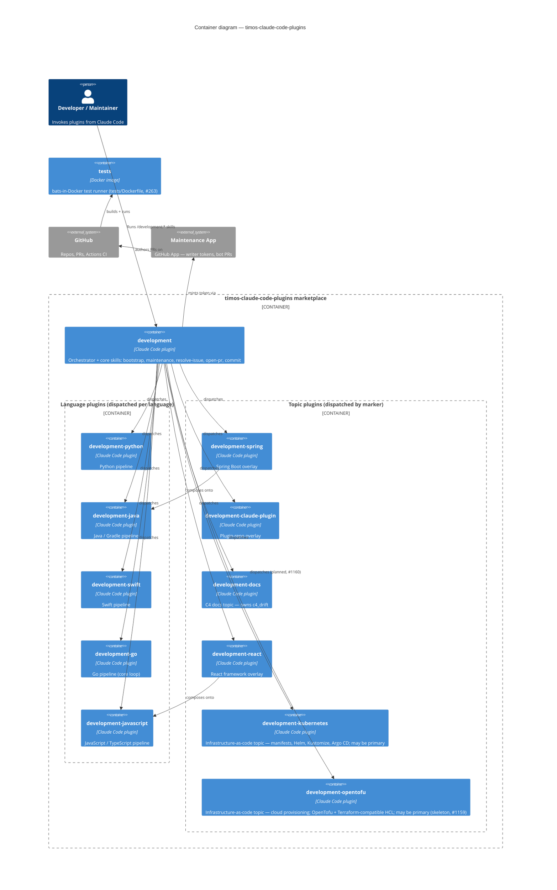

# Container Diagram

The deployable units that make up **timos-claude-code-plugins** — the installed
**plugins** of the marketplace, plus the one Docker image the repo builds. Each
`Container(...)` entry follows the `c4/v1` declared-container shape
([ARCHITECTURE.md](https://github.com/timo-jakob/timos-claude-code-plugins/blob/main/ARCHITECTURE.md)),
so the maintenance pipeline can compare it against the code (`c4_drift`).

Every plugin is itself composed of **skills** (multi-step procedures the user
invokes as `/plugin:skill`) and **agents** (single-purpose sub-agents the skills
dispatch to) — the skills/agents split described in ARCHITECTURE.md. That split
is a Component-level concern; at Container level the deployable unit is the
plugin. The orchestrator (`development:maintenance`) dispatches a JSON payload to
the matching **language plugin** *and* to any **topic plugins** whose markers
fire; a topic plugin composes alongside the language plugin for that run.

> **Detection note — declared vs detected on a marketplace-shaped repo.**
> `c4/v1`'s detector (`detect-stack.sh`, #799) keys on Dockerfiles, compose
> services, and build images. Run here it finds exactly **one** container —
> `tests` (`tests/Dockerfile`, the bats-in-Docker test runner, #263) — which
> this diagram **declares**, so there is no `detected_not_declared` drift. The
> twelve **plugins**, by contrast, are the product's real deployable units but
> are not Docker/compose-detectable, so they read as `declared_not_detected` —
> a direction the pipeline **escalates for human judgement, never auto-removes**
> (removing a declared container is an architectural statement). That asymmetry
> is the expected, useful signal for the seeding (#791) and `c4_drift` (#793)
> machinery: it bounds what they can promise for a marketplace, which has no
> product-container surface for the detector to see. The capstone that exercises
> the detector on a real service is child (g) #796.

The **declared container set** is the thirteen `Container(...)` entries above —
the twelve installed plugins plus the `tests` runner image — recoverable by the
`c4/v1` parser (`extract-declared-containers.zsh`) without a Mermaid engine.
`github` and `maint_app` are `System_Ext` — outside the marketplace's container
boundary, so outside the system this diagram decomposes and therefore outside
the declared set (an external dependency is deliberately invisible to
`c4_drift`). For who invokes the marketplace and the external services it reads,
see the [System Context diagram](c4-context.md).
