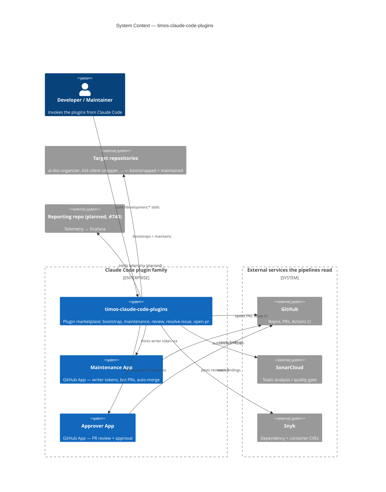

# System Context

The system context for **timos-claude-code-plugins** — who uses it and the
systems it talks to. This repo is not a service; it is a **Claude Code plugin
marketplace** whose skills and agents act on *other* repositories, so its
landscape is the plugins, the two GitHub App identities they operate under, the
target repositories they maintain, and the external services the pipelines read.

Authored by hand against the `c4/v1` contract
([ARCHITECTURE.md](https://github.com/timo-jakob/timos-claude-code-plugins/blob/main/ARCHITECTURE.md)).
Refine the actors and external systems as the architecture settles.

The diagram renders natively on GitHub and through the MkDocs Material +
`superfences` pipeline (client-side Mermaid). No build gate validates the Mermaid
body — see the [Container diagram](c4-container.md) for the machine-checkable
declared-container set.
