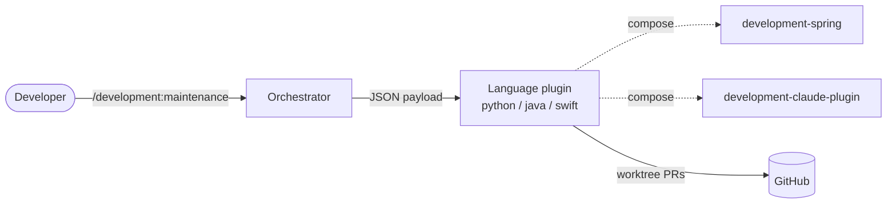

# Architecture

This section is the future home of **C4 architecture diagrams** (system context,
containers, and — where useful — components), authored as Mermaid C4 blocks that
render natively on GitHub and in the docs site.

> **Placeholder.** The C4 diagrams are delivered by documentation epic 3/3
> ([#746](https://github.com/timo-jakob/timos-claude-code-plugins/issues/746)).
> Until then, the authoritative architecture reference is the repo-root
> [`ARCHITECTURE.md`](https://github.com/timo-jakob/timos-claude-code-plugins/blob/main/ARCHITECTURE.md)
> — the contributor/Claude-facing contract covering the maintenance dispatch
> schema, the plugin composition model, and the scripting conventions.

The illustrative sketch below is a placeholder for the real C4 diagrams (#746);
it also confirms the docs site renders Mermaid. It shows the dispatch layering
— the orchestrator hands a JSON payload to a language plugin, which composes
with any matching topic plugins:

Related:

- [`ARCHITECTURE.md`](https://github.com/timo-jakob/timos-claude-code-plugins/blob/main/ARCHITECTURE.md)
  — authoritative architecture & schema contract (repo root).
- [`MAINTAINING.md`](https://github.com/timo-jakob/timos-claude-code-plugins/blob/main/MAINTAINING.md)
  — quarterly template-refresh procedure (repo root).
- [Why per-language plugins?](../explanation/why-per-language-plugins.md) — the composition rationale.
