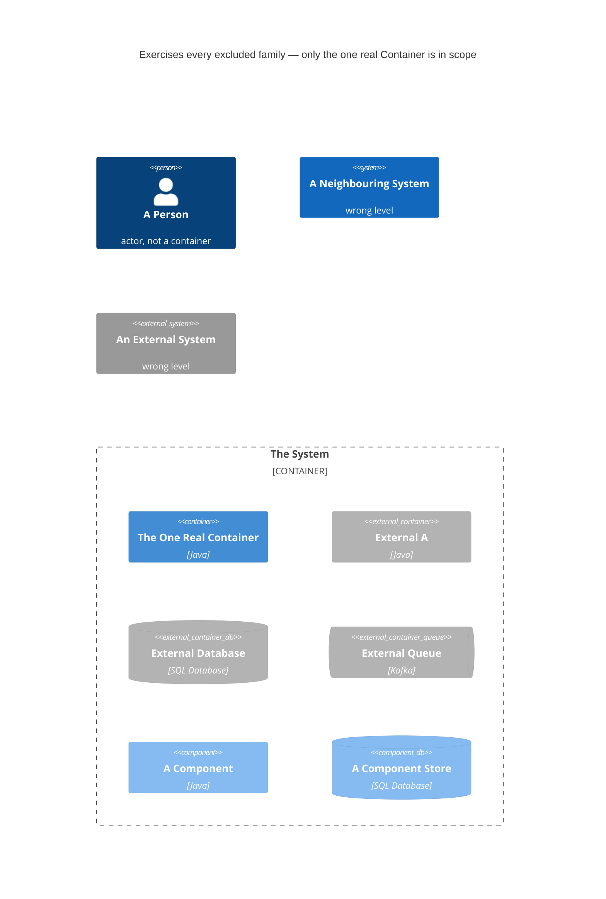

```mermaid
C4Container
    title Exercises every excluded family — only the one real Container is in scope

    Person(person_a, "A Person", "actor, not a container")

    Container_Boundary(c1, "The System") {
        Container(real_one, "The One Real Container", "Java")
        Container_Ext(ext_a, "External A", "Java")
        ContainerDb_Ext(ext_db, "External Database", "SQL Database")
        ContainerQueue_Ext(ext_q, "External Queue", "Kafka")
        Component(comp_a, "A Component", "Java")
        ComponentDb(comp_db, "A Component Store", "SQL Database")
    }

    System(sys_a, "A Neighbouring System", "wrong level")
    System_Ext(sys_ext, "An External System", "wrong level")
```
