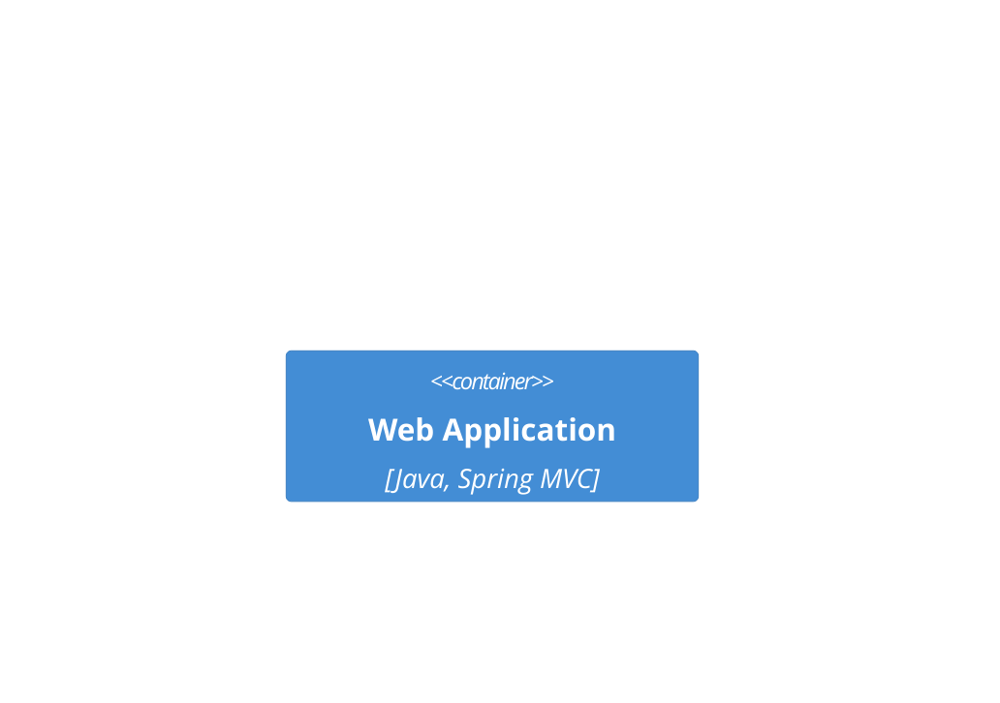

# Container diagram — two C4Container blocks (not allowed)

```mermaid
C4Container
    Container(web_app, "Web Application", "Java, Spring MVC")
```

A second, illustrative "target architecture" diagram — a merge hazard:

```mermaid
C4Container
    Container(worker, "Background Worker", "Java")
```
