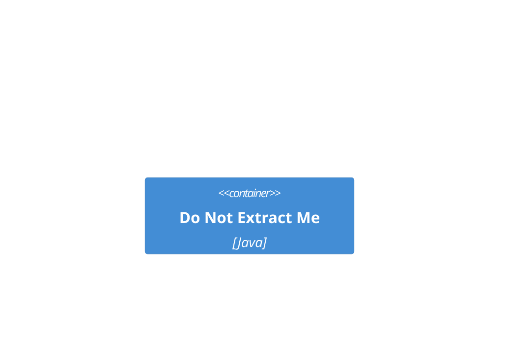

# Container diagram — with an illustrative nested fence

Here is how a `C4Container` block is written (shown inside a four-backtick fence,
so it must NOT be extracted):

````text

````

And here is the real diagram:


