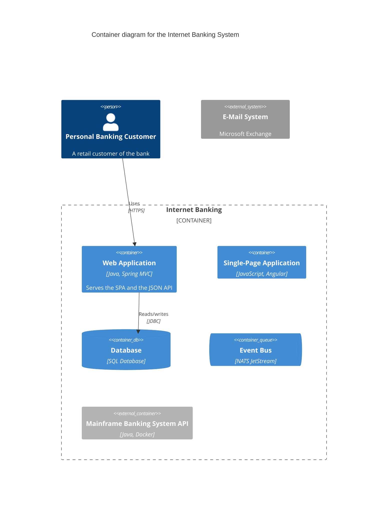

```mermaid
C4Container
    title Container diagram for the Internet Banking System

    Person(customer, "Personal Banking Customer", "A retail customer of the bank")

    Container_Boundary(c1, "Internet Banking") {
        Container(web_app, "Web Application", "Java, Spring MVC", "Serves the SPA and the JSON API")
        Container(spa, "Single-Page Application", "JavaScript, Angular")
        ContainerDb(database, "Database", "SQL Database")
        ContainerQueue(events, "Event Bus", "NATS JetStream")
        Container_Ext(backend_api, "Mainframe Banking System API", "Java, Docker")
    }

    System_Ext(email_system, "E-Mail System", "Microsoft Exchange")

    Rel(customer, web_app, "Uses", "HTTPS")
    Rel(web_app, database, "Reads/writes", "JDBC")
```
