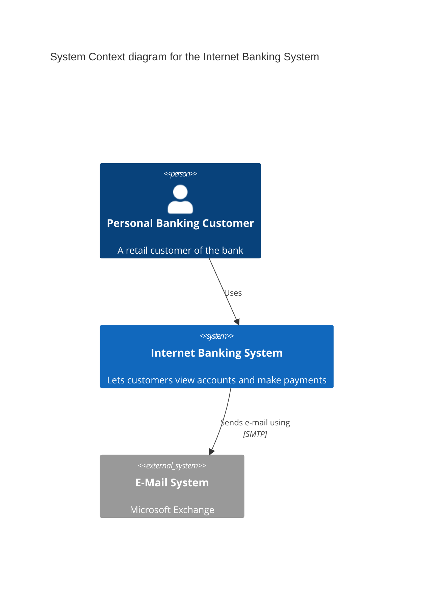

```mermaid
C4Context
    title System Context diagram for the Internet Banking System

    Person(customer, "Personal Banking Customer", "A retail customer of the bank")
    System(banking, "Internet Banking System", "Lets customers view accounts and make payments")
    System_Ext(email_system, "E-Mail System", "Microsoft Exchange")

    Rel(customer, banking, "Uses")
    Rel(banking, email_system, "Sends e-mail using", "SMTP")
```
